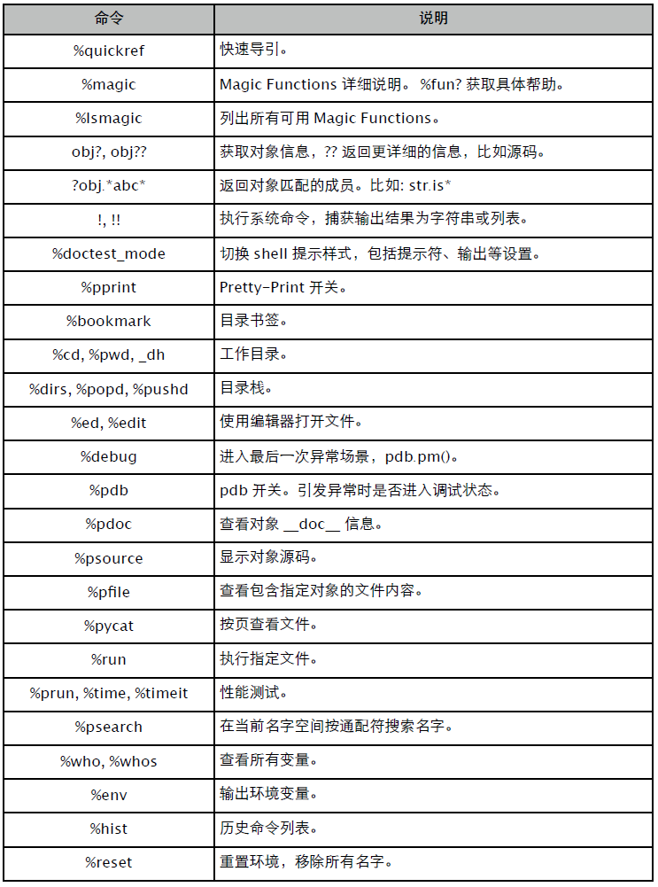
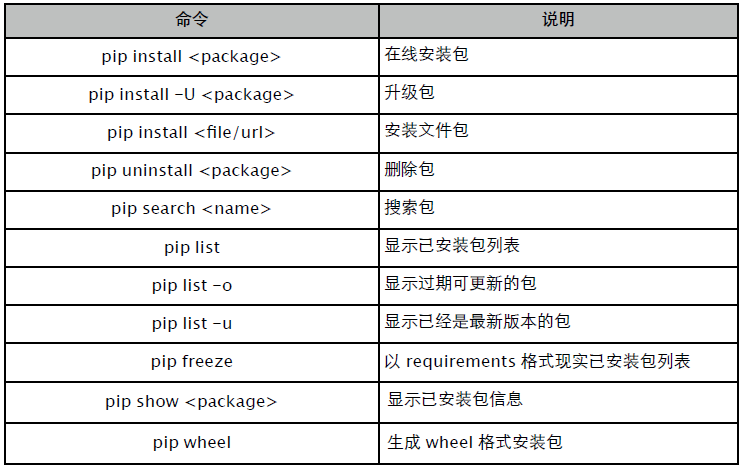
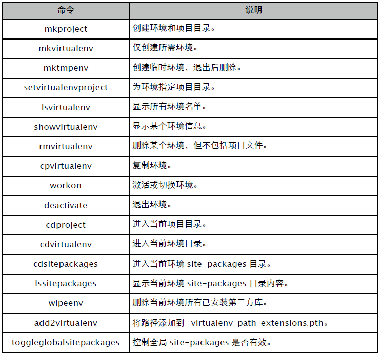

#附录
#A. CPython
参数：

- -b: 不生成 pyc/pyo 字节码文件。
- -E: 忽略 PYTHONPATH 环境变量。
- -i: 执行完成后，进入交互模式。(通常用 pdb.pm() 进入异常现场)
- -O: 优化字节码，并设置 __debug__ = False。
- -OO: 优化字节码，并移除 __doc__ 信息。
- -S: 不执行 site.py，不添加所有第三方库搜索路径。
- -v: 显示模块初始化和回收信息。
- -c: 直接执行 Python 代码。如: python -c "print 1+2"。
- -m: 执行模块。如: python -m pdb main.py

#B. IPython
远超 Python shell 的增强版本，可以当做 "IDE" 使用。




**备注**

- 在 shell command 中可以用 $name 引用 Python 名字，$$name 引用环境变量。
- 系统命名捕获可以直接赋值给某个名字，如 name = uname。
- %ed: -n 跳转到指定行；-x 退出编辑器时不执行；-p 使用上一次 ed 命令。
- %run: -n 设定 __name__ 为非 "__main__"；-i 引入交互环境名字空间；-d 进入调试模式；-t timeit；-p profile。

**演示**

```
In [1]: prun sum(range(1000))
		4 function calls in 0.000 seconds
	Ordered by: internal time

	ncalls tottime percall cumtime percall filename:lineno(function)
		 1   0.000   0.000   0.000   0.000 {range}
		 1   0.000   0.000   0.000   0.000 {sum}
		 1   0.000   0.000   0.000   0.000 <string>:1(<module>)

In [2]: time sum(range(1000))
CPU times: user 0.00 s, sys: 0.00 s, total: 0.00 s
Wall time: 0.00 s
Out[2]: 499500

In [3]: timeit -n 10 -r 3 sum(range(1000))
10 loops, best of 3: 25.8 us per loop
```

#C. PDB
习惯用 ipdb，代码高亮，更好的异常调试支持。


**启动方式：**

- 在源码中插入 import ipdb; ipdb.set_trace() 。
- 命令行 python -m ipdb main.py 。

相关方法：

- pm: 切换到最后的异常现场。

#D. PIP-install
easy_install 替代品，功能更丰富一些，建议使用 1.3 以上版本。



指定版本:

```
$ pip install SomePackage==1.04
$ pip install SomePackage>=1.04
```

清单文件:

```
$ pip install -r requirements.txt
```

文本文件，每行一个包记录，如:

```
Package1
Package2==1.0.4
Package3>=2.0
```

可以用 pip freeze > requirements.txt 将当前已安装的包导出。

#E. VirtualEnv
通常配合 VirtualEnvWrapper 使用，它提供一些更易于使用的命令。

```
$ pip install virtualenv virtualenvwrapper
```

在 ~/.profile 添加虚拟环境、项目根目录等环境配置。

```
export WORKON_HOME=$HOME/projects/.virtualenv
export PROJECT_HOME=$HOME/projects
source /usr/local/bin/virtualenvwrapper.sh
```
相关命令:

