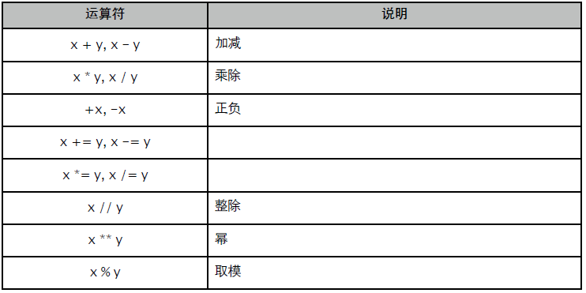
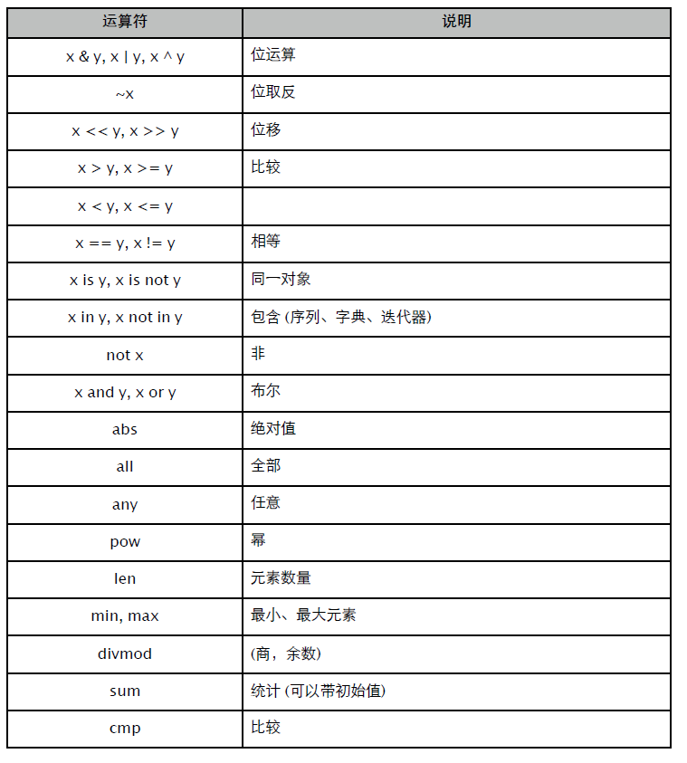

# 第一部分 Python 语言

Python 2.7 语言相关……

# 第 1 章 基本环境

## 1.1 虚拟机

Python 是一种半编译半解释型运行环境。首先，它会在模块 "载入" 时将源码编译成字节码 (Byte Code)。而后，这些字节码会被虚拟机在一个 "巨大" 的核心函数里解释执行。这是导致 Python 性能较低的重要原因，好在现在有了内置 Just-in-time 二次编译器的 PyPy 可供选择。

当虚拟机开始运行时，它通过初始化函数完成整个运行环境设置：

- 创建解释器和主线程状态对象，这是整个进程的根对象。
- 初始化内置类型。数字、列表等类型都有专门的缓存策略需要处理。
- 创建 __builtin__ 模块，该模块持有所有内置类型和函数。
- 创建 sys 模块，其中包含了 sys.path、modules 等重要的运行期信息。
- 初始化 import 机制。
- 初始化内置 Exception。
- 创建 __main__ 模块，准备运行所需的名字空间。
- 通过 site.py 将 site-packages 中的第三方扩展库添加到搜索路径列表。
- 执行入口 py 文件。执行前会将 __main__.__dict__ 作为名字空间传递进去。
- 程序执行结束。
- 执行清理操作，包括调用退出函数，GC 清理现场，释放所有模块等。
- 终止进程。

Python 源码是个宝库，其中有大量的编程范式和技巧可供借鉴，尤其是对内存的管理分配。个人建议有 C 基础的兄弟，在闲暇时翻看一二。

## 1.2 类型和对象

先有类型 (Type)，而后才能生成实例 (Instance)。Python 中的一切都是对象，包括类型在内的每个对象都包含一个标准头，通过头部信息就可以明确知道其具体类型。

头信息由 "引用计数" 和 "类型指针" 组成，前者在对象被引用时增加，超出作用域或手工释放后减小，等于 0 时会被虚拟机回收 (某些被缓存的对象计数器永远不会为 0)。

以 int 为例，对应 Python 结构定义是：

```
#define PyObject_HEAD \
	Py_ssize_t ob_refcnt; \
	struct _typeobject *ob_type;

typedef struct _object {
	PyObject_HEAD
} PyObject;

typedef struct {
	PyObject_HEAD  // 在 64 位版本中，头长度为 16 字节。
	long ob_ival;  // long 是 8 字节。
} PyIntObject;
```

可以用 sys 中的函数测试一下。

```
>>> import sys

>>> x = 0x1234  # 不要使用 [-5, 257) 之间的小数字，它们有专门的缓存机制。

>>> sys.getsizeof(x) # 符合长度预期。
24

>>> sys.getrefcount(x) # sys.getrefcount() 读取头部引用计数，注意形参也会增加一次引用。
2

>>> y = x   # 引用计数增加。
>>> sys.getrefcount(x)
3

>>> del y   # 引用计数减小。
>>> sys.getrefcount(x)
2
```

类型指针则指向具体的类型对象，其中包含了继承关系、静态成员等信息。所有的内置类型对象都能从 types 模块中找到，至于 int、long、str 这些关键字可以看做是简短别名。

```
>>> import types

>>> x = 20

>>> type(x) is types.IntType  # is 通过指针判断是否指向同一对象。
True

>>> x.__class__    # __class__ 通过类型指针来获取类型对象。
<type 'int'>

>>> x.__class__ is type(x) is int is types.IntType
True

>>> y = x

>>> hex(id(x)), hex(id(y))  # id() 返回对象标识，其实就是内存地址。
('0x7fc5204103c0', '0x7fc5204103c0')
>>> hex(id(int)), hex(id(types.IntType))
('0x1088cebd8', '0x1088cebd8')
```

除了 int 这样的固定长度类型外，还有 long、str 这类变长对象。其头部多出一个记录元素项数量的字段。比如 str 的字节数量，list 列表的长度等等。

```
#define PyObject_VAR_HEAD \
	PyObject_HEAD \
	Py_ssize_t ob_size;  /* Number of items in variable part */

typedef struct {
	PyObject_VAR_HEAD
} PyVarObject;
```

有关类型和对象更多的信息，将在后续章节中详述。

## 1.3 名字空间

名字空间是 Python 最核心的内容。

```
>>> x
NameError: name 'x' is not defined
```

我们习惯于将 x 称为变量，但在这里，更准确的词语是 "名字"。

和 C 变量名是内存地址别名不同，Python 的名字实际上是一个字符串对象，它和所指向的目标对象一起在名字空间中构成一项 {name: object} 关联。

Python 有多种名字空间，比如称为 globals 的模块名字空间，称为 locals 的函数堆栈帧名字空间，还有 class、instance 名字空间。不同的名字空间决定了对象的作用域和生存周期。

```
>>> x = 123

>>> globals()   # 获取 module 名字空间。
{'x': 123, ......}
```

可以看出，名字空间就是一个字典 (dict)。我们完全可以直接在名字空间添加项来创建名字。

```
>>> globals()["y"] = "Hello, World"

>>> y
'Hello, World'
```

在 Python 源码中，有这样一句话：Names have no type, but objects do.

名字的作用仅仅是在某个时刻与名字空间中的某个对象进行关联。其本身不包含目标对象的任何信息，只有通过对象头部的类型指针才能获知其具体类型，进而查找其相关成员数据。正因为名字的弱类型特征，我们可以在运行期随时将其关联到任何类型对象。

```
>>> y
'Hello, World'

>>> type(y)
<type 'str'>

>>> y = __import__("string") # 将原本与字符串关联的名字指向模块对象。

>>> type(y)
<type 'module'>

>>> y.digits   # 查看模块对象的成员。
'0123456789'
```

在函数外部，locals() 和 globals() 作用完全相同。而当在函数内部调用时，locals() 则是获取当前函数堆栈帧的名字空间，其中存储的是函数参数、局部变量等信息。

```
>>> import sys

>>> globals() is locals()
True

>>> locals()
{
 	'__builtins__': <module '__builtin__' (built-in)>,
 	'__name__': '__main__',
 	'sys': <module 'sys' (built-in)>,
}

>>> def test(x):     # 请对比下面的输出内容。
... y = x + 100
... print locals()    # 可以看到 locals 名字空间中包含当前局部变量。
... print globals() is locals()  # 此时 locals 和 globals 指向不同名字空间。

... frame = sys._getframe(0)   # _getframe(0) 获取当前堆栈帧。
... print locals() is frame.f_locals # locals 名字空间实际就是当前堆栈帧的名字空间。
... print globals() is frame.f_globals # 通过 frame 我们也可以函数定义模块的名字空间。

>>> test(123)
{'y': 223, 'x': 123}
False
True
True
```

在函数中调用 globals() 时，总是获取包含该函数定义的模块名字空间，而非调用处。

```
>>> pycat test.py

a = 1
def test():
	print {k:v for k, v in globals().items() if k = "__builtins__"}

>>> import test

>>> test.test()
{
 	'__file__': 'test.pyc',
 	'__name__': 'test',
 	'a': 1,
	 'test': <function test at 0x10bd85e60>,
}
```

可通过 <module>.__dict__ 访问其他模块的名字空间。

```
>>> test.__dict__      # test 模块的名字空间
{
 	'__file__': 'test.pyc',
 	'__name__': 'test',
 	'a': 1,
 	'test': <function test at 0x10bd85e60>,
}

>>> import sys

>>> sys.modules[__name__].__dict__ is globals() # 当前模块名字空间和 globals 相同。
True
```

与名字空间有关的内容很多，比如作用域、LEGB 查找规则、成员查找规则等等。所有这些，都将在相关章节中给出详细说明。

使用名字空间管理上下文对象，带来无与伦比的灵活性，但也牺牲了执行性能。毕竟从字典中查找对象远比指针低效很多，各有得失。

## 1.4 内存管理

为提升执行性能，Python 在内存管理上做了大量工作。最直接的做法就是用内存池来减少操作系统内存分配和回收操作，那些小于等于 256 字节对象，将直接从内存池中获取存储空间。

根据需要，虚拟机每次从操作系统申请一块 256KB，取名为 arena 的大块内存。并按系统页大小，划分成多个 pool。每个 pool 继续分割成 n 个大小相同的 block，这是内存池最小存储单位。

block 大小是 8 的倍数，也就是说存储 13 字节大小的对象，需要找 block 大小为 16 的 pool 获取空闲块。所有这些都用头信息和链表管理起来，以便快速查找空闲区域进行分配。

大于 256 字节的对象，直接用 malloc 在堆上分配内存。程序运行中的绝大多数对象都小于这个阈值，因此内存池策略可有效提升性能。

当所有 arena 的总容量超出限制 (64MB) 时，就不再请求新的 arena 内存。而是如同 "大对象" 一样，直接在堆上为对象分配内存。另外，完全空闲的 arena 会被释放，其内存交还给操作系统。

**引用传递**

对象总是按引用传递，简单点说就是通过复制指针来实现多个名字指向同一对象。因为 arena 也是在堆上分配的，所以无论何种类型何种大小的对象，都存储在堆上。Python 没有值类型和引用类型一说，就算是最简单的整数也是拥有标准头的完整对象。

```
>>> a = object()

>>> b = a
>>> a is b
True

>>> hex(id(a)), hex(id(b))  # 地址相同，意味着对象是同一个。
('0x10b1f5640', '0x10b1f5640')

>>> def test(x):   
... print hex(id(x))  

>>> test(a)
0x10b1f5640     # 地址依旧相同。
```

如果不希望对象被修改，就需使用不可变类型，或对象复制品。

```
不可变类型：int, long, str, tuple, frozenset
```

除了某些类型自带的 copy 方法外，还可以：

- 使用标准库的 copy 模块进行深度复制。
- 序列化对象，如 pickle、cPickle、marshal。

下面的测试建议不要用数字等不可变对象，因为其内部的缓存和复用机制可能会造成干扰。

```
>>> import copy

>>> x = object()
>>> l = [x]    # 创建一个列表。

>>> l2 = copy.copy(l)  # 浅复制，仅复制对象自身，而不会递归复制其成员。
>>> l2 is l    # 可以看到复制列表的元素依然是原对象。
False
>>> l2[0] is x
True

>>> l3 = copy.deepcopy(l) # 深度复制，会递归复制所有深度成员。
>>> l3 is l    # 列表元素也被复制了。
False
>>> l3[0] is x
False
```

循环引用会影响 deepcopy 函数的运作，建议查阅官方标准库文档。

**引用计数**

Python 默认采用引用计数来管理对象的内存回收。当引用计数为 0 时，将立即回收该对象内存，要么将对应的 block 块标记为空闲，要么返还给操作系统。

为观察回收行为，我们用 __del__ 监控对象释放。

```
>>> class User(object):
... 	def __del__(self):
... 		print "Will be dead"

>>> a = User()
>>> b = a

>>> import sys
>>> sys.getrefcount(a)
3

>>> del a    # 删除引用，计数减小。
>>> sys.getrefcount(b)
2

>>> del b    # 删除最后一个引用，计数器为 0，对象被回收。
Will be dead
```

某些内置类型，比如小整数，因为缓存的缘故，计数永远不会为 0，直到进程结束才由虚拟机清理函数释放。

除了直接引用外，Python 还支持弱引用。允许在不增加引用计数，不妨碍对象回收的情况下间接引用对象。但不是所有类型都支持弱引用，比如 list、dict ，弱引用会引发异常。

改用弱引用回调监控对象回收。

```
>>> import sys, weakref

>>> class User(object): pass

>>> def callback(r):   # 回调函数会在原对象被回收时调用。
...		 print "weakref object:", r
... 	 print "target object dead"

>>> a = User()

>>> r = weakref.ref(a, callback) # 创建弱引用对象。

>>> sys.getrefcount(a)   # 可以看到弱引用没有导致目标对象引用计数增加。
2      # 计数 2 是因为 getrefcount 形参造成的。

>>> r() is a    # 透过弱引用可以访问原对象。
True

>>> del a     # 原对象回收，callback 被调用。
weakref object: <weakref at 0x10f99a368; dead>
target object dead

>>> hex(id(r))    # 通过对比，可以看到 callback 参数是弱引用对象。
'0x10f99a368'    # 因为原对象已经死亡。

>>> r() is None    # 此时弱引用只能返回 None。也可以此判断原对象死亡。
True
```

引用计数是一种简单直接，并且十分高效的内存回收方式。大多数时候它都能很好地工作，除了循环引用造成计数故障。简单明显的循环引用，可以用弱引用打破循环关系。但在实际开发中，循环引用的形成往往很复杂，可能由 n 个对象间接形成一个大的循环体，此时只有靠 GC 去回收了。

**垃圾回收**

事实上，Python 拥有两套垃圾回收机制。除了引用计数，还有个专门处理循环引用的 GC。通常我们提到垃圾回收时，都是指这个 "Reference Cycle Garbage Collection"。

能引发循环引用问题的，都是那种容器类对象，比如 list、set、object 等。对于这类对象，虚拟机在为其分配内存时，会额外添加用于追踪的 PyGC_Head。这些对象被添加到特殊链表里，以便 GC 进行管理。

```
typedef union _gc_head {
	struct {
		union _gc_head *gc_next;
		union _gc_head *gc_prev;
		Py_ssize_t gc_refs;
	} gc;
	long double dummy;
} PyGC_Head;
```

当然，这并不表示此类对象非得 GC 才能回收。如果不存在循环引用，自然是积极性更高的引用计数机制抢先给处理掉。也就是说，只要不存在循环引用，理论上可以禁用 GC。当执行某些密集运算时，临时关掉 GC 有助于提升性能。

```
>>> import gc

>>> class User(object):
... 	def __del__(self):
... 		print hex(id(self)), "will be dead"

>>> gc.disable()    # 关掉 GC

>>> a = User()  
>>> del a     # 对象正常回收，引用计数不会依赖 GC。
0x10fddf590 will be dead
```

同 .NET、JAVA 一样，Python GC 同样将要回收的对象分成 3 级代龄。GEN0 管理新近加入的年轻对象，GEN1 则是在上次回收后依然存活的对象，剩下 GEN2 存储的都是生命周期极长的家伙。每级代龄都有一个最大容量阈值，每次 GEN0 对象数量超出阈值时，都将引发垃圾回收操作。

```
#define NUM_GENERATIONS 3

/* linked lists of container objects */
static struct gc_generation generations[NUM_GENERATIONS] = {
	/* PyGC_Head, threshold, count */
	{{{GEN_HEAD(0), GEN_HEAD(0), 0}}, 700, 0},
	{{{GEN_HEAD(1), GEN_HEAD(1), 0}}, 10, 0},
	{{{GEN_HEAD(2), GEN_HEAD(2), 0}}, 10, 0},
};
```

GC 首先检查 GEN2，如阈值被突破，那么合并 GEN2、GEN1、GEN0 几个追踪链表。如果没有超出，则检查 GEN1。GC 将存活的对象提升代龄，而那些可回收对象则被打破循环引用，放到专门的列表等待回收。

```
>>> gc.get_threshold()  # 获取各级代龄阈值
(700, 10, 10)

>>> gc.get_count()   # 各级代龄链表跟踪的对象数量
(203, 0, 5)
```

包含 __del__ 方法的循环引用对象，永远不会被 GC 回收，直至进程终止。

这回不能偷懒用 __del__ 监控对象回收了，改用 weakref。因 IPython 对 GC 存在干扰，下面的测试代码建议在原生 shell 中进行。

```
>>> import gc, weakref

>>> class User(object): pass
>>> def callback(r): print r, "dead"

>>> gc.disable()     # 停掉 GC，看看引用计数的能力。

>>> a = User(); wa = weakref.ref(a, callback)
>>> b = User(); wb = weakref.ref(b, callback)

>>> a.b = b; b.a = a    # 形成循环引用关系。

>>> del a; del b     # 删除名字引用。
>>> wa(), wb()     # 显然，计数机制对循环引用无效。
(<__main__.User object at 0x1045f4f50>, <__main__.User object at 0x1045f4f90>)

>>> gc.enable()     # 开启 GC。
>>> gc.isenabled()     # 可以用 isenabled 确认。
True

>>> gc.collect()     # 因为没有达到阈值，我们手工启动回收。
<weakref at 0x1045a8cb0; dead> dead  # GC 的确有对付基友的能力。 
<weakref at 0x1045a8db8; dead> dead  # 这个地址是弱引用对象的，别犯糊涂。
```

一旦有了 __del__，GC 就拿循环引用没办法了。

```
>>> import gc, weakref

>>> class User(object):
... def __del__(self): pass    # 难道连空的 __del__ 也不行？

>>> def callback(r): print r, "dead"

>>> gc.set_debug(gc.DEBUG_STATS | gc.DEBUG_LEAK) # 输出更详细的回收状态信息。
>>> gc.isenabled()      # 确保 GC 在工作。
True

>>> a = User(); wa = weakref.ref(a, callback)
>>> b = User(); wb = weakref.ref(b, callback)
>>> a.b = b; b.a = a

>>> del a; del b
>>> gc.collect()      # 从输出信息看，回收失败。
gc: collecting generation 2...
gc: objects in each generation: 520 3190 0
gc: uncollectable <User 0x10fd51fd0>   # a
gc: uncollectable <User 0x10fd57050>   # b
gc: uncollectable <dict 0x7f990ac88280>  # a.__dict__
gc: uncollectable <dict 0x7f990ac88940>  # b.__dict__
gc: done, 4 unreachable, 4 uncollectable, 0.0014s elapsed.
4

>>> xa = wa()
>>> xa, hex(id(xa.__dict__))
<__main__.User object at 0x10fd51fd0>, '0x7f990ac88280',

>>> xb = wb()
>>> xb, hex(id(xb.__dict__))
<__main__.User object at 0x10fd57050>, '0x7f990ac88940'
```

关于用不用 __del__ 的争论很多。大多数人的结论是坚决抵制，诸多 "牛人" 也是这样教导新手的。可毕竟 __del__ 承担了析构函数的角色，某些时候还是有其特定的作用的。用弱引用回调会造成逻辑分离，不便于维护。对于一些简单的脚本，我们还是能保证避免循环引用的，那不妨试试。就像前面例子中用来监测对象回收，就很方便。

## 1.5 编译

Python 实现了栈式虚拟机 (Stack-Based VM) 架构，通过与机器无关的字节码来实现跨平台执行能力。这种字节码指令集没有寄存器，完全以栈 (抽象层面) 进行指令运算。尽管很简单，但对普通开发人员而言，是无需关心的细节。

要运行 Python 语言编写的程序，必须将源码编译成字节码。通常情况下，编译器会将源码转换成字节码后保存在 pyc 文件中。还可用 -O 参数生成 pyo 格式，这是简单优化后的 pyc 文件。

编译发生在模块载入那一刻。具体来看，又分为 pyc 和 py 两种情况。

载入 pyc 流程：

- 核对文件 Magic 标记。
- 检查时间戳和源码文件修改时间是否相同，以确定是否需要重新编译。
- 载入模块。

如果没有 pyc，那么就需要先完成编译：

- 对源码进行 AST 分析。
- 将分析结果编译成 PyCodeObject。
- 将 Magic、源码文件修改时间、PyCodeObject 保存到 pyc 文件中。
- 载入模块。

Magic 是一个特殊的数字，由 Python 版本号计算得来，作为 pyc 文件和 Python 版本检查标记。PyCodeObject 则包含了代码对象的完整信息。

```
typedef struct {
	PyObject_HEAD
	int co_argcount;  // 参数个数，不包括 *args, **kwargs。
	int co_nlocals;  // 局部变量数量。
	int co_stacksize;  // 执行所需的栈空间。
	int co_flags;   // 编译标志，在创建 Frame 时用得着。
	PyObject *co_code;  // 字节码指令。
	PyObject *co_consts;  // 常量列表。
	PyObject *co_names;  // 符号列表。
	PyObject *co_varnames; // 局部变量名列表。
	PyObject *co_freevars; // 闭包: 引用外部函数名字列表。
	PyObject *co_cellvars; // 闭包: 被内部函数引用的名字列表。
	PyObject *co_filename; // 源码文件名。
	PyObject *co_name;  // PyCodeObject 的名字，函数名、类名什么的。
	int co_firstlineno;  // 这个 PyCodeObject 在源码文件中的起始位置，也就是行号。
	PyObject *co_lnotab;  // 字节码指令偏移量和源码行号的对应关系，反汇编时用得着。
	void *co_zombieframe;  // 为优化准备的特殊 Frame 对象。
	PyObject *co_weakreflist; // 为弱引用准备的...
} PyCodeObject;
```

无论是模块还是其内部的函数，都被编译成 PyCodeObject 对象。内部成员都嵌套到 co_consts 列表中。

```
>>> pycat test.py
"""
	Hello, World
"""

def add(a, b):
	return a + b

c = add(10, 20)

>>> code = compile(open("test.py").read(), "test.py", "exec")

>>> code.co_filename, code.co_name, code.co_names
('test.py', '<module>', ('__doc__', 'add', 'c'))

>>> code.co_consts
('\n Hello, World\n', <code object add at 0x105b76e30, file "test.py", line 5>, 10,
20, None)

>>> add = code.co_consts[1]
>>> add.co_varnames
('a', 'b')
```

除了内置 compile 函数，标准库里还有 py_compile、compileall 可供选择。

```
>>> import py_compile, compileall

>>> py_compile.compile("test.py", "test.pyo")
>>> ls
main.py* test.py  test.pyo

>>> compileall.compile_dir(".", 0)
Listing . ...
Compiling ./main.py ...
Compiling ./test.py ...
```

如果对 pyc 文件格式有兴趣，但又不想看 C 代码，可以到 /usr/lib/python2.7/compiler 目录里寻宝。又或者你对反汇编、代码混淆、代码注入等话题更有兴趣，不妨看看标准库里的 dis。

## 1.6 执行

相比 .NET、JAVA 的 CodeDOM 和 Emit，Python 天生拥有无与伦比的动态执行优势。

最简单的就是用 eval() 执行表达式。

```
>>> eval("(1 + 2) * 3")  # 假装看不懂这是啥……
9

>>> eval("{'a': 1, 'b': 2}") # 将字符串转换为 dict。
{'a': 1, 'b': 2}
```

eval 默认会使用当前环境的名字空间，当然我们也可以带入自定义字典。

```
>>> x = 100
>>> eval("x + 200")  # 使用当前上下文的名字空间。
300

>>> ns = dict(x = 10, y = 20)
>>> eval("x + y", ns)  # 使用自定义名字空间。
30

>>> ns.keys()   # 名字空间里多了 __builtins__。
['y', 'x', '__builtins__']
```

要执行代码片段，或者 PyCodeObject 对象，那么就需要动用 exec 。同样可以带入自定义名字空间，以避免对当前环境造成污染。

```
>>> py = """
... class User(object):
... 	def __init__(self, name):
... 		self.name = name
... 	def __repr__(self):
... 		return "<User: {0:x}; name={1}>".format(id(self), self.name)
... """

>>> ns = dict()
>>> exec py in ns   # 执行代码片段，使用自定义的名字空间。

>>> ns.keys()   # 可以看到名字空间包含了新的类型：User。
['__builtins__', 'User']

>>> ns["User"]("Tom")  # 完全可用。貌似用来开发 ORM 会很简单。
<User: 10547f290; name=Tom>
```

继续看 exec 执行 PyCodeObject 的演示。

```
>>> py = """
... def incr(x):
... 	global z
... 	z += x
... """

>>> code = compile(py, "test", "exec")   # 编译成 PyCodeObject。

>>> ns = dict(z = 100)     # 自定义名字空间。
>>> exec code in ns     # exec 执行以后，名字空间多了 incr。

>>> ns.keys()      # def 的意思是创建一个函数对象。
['__builtins__', 'incr', 'z']

>>> exec "incr(x); print z" in ns, dict(x = 50) # 试着调用这个 incr，不过这次我们提供一个
150        # local 名字空间，以免污染 global。
>>> ns.keys()      # 污染没有发生。
['__builtins__', 'incr', 'z']
```

动态执行一个 py 文件，可以考虑用 execfile()，或者 runpy 模块。

# 第 2 章 内置类型

按照用途不同，Python 内置类型可分为 "数据" 和 "程序" 两大类。

数据类型：
- 空值: None
- 数字: bool, int, long, float, complex
- 序列: str, unicode, list, tuple
- 字典: dict
- 集合: set, frozenset

## 2.1 数字

**bool**

None、0、空字符串、以及没有元素的容器对象都可视为 False，反之为 True。

```
>>> map(bool, [None, 0, "", u"", list(), tuple(), dict(), set(), frozenset()])
[False, False, False, False, False, False, False, False, False]
```

虽然有点古怪，但 True、False 的确可以当数字使用。

```
>>> int(True)
1
>>> int(False)
0
>>> range(10)[True]
1

>>> x = 5
>>> range(10)[x > 3]
1
```

**int**

在 64 位平台上，int 类型是 64 位整数 (sys.maxint)，这显然能应对绝大多数情况。整数是虚拟机特殊照顾对象：

- 从堆上按需申请名为 PyIntBlock 的缓存区域存储整数对象。
- 使用固定数组缓存 [-5, 257) 之间的小数字，只需计算下标就能获得指针。
- PyIntBlock 内存不会返还给操作系统，直至进程结束。

看看 "小数字" 和 "大数字" 的区别：

```
>>> a = 15
>>> b = 15

>>> a is b
True

>>> sys.getrefcount(a)
47

>>> a = 257
>>> b = 257

>>> a is b
False

>>> sys.getrefcount(a)
2
```

因 PyIntBlock 内存只复用不回收，同时持有大量整数对象将导致内存暴涨，且不会在这些对象被回收后释放内存，造成事实上的内存泄露。

用 range 创建一个巨大的数字列表，这就需要足够多的 PyIntBlock 为数字对象提供存储空间。但换成 xrange 就不同了，每次迭代后，数字对象被回收，其占用内存空闲出来并被复用，内存也就不会暴涨了。

运行下面测试代码前，必须先安装 psutil 包，用来获取内存统计数据。

```
$ sudo easy_install -U psutil
```

```
$ cat test.py
#/usr/bin/env python

import gc, os, psutil

def test():
	x = 0
	for i in range(10000000): # xrange
		x += i

	return x

def main():
	print test()
	gc.collect()

	p = psutil.Process(os.getpid())
	print p.get_memory_info()

if __name__ == "__main__":
	main()
```

对比 range 和 xrange 所需的 RSS 值。

```
range: meminfo(rss=93339648L, vms=2583552000L) # 89 MB
xrange: meminfo(rss=8638464L, vms=2499342336L) # 8 MB
```

在实际开发中，很少会遇到这样的情形。就算是海量整数去重、排序，我们也可用位图等算法来节约内存使用。Python 3 已经用 xrange 替换掉了默认的 range，我们使用 2.x 时稍微注意一下即可。

**long**

当超出 int 限制时， 会自动转换成 long。 作为变长对象，只要有内存足够，足以存储无法想象的天文数字。

```
>>> a = sys.maxint
>>> type(a)
<type 'int'>

>>> b = a + 1   # 超出，自动使用 long 类型。
>>> type(b)
<type 'long'>

>>> 1 << 3000
12302319221611....890612250135171889174899079911291512399773872178519018229989376L

>>> sys.getsizeof(1 << 0xFFFFFFFF)
572662332
```

使用 long 的机会不多，Python 也就没有必要专门为其设计优化策略。

**float**

使用双精度浮点数 (float)，不能 "精确" 表示某些十进制的小数值。尤其是 "四舍五入 (round)" 的结果，可能和预想不同。

```
>>> 3 / 2   # 除法默认返回整数，在 Python 3 中返回浮点数。
1

>>> float(3) / 2
1.5

>>> 3 * 0.1 == 0.3  # 这个容易导致莫名其妙的错误。
False

>>> round(2.675, 2) # 并没有想象中的四舍五入。
2.67
```

如果需要，可用 Decimal 代替，它能精确控制运算精度、有效数位和 round 的结果。

```
>>> from decimal import Decimal, ROUND_UP, ROUND_DOWN

>>> float('0.1') * 3 == float('0.3')     # float 转型精度不同
False

>>> Decimal('0.1') * 3 == Decimal('0.3')    # decimal 没有问题
True

>>> Decimal('2.675').quantize(Decimal('.01'), ROUND_UP)  # 精确控制 round
Decimal('2.68')

>>> Decimal('2.675').quantize(Decimal('.01'), ROUND_DOWN)
Decimal('2.67')
```

在内存管理上，float 也采用 PyFloatBlock 模式，但没有特殊的 "小浮点数"。

## 2.2 字符串

与字符串相关的问题总是很多，比如池化 (intern)、编码 (encode) 等。字符串是不可变类型，保存字符序列或二进制数据。

- 短字符串存储在 arena 区域， str、unicode 单字符会被永久缓存。
- str 没有缓存机制，unicode 则保留 1024 个宽字符长度小于 9 的复用对象。
- 内部包含 hash 值，str 另有标记用来判断是否被池化。

字符串常量定义简单自由，可以是单引号、双引号或三引号。但我个人建议用双引号表示字符串，用单引号表示字符，和其他语言习惯保持一致。

```
>>> "It's a book."    # 双引号里面可以用单引号。
"It's a book."

>>> 'It\'s a book.'   # 转义
"It's a book."

>>> '{"name":"Tom"}'   # 单引号里面正常使用双引号。
'{"name":"Tom"}'

>>> """     # 多行
... line 1
... line 2
... """

>>> r"abc\x"    # r 前缀定义非转义的 raw-string。
'abc\\x'

>>> "a" "b" "c"    # 自动合并多个相邻字符串。
'abc'

>>> "中国人"     # UTF-8 字符串 (Linux 系统默认)。
'\xe4\xb8\xad\xe5\x9b\xbd\xe4\xba\xba'

>>> type(s), len(s)
<type 'str'>, 9

>>> u"中国人"    # 使用 u 前缀定义 UNICODE 字符串。
u'\u4e2d\u56fd\u4eba'

>>> type(u), len(u)
<type 'unicode'>, 3
```

基本操作：

```
>>> "a" + "b"
'ab'

>>> "a" * 3
'aaa'

>>> ",".join(["a", "b", "c"])     # 合并多个字符串。
'a,b,c'

>>> "a,b,c".split(",")      # 按指定字符分割。
['a', 'b', 'c']

>>> "a\nb\r\nc".splitlines()     # 按行分割。
['a', 'b', 'c']

>>> "a\nb\r\nc".splitlines(True)    # 分割后，保留换行符。
['a\n', 'b\r\n', 'c']

>>> "abc".startswith("ab"), "abc".endswith("bc")  # 判断是否以特定子串开始或结束。
True, True

>>> "abc".upper(), "Abc".lower()    # 大小写转换。
'ABC', 'abc'

>>> "abcabc".find("bc"), "abcabc".find("bc", 2)  # 可指定查找起始结束位置。
1, 4

>>> " abc".lstrip(), "abc ".rstrip(), " abc ".strip() # 剔除前后空格。
'abc', 'abc', 'abc'

>>> "abc".strip("ac")      # 可删除指定的前后缀字符。
'b'

>>> "abcabc".replace("bc", "BC")    # 可指定替换次数。
'aBCaBC'

>>> "a\tbc".expandtabs(4)     # 将 tab 替换成空格。
'a bc'

>>> "123".ljust(5, '0'), "456".rjust(5, '0'), "abc".center(10, '*') # 填充
'12300', '00456', '***abc****'

>>> "123".zfill(6), "123456".zfill(4)      # 数字填充
'000123', '123456'
```

**编码**

Python 2.x 默认采用 ASCII 编码。为了完成编码转换，必须和操作系统字符编码统一起来。

```
>>> import sys, locale

>>> sys.getdefaultencoding()  # Python 默认编码。
'ascii'

>>> c = locale.getdefaultlocale(); c # 获取当前系统编码。
('zh_CN', 'UTF-8')

>>> reload(sys)    # setdefaultencoding 在被初始化时被 site.py 删掉了。
<module 'sys' (built-in)>

>>> sys.setdefaultencoding(c[1]) # 重新设置默认编码。
```

str、unicode 都提供了 encode 和 decode 编码转换方法。

- encode: 将默认编码转换为其他编码。
- decode: 将默认或者指定编码字符串转换为 unicode。

```
>>> s = "中国人"; s
'\xe4\xb8\xad\xe5\x9b\xbd\xe4\xba\xba'

>>> u = s.decode(); u   # UTF-8 -> UNICODE
u'\u4e2d\u56fd\u4eba'

>>> gb = s.encode("gb2312"); gb  # UTF-8 -> GB2312
'\xd6\xd0\xb9\xfa\xc8\xcb'

>>> gb.encode("utf-8")   # encode 会把 gb 当做默认 UTF-8 编码，所以出错。
UnicodeDecodeError: 'utf8' codec can't decode byte 0xd6 in position 0: invalid
continuation byte

>>> gb.decode("gb2312")   # 可以将其转换成 UNICODE。
u'\u4e2d\u56fd\u4eba'

>>> gb.decode("gb2312").encode() # 然后再转换成 UTF-8
'\xe4\xb8\xad\xe5\x9b\xbd\xe4\xba\xba'

>>> unicode(gb, "gb2312")  # GB2312 -> UNICODE
u'\u4e2d\u56fd\u4eba'
>>> u.encode()    # UNICODE -> UTF-8
'\xe4\xb8\xad\xe5\x9b\xbd\xe4\xba\xba'

>>> u.encode("gb2312")   # UNICODE -> GB2312
'\xd6\xd0\xb9\xfa\xc8\xcb'
```

标准库另有 codecs 模块用来处理更复杂的编码转换，比如大小端和 BOM。

```
>>> from codecs import BOM_UTF32_LE

>>> s = "中国人"
>>> s
'\xe4\xb8\xad\xe5\x9b\xbd\xe4\xba\xba'

>>> s.encode("utf-32")
'\xff\xfe\x00\x00-N\x00\x00\xfdV\x00\x00\xbaN\x00\x00'

>>> BOM_UTF32_LE
'\xff\xfe\x00\x00'

>>> s.encode("utf-32").decode("utf-32")
u'\u4e2d\u56fd\u4eba'
```

**格式化**

Python 提供了两种字符串格式化方法，除了熟悉的 C 样式外，还有更强大的 format。

```
%[(key)][flags][width][.precision]typecode
```

标记：- 左对齐，+ 数字符号，# 进制前缀，或者用空格、0 填充。

```
>>> "%(key)s=%(value)d" % dict(key = "a", value = 10)  # key
'a=10'

>>> "[%-10s]" % "a"      # 左对齐
'[a ]'

>>> "%+d, %+d" % (-10, 10)     # 数字符号
'-10, +10'

>>> "%010d" % 3       # 填充
'0000000003'

>>> "%.2f" % 0.1234      # 小数位
'0.12'

>>> "%#x, %#X" % (100, 200)     # 十六进制、前缀、大小写。
'0x64, 0XC8'

>>> "%s, %r" % (m, m)      # s: str(); r: repr()
'test..., <__main__.M object at 0x103c4aa10>'
```

format 方法支持更多的数据类型，包括列表、字典、对象成员等。

```
{fieldconvertflag:formatspec}
```

格式化规范：

```
formatspec: [[fill]align][sign][#][0][width][.precision][typecode]
```

示例：

```
>>> "{key}={value}".format(key="a", value=10) # 使用命名参数。
'a=10'

>>> "{0},{1},{0}".format(1, 2)    # field 可多次使用。
'1,2,1'

>>> "{0:,}".format(1234567)    # 千分位符号
'1,234,567'

>>> "{0:,.2f}".format(12345.6789)   # 千分位，带小数位。
'12,345.68'

>>> "[{0:<10}], [{0:^10}], [{0:*>10}]".format("a") # 左中右对齐，可指定填充字符。
'[a ], [ a ], [*********a]'

>>> import sys

>>> "{0.platform}".format(sys)    # 成员
'darwin'

>>> "{0[a]}".format(dict(a=10, b=20))   # 字典
'10'

>>> "{0[5]}".format(range(10))    # 列表
'5'
```

另有 string.Template 模板可供使用。该模块还定义了各种常见的字符序列。

```
>>> from string import letters, digits, Template

>>> letters         # 字母表
'abcdefghijklmnopqrstuvwxyzABCDEFGHIJKLMNOPQRSTUVWXYZ'

>>> digits         # 数字表
'0123456789'

>>> Template("$name, $age").substitute(name = "User1", age = 20) # 模板替换。
'User1, 20'

>>> Template("${name}, $age").safe_substitute(name = "User1")  # 没找到值，不会抛出异常。
'User1, $age'
```

**池化**

在 Python 进程中，无数的对象拥有一堆类似 "__name__"、"__doc__" 这样的名字，池化有助于减少对象数量和内存消耗， 提升性能。

用 intern() 函数可以把运行期动态生成的字符串池化。

```
>>> s = "".join(["a", "b", "c"])

>>> s is "abc"   # 显然动态生成的字符串 s 没有被池化。
False

>>> intern(s) is "abc"  # intern 会检查内部标记。
True

>>> intern(s) is intern(s) # 以后用 intern 从池中获取字符串对象，就可以复用了。
True
```

当池化的字符串不再有引用时，将被回收。

## 2.3 列表

从功能上看，列表 (list) 类似 Vector，而非数组或链表。

- 列表对象和存储元素指针的数组是分开的两块内存，后者在堆上分配。
- 虚拟机会保留 80 个列表复用对象，但其元素指针数组会被释放。
- 列表会动态调整指针数组大小，预分配内存多于实际元素数量。

创建列表：

```
>>> []       # 空列表。
[]

>>> ['a', 'b'] * 3      # 这个少见吧。
['a', 'b', 'a', 'b', 'a', 'b']

>>> ['a', 'b'] + ['c', 'd']    # 连接多个列表。
['a', 'b', 'c', 'd']

>>> list("abcd")      # 将序列类型或迭代器转换为列表。
['a', 'b', 'c', 'd']

>>> [x for x in range(3)]    # 生成器表达式。
[0, 1, 2]
```

常见操作：

```
>>> l = list("abc")
>>> l[1] = 2      # 按序号读写。
>>> l       
['a', 2, 'c']

>>> l = list(xrange(10))
>>> l[2:-2]       # 切片。
[2, 3, 4, 5, 6, 7]

>>> l = list("abcabc")
>>> l.count("b")      # 统计元素项。
2

>>> l = list("abcabc")
>>> l.index("a", 2)     # 从指定位置查找项，返回序号。
3

>>> l = list("abc")
>>> l.append("d")
>>> l        # 追加元素。
['a', 'b', 'c', 'd']

>>> l = list("abc")
>>> l.insert(1, 100)     # 在指定位置插入元素。
>>> l 
['a', 100, 'b', 'c']

>>> l = list("abc")
>>> l.extend(range(3))     # 合并列表。
>>> l 
['a', 'b', 'c', 0, 1, 2]

>>> l = list("abcabc")
>>> l.remove("b")      # 移除第一个指定元素。
>>> l 
['a', 'c', 'a', 'b', 'c']

>>> l = list("abc")
>>> l.pop(1)      # 弹出指定位置的元素 (默认最后项)。
'b'
>>> l   
['a', 'c']
```

可用 bisect 向有序列表中插入元素。

```
>>> import bisect

>>> l = ["a", "d", "c", "e"]
>>> l.sort()
>>> l
['a', 'c', 'd', 'e']

>>> bisect.insort(l, "b")
>>> l
['a', 'b', 'c', 'd', 'e']

>>> bisect.insort(l, "d")
>>> l
['a', 'b', 'c', 'd', 'd', 'e']
```

**性能**

列表用 realloc() 调整指针数组内存大小，可能需要复制数据。插入和删除操作，还会循环移动后续元素。这些都是潜在的性能隐患。对于频繁增删元素的大型列表，应该考虑用链表等数据结构代替。

下面的例子测试了两种创建列表对象方式的性能差异。为获得更好测试结果，我们关掉 GC，元素使用同一个小整数对象，减少其他干扰因素。

```
>>> import itertools, gc

>>> gc.disable()

>>> def test(n):
... 	return len([0 for i in xrange(n)])  # 先创建列表，然后 append。

>>> def test2(n):
... 	return len(list(itertools.repeat(0, n))) # 按照迭代器创建列表对象，一次分配内存。

>>> timeit test(10000)
1000 loops, best of 3: 810 us per loop

>>> timeit test2(10000)
10000 loops, best of 3: 89.5 us per loop
```

从测试结果来看，性能差异非常大。

某些时候，可以考虑用数组代替列表。 和列表存储对象指针不同，数组直接内嵌数据，既省了创建对象的内存开销，又提升了读写效率。

```
>>> import array

>>> a = array.array("l", range(10))  # 用其他序列类型初始化数组。
>>> a
array('l', [0, 1, 2, 3, 4, 5, 6, 7, 8, 9])

>>> a.tolist()     # 转换为列表。
[0, 1, 2, 3, 4, 5, 6, 7, 8, 9]

>>> a = array.array("c")    # 创建特定类型数组。

>>> a.fromstring("abc")    # 从字符串添加元素。
>>> a
array('c', 'abc')

>>> a.fromlist(list("def"))   # 从列表添加元素。
>>> a
array('c', 'abcdef')

>>> a.extend(array.array("c", "xyz"))  # 合并列表或数组。
>>> a
array('c', 'abcdefxyz')
```

## 2.4 元组

元组 (tuple) 看上去像列表的只读版本，但在底层实现上有很多不同之处。
- 只读对象，元组和元素指针数组内存是一次性连续分配的。
- 虚拟机缓存 n 个元素数量小于 20 的元组复用对象。

在编码中，应该尽可能用元组代替列表。除内存复用更高效外，其只读特征更利于并行开发。

基本操作：

```
>>> a = (4)     # 少了逗号，就成了普通的括号运算符了。
>>> type(a)
<type 'int'>

>>> a = (4,)    # 这才是元组。
>>> type(a)
<type 'tuple'>

>>> s = tuple("abcadef")   # 将其他序列类型转换成元组。
>>> s
('a', 'b', 'c', 'a', 'd', 'e', 'f')

>>> s.count("a")    # 元素统计。
2

>>> s.index("d")    # 查找元素，返回序号。
4
```

标准库另提供了特别的 namedtuple，可用名字访问元素项。

```
>>> from collections import namedtuple

>>> User = namedtuple("User", "name age") # 空格分隔字段名，或使用迭代器。

>>> u = User("user1", 10)
>>> u.name, u.age
('user1', 10)
```

其实 namedtuple 并不是元组，而是利用模板动态创建的自定义类型。

## 2.5 字典

字典 (dict) 采用开放地址法的哈希表实现。
- 自带元素容量为 8 的 smalltable，只有 "超出" 时才到堆上额外分配元素表内存。
- 虚拟机缓存 80 个字典复用对象，但在堆上分配的元素表内存会被释放。
- 按需动态调整容量。扩容或收缩操作都将重新分配内存，重新哈希。
- 删除元素操作不会立即收缩内存。

创建字典：

```
>>> {}      # 空字典
{}

>>> {"a":1, "b":2}     # 普通构造方式
{'a': 1, 'b': 2}

>>> dict(a = 1, b = 2)    # 构造
{'a': 1, 'b': 2}

>>> dict((["a", 1], ["b", 2]))   # 用两个序列类型构造字典。
{'a': 1, 'b': 2}

>>> dict(zip("ab", range(2)))   # 同上
{'a': 0, 'b': 1}

>>> dict(map(None, "abc", range(2)))  # 同上
{'a': 0, 'c': None, 'b': 1}

>>> dict.fromkeys("abc", 1)   # 用序列做 key，并提供默认 value。
{'a': 1, 'c': 1, 'b': 1}

>>> {k:v for k, v in zip("abc", range(3))} # 使用生成表达式构造字典。
{'a': 0, 'c': 2, 'b': 1}
```

基本操作：

```
>>> d = {"a":1, "b":2}
>>> "b" in d     # 判断是否包含 key。
True

>>> d = {"a":1, "b":2}
>>> del d["b"]     # 删除 k/v。
>>> d
{'a': 1}

>>> d = {"a":1}
>>> d.update({"c": 3})    # 合并 dict。
>>> d
{'a': 1, 'c': 3}

>>> d = {"a":1, "b":2}
>>> d.pop("b")     # 弹出 value。
>>> d
(2, {'a': 1})

>>> d = {"a":1, "b":2}
>>> d.popitem()     # 弹出 (key, value)。
('a', 1)
```

默认返回值：

```
>>> d = {"a":1, "b":2}

>>> d.get("c")     # 如果没有对应 key，返回 None。
None

>>> d.get("d", 123)    # 如果没有对应 key，返回缺省值。
123

>>> d.setdefault("a", 100)   # key 存在，直接返回 value。
1

>>> d.setdefault("c", 200)    # key 不存在，先设置，后返回。
200

>>> d
{'a': 1, 'c': 200, 'b': 2}
```

迭代器操作：

```
>>> d = {"a":1, "b":2}

>>> d.keys()
['a', 'b']

>>> d.values()
[1, 2]

>>> d.items()
[('a', 1), ('b', 2)]

>>> for k in d: print k, d[k]
a 1
b 2

>>> for k, v in d.items(): print k, v
a 1
b 2
```

对于大字典，调用 keys()、values()、items() 会构造同样巨大的列表。建议用迭代器替代，以减少内存开销。

```
>>> d = {"a":1, "b":2}

>>> d.iterkeys()
<dictionary-keyiterator object at 0x10de82cb0>

>>> d.itervalues()
<dictionary-valueiterator object at 0x10de82d08>

>>> d.iteritems()
<dictionary-itemiterator object at 0x10de82d60>

>>> for k, v in d.iteritems():
... print k, v
a 1
b 2
```

**视图**

要判断两个字典间的差异，使用视图是最简便的做法。

```
>>> d1 = dict(a = 1, b = 2)
>>> d2 = dict(b = 2, c = 3)

>>> d1 & d2     # 字典不支持该操作。
TypeError: unsupported operand type(s) for &: 'dict' and 'dict'

>>> v1 = d1.viewitems()
>>> v2 = d2.viewitems()

>>> v1 & v2     # 交集
set([('b', 2)])

>>> v1 | v2     # 并集
set([('a', 1), ('b', 2), ('c', 3)])

>>> v1 - v2     # 差集 (仅 v1 有，v2 没有的)
set([('a', 1)])

>>> v1 ^ v2     # 对称差集 (不会同时出现在 v1 和 v2 中)
set([('a', 1), ('c', 3)])

>>> ('a', 1) in v1    # 判断
True
```

视图让某些操作变得更加简便，比如在不引入新数据项的情况下更新字典内容。

```
>>> a = dict(x=1)
>>> b = dict(x=10, y=20)
>>> a.update({k:b[k] for k in a.viewkeys() & b.viewkeys()})
>>> a
{'x': 10}
```

视图会和字典同步变更。

```
>>> d = {"a": 1}
>>> v = d.viewitems()
>>> v
dict_items([('a', 1)])

>>> d["b"] = 2
>>> v
dict_items([('a', 1), ('b', 2)])

>>> del d["a"]
>>> v
dict_items([('b', 2)])
```

**扩展**

当访问的 key 不存在时， defaultdict 自动调用 factory 对象创建所需键值对。factory 可以是任何无参数函数或 callable 对象。

```
>>> from collections import defaultdict

>>> d = defaultdict(list)

>>> d["a"].append(1) # key "a" 不存在，直接用 list() 函数创建一个空列表作为 value。
>>> d["a"].append(2)
>>> d["a"]
[1, 2]
```

字典是哈希表，默认迭代是无序的。如果希望按照元素添加顺序输出结果，可以用 OrderedDict。

```
>>> from collections import OrderedDict

>>> d = dict()
>>> d["a"] = 1
>>> d["b"] = 2
>>> d["c"] = 3

>>> for k, v in d.items(): print k, v  # 并非按添加顺序输出。
a 1
c 3
b 2

>>> od = OrderedDict()
>>> od["a"] = 1
>>> od["b"] = 2
>>> od["c"] = 3

>>> for k, v in od.items(): print k, v  # 按添加顺序输出。
a 1
b 2
c 3

>>> od.popitem()     # 按 LIFO 顺序弹出。
('c', 3)
>>> od.popitem()
('b', 2)
>>> od.popitem()
('a', 1)
```

## 2.6 集合

集合 (set) 用来存储无序不重复对象。所谓不重复对象，除了不是同一对象外，还包括 "值" 不能相同。集合只能存储可哈希对象，一样有只读版本 frozenset。

```
判重公式：(a is b) or (hash(a) == hash(b) and eq(a, b))
```

在内部实现上，集合和字典非常相似，除了 Entry 没有 value 字段。集合不是序列类型，不能像列表那样按序号访问，也不能做切片操作。

```
>>> s = set("abc")     # 通过序列类型初始化。
>>> s
set(['a', 'c', 'b'])

>>> {v for v in "abc"}    # 通过构造表达式创建。
set(['a', 'c', 'b'])

>>> "b" in s     # 判断元素是否在集合中。
True

>>> s.add("d")     # 添加元素
>>> s
set(['a', 'c', 'b', 'd'])

>>> s.remove("b")     # 移除元素
>>> s
set(['a', 'c', 'd'])

>>> s.discard("a")     # 如果存在，就移除。
>>> s
set(['c', 'd'])

>>> s.update(set("abcd"))   # 合并集合
>>> s
set(['a', 'c', 'b', 'd'])

>>> s.pop()      # 弹出元素
'a'
>>> s
set(['c', 'b', 'd'])
```

集合和字典、列表最大的不同除了元素不重复外，还支持集合运算。

```
>>> "c" in set("abcd")    # 判断集合中是否有特定元素。
True

>>> set("abc") is set("abc")
False

>>> set("abc") == set("abc")   # 相等判断
True

>>> set("abc") = set("abc")   # 不等判断
False

>>> set("abcd") >= set("ab")   # 超集判断 (issuperset)
True

>>> set("bc") < set("abcd")   # 子集判断 (issubset)
True

>>> set("abcd") | set("cdef")   # 并集 (union)
set(['a', 'c', 'b', 'e', 'd', 'f'])

>>> set("abcd") & set("abx")   # 交集 (intersection)
set(['a', 'b'])

>>> set("abcd") - set("ab")   # 差集 (difference)， 仅左边有，右边没有的。
set(['c', 'd'])    

>>> set("abx") ^ set("aby")   # 对称差集 (symmetric_difference)
set(['y', 'x'])     # 不会同时出现在两个集合当中的元素。

>>> set("abcd").isdisjoint("ab")  # 判断是否没有交集
False
```

更新操作：

```
>>> s = set("abcd")
>>> s |= set("cdef")    # 并集 (update)
>>> s
set(['a', 'c', 'b', 'e', 'd', 'f'])

>>> s = set("abcd")
>>> s &= set("cdef")    # 交集 (intersection_update)
>>> s
set(['c', 'd'])

>>> s = set("abx")
>>> s -= set("abcdy")    # 差集 (difference_update)
>>> s
set(['x'])   

>>> s = set("abx")
>>> s ^= set("aby")    # 对称差集 (symmetric_difference_update)
>>> s
set(['y', 'x'])  
```
  
集合和字典主键都必须是可哈希类型对象，但常用的 list、dict、set、defaultdict、OrderedDict 都是不可哈希的，仅有 tuple、frozenset 可用。

```
>>> hash([])
TypeError: unhashable type: 'list'

>>> hash({})
TypeError: unhashable type: 'dict'

>>> hash(set())
TypeError: unhashable type: 'set'

>>> hash(tuple()), hash(frozenset())
(3527539, 133156838395276)
```

如果想把自定义类型放入集合，需要保证 hash 和 equal 的结果都相同才能去重。

```
>>> class User(object):
... 	def __init__(self, name):
... 		self.name = name

>>> hash(User("tom")) # 每次的哈希结果都不同
279218517

>>> hash(User("tom"))
279218521

>>> class User(object):
... 	def __init__(self, name):
... 		self.name = name
...
...	 	def __hash__(self):
... 		return hash(self.name)
...
... 	def __eq__(self, o):
... 		if not o or not isinstance(o, User): return False
... 		return self.name == o.name

>>> s = set()

>>> s.add(User("tom"))
>>> s.add(User("tom"))

>>> s
set([<__main__.User object at 0x10a48d150>])
```

数据结构很重要，这几个内置类型并不足以完成全部工作。像 C、数据结构、常用算法这类基础是每个程序开发人员都应该掌握的。

# 第 3 章 表达式

## 3.1 句法规则

Python 源码格式有点特殊。首先，可能因为出生年代久远的缘故，编译器默认编码采用 ASCII，而非当前通行的 UTF-8。其次，就是强制缩进格式让很多人 "纠结"，甚至 "望而却步"。

**源文件编码**

下面这样的错误，初学时很常见。究其原因，还是编译器默认将文件当成 ASCII 码的缘故。

```
SyntaxError: Non-ASCII character '\xe4' in file ./main.py on line 4, but no encoding
declared; see http://www.python.org/peps/pep-0263.html for details
```

解决方法：在文件头部添加正确的编码标识。

```
$ cat main.py
#/usr/bin/env python
# coding=utf-8

def main():
	print "世界末日！"   # 玛雅人都是骗人的

if __name__ == "__main__":
	main()
```

也可以写成：

```
# -*- coding:utf-8 -*-
```

**强制缩进**

缩进是强制性的语法规则。通常建议用 4 个空格代替 TAB，好在多数编辑器都能自动转换。

最大的麻烦就是从网页拷贝代码时，缩进丢失导致源码成了乱码。解决方法是：

- 像很多 C 程序员那样，在 block 尾部添加 "# end" 注释。
- 如果嫌不好看，可自定义一个 end 伪关键字。

```
#/usr/bin/env python
# coding=utf-8

__builtins__.end = None  # 看这里，看这里……

def test(x):
	if x > 0:
		print "a"
	else:
		print "b"
	end
end

def main():
	print "世界末日！"   # 再次鄙视玛雅人！(*_*)
end

if __name__ == "__main__":
	main()
```

只要找到 end，就能确定 code block 的缩进范围了。

**注释**

注释从 # 开始，到行尾结束，不支持跨行。大段的描述可以用 """__doc__"""。

**语句**

可以用 ";" 将多条语句写在同一行，或者用 "\" 将一条语句拆分成多行。

```
>>> d = {}; d["a"] = 1; d.items()
[('a', 1)]

>>> for k, v in \
... d.items():
... print k, v

a 1
```

某些 ()、[]、{} 表达式无需 "\" 就可写成多行。

```
>>> d = {
... 	"a": 1,
... 	"b": 2
... }

>>> d.pop("a",
... 2)
1
```

**帮助**

可以非常方便地为函数、模块和类添加帮助信息。

```
>>> def test():
... 	"""
... 	func help
... 	"""
... 	pass

>>> test.__doc__
'\n 	func help\n '

>>> class User(object):
... 	"""User Model"""
...
... 	def __init__(self):
... 		"""user.__init__"""
... 		pass

>>> User.__doc__
'User Model'

>>> User.__init__.__doc__
'user.__init__'
```

在 shell 用 help() 查看帮助信息，它会合并对象所有成员的帮助内容。

## 3.2 命名规则

命名规则不算复杂，只不过涉及私有成员命名时有点讲究。
- 必须以字母或下划线开头，且只能是下划线、字母和数字的组合。
- 不能和语言保留字相同。
- 名字区分大小写。
- 模块中以下划线开头的名字视为私有。
- 以双下划线开头的类成员名字视为私有。
- 同时以双下划线开头和结尾的名字，通常是特殊成员。
- 单一下划线代表最后表达式的返回值。

```
>>> s = set("abc")
>>> s.pop()
'a'
>>> _
'a'
```

保留字 (包括 Python 3)：

```
False  		class  		finally 		is  		return
None  	    continue    for             lambda      try
True        def         from            nolcoal     while
and         del         global          not         with
as          elif        if              or          yield
assert      else        import          pass
break       except      in              raise
```

## 3.3 赋值

除非在函数中使用关键字 global、nolocal 指明外部名字，否则赋值语句总是在当前名字空间创建或修改 {name:object} 关联。

与 C 以 block 为隔离，能在函数中创建多个同名变量不同，Python 函数所有代码共享同一名字空间，会出现下面这样的状况。

```
>>> def test():
... 	while True:
... 		x = 10
... 		break
... 	print locals()
... 	print x   # 这个写法在 C 里面会报错。

>>> test()
{'x': 10}
10
```

支持用序列类型或迭代器对多个名字同时赋值。

```
>>> a, b = "a", "b"
>>> a, b = "ab"
>>> a, b = [1, 2]
>>> a, b = xrange(2)
```

一旦值多过名字数量，会引发异常。要么切片，要么用 "_" 补位。

```
>>> a, b = "abc"
Traceback (most recent call last):
	a, b = "abc"
ValueError: too many values to unpack

>>> a, b, _ = "abc"

>>> a, b = "abc"[:2]
```

Python 3 对此提供了更好的支持。

```
Python 3.3.0 (default, Nov 4 2012, 20:26:43)

>>> a, *b, c = "a1234c"
>>> a, b, c
('a', ['1', '2', '3', '4'], 'c')
```

## 3.4 表达式

**if**

只需记住将 "else if" 换成 "elif" 即可。

```
>>> x = 10

>>> if x > 0:
... 	print "+"
... elif x < 0:
... 	print "-"
... else:
... 	print "0"

+
```

可以改造得简单一些。

```
>>> x = 1
>>> print "+" if x > 0 else ("-" if x < 0 else "0")
+

>>> x = 0
>>> print "+" if x > 0 else ("-" if x < 0 else "0")
0

>>> x = -1
>>> print "+" if x > 0 else ("-" if x < 0 else "0")
-
```

或者利用 and、or 条件短路，写得更简洁些。

```
>>> x = 1
>>> print (x > 0 and "+") or (x < 0 and "-") or "0"
+

>>> x = 0
>>> print (x > 0 and "+") or (x < 0 and "-") or "0"
0

>>> x = -1
>>> print (x > 0 and "+") or (x < 0 and "-") or "0"
-
```

可以将两次比较合并成一个表达式。

```
>>> x = 10
>>> if (5 < x <= 10): print "haha"
haha!
```

条件表达式不能包含赋值语句，习惯此种写法的需要调整一下了。

```
>>> if (x = 1) > 0: pass
	File "<ipython-input-4-bc2d73931d91>", line 1
		if (x = 1) > 0: pass
			^
SyntaxError: invalid syntax
```

**while**

比我们熟悉的 while 多了个可选的 else 分支。如果循环没有被中断，那么 else 就会执行。

```
>>> x = 3

>>> while x > 0:
... 	x -= 1
... else:
... 	print "over"

over!

>>> while True:
... 	x += 1
... 	if x > 3: break
... else:
... 	print "over"
```

利用 else 分支标记循环逻辑被完整处理是个不错的主意。

**for**

更名为 foreach 可能更合适一些，用来循环处理序列和迭代器对象。

```
>>> for i in xrange(3): print i
0
1
2

>>> for k, v in {"a":1, "b":2}.items(): print k, v # 多变量赋值
a 1
b 2

>>> d = ((1, ["a", "b"]), (2, ["x", "y"]))

>>> for i, (c1, c2) in d:    # 多层展开
... print i, c1, c2
1 a b
2 x y
```

同样有个可选的 else 分支。

```
>>> for x in xrange(3):
... 	print x
... else:
... 	print "over"

0
1
2
over!

>>> for x in xrange(3):
... 	print x
... 	if x > 1: break
... else:
... 	print "over"

0
1
2
```

要实现传统的 for 循环，需要借助 enumerate() 返回序号。

```
>>> for i, c in enumerate("abc"):
... print "s[{0}] = {1}".format(i, c)

s[0] = a
s[1] = b
s[2] = c
```

**pass**

占位符，用来标记空代码块。

```
>>> def test():
... 	pass

>>> class User(object):
... 	pass
```

**break / continue**

break 中断循环，continue 开始下一次循环。

没有 goto、label，也无法用 break、continue 跳出多层嵌套循环。

```
>>> while True:
... 	while True:
... 		flag = True
... 		break
... 	if "flag" in locals(): break
```

如果嫌 "跳出标记" 不好看，可以考虑抛出异常。

```
>>> class BreakException(Exception): pass

>>> try:
... 	while True:
... 		while True:
... 			raise BreakException()
... except BreakException:
... 	print "越狱成功"
```

其实也没好看到哪去，但好歹保持内部逻辑的干净。

**del**

可删除名字、序列元素、字典键值，以及对象成员。

```
>>> x = 1
>>> "x" in globals()
True

>>> del x
>>> "x" in globals()
False

>>> x = range(10)
>>> del x[1]
>>> x
[0, 2, 3, 4, 5, 6, 7, 8, 9]

>>> x = range(10)
>>> del x[1:5]     # 按切片删除
>>> x
[0, 5, 6, 7, 8, 9]

>>> d = {"a":1, "b":2}
>>> del d["a"]     # key 不存在时，会抛出异常。
>>> d
{'b': 2}

>>> class User(object): pass

>>> o = User()
>>> o.name = "user1"
>>> hasattr(o, "name")
True

>>> del o.name
>>> hasattr(o, "name")
False
```

**Generator**

用一种优雅的方式创建列表、字典或集合。

```
>>> [x for x in range(10)]   # 列表
[0, 1, 2, 3, 4, 5, 6, 7, 8, 9]

>>> {x for x in range(10)}   # 集合
set([0, 1, 2, 3, 4, 5, 6, 7, 8, 9])

>>> {c:ord(c) for c in "abc"}   # 字典
{'a': 97, 'c': 99, 'b': 98}

>>> (x for x in range(10))
<generator object <genexpr> at 0x10328a690>
```

可带上条件进行过滤。

```
>>> [x for x in range(10) if x % 2]
[1, 3, 5, 7, 9]
```

或用多个 for 子句实现嵌套。

```
>>> ["{0}{1}".format(c, x) for c in "abc" for x in range(3)]
['a0', 'a1', 'a2', 'b0', 'b1', 'b2', 'c0', 'c1', 'c2']
```

这相当于：

```
>>> n = []
>>> for c in "abc":
... 	for x in range(3):
... 		n.append("{0}{1}".format(c, x))
```

每个子句都可有条件表达式，内层可引用外层名字。

```
>>> ["{0}{1}".format(c, x)   \
... 	for c in "aBcD" if c.isupper() \
... 	for x in range(5) if x % 2  \
... ]
['B1', 'B3', 'D1', 'D3']
```

甚至可直接用做函数实参。

```
>>> def test(it):
... 	for i, x in enumerate(it):
... 		print "{0} = {1}".format(i, x)

>>> test(hex(x) for x in range(3))
0 = 0x0
1 = 0x1
2 = 0x2
```

## 3.5 运算符

这东西没啥好说的，只要记得没 "++"、"--" 就行。





**切片**

序列类型支持 "切片 (slice)" 操作，可通过两个索引序号获取片段。

```
>>> x = range(10)

>>> x[2:6]   # [2, 6)
[2, 3, 4, 5]

>>> x[2:-2]   # [2, len(x) - 2)
[2, 3, 4, 5, 6, 7]
```

支持大于 1 的步进。

```
>>> x[2:6:2]
[2, 4]
```

可以忽略起始或结束序号。

```
>>> x[:]
[0, 1, 2, 3, 4, 5, 6, 7, 8, 9]

>>> x[:6]
[0, 1, 2, 3, 4, 5]

>>> x[7:]
[7, 8, 9]
```

支持倒序。

```
>>> x[::-1]
[9, 8, 7, 6, 5, 4, 3, 2, 1, 0]

>>> x[7:3:-2]
[7, 5]
```

可按切片范围删除序列元素。

```
>>> x = range(10)
>>> del x[4:8]; x
[0, 1, 2, 3, 8, 9]

>>> x = range(10)
>>> del x[::2]; x
[1, 3, 5, 7, 9]
```

甚至不等长的切片替换。

```
>>> a = [1, 2, 3]
>>> a[:1] = ["a", "b", "c"]

>>> a
['a', 'b', 'c', 2, 3]
```

**布尔**
and 返回短路时的最后一个值，or 返回第一个真值。要是没短路的话，返回最后一个值。

```
>>> 1 and 2   # True: 最后一个值
2

>>> 1 and 2 and 0  # False: 最后一个值
0

>>> 1 and 0 and 2  # False: 第一个短路值 0
0

>>> 1 or 0   # True: 第一个真值 1
1

>>> 0 or [] or 1  # True: 第一个真值 1
1

>>> 0 or 1 or ["a"] # True: 第一个真值 1
1
```

用 and、or 实现 "三元表达式 (:)"。

```
>>> x = 5
>>> print x > 0 and "A" or "B"
A
```

用 or 提供默认值。

```
>>> x = 5
>>> y = x or 0
>>> y
5

>>> x = None
>>> y = x or 0
>>> y
0
```

**相等**

操作符 "==" 可被重载，不适合用来判断两个名字是否指向同一对象。

```
>>> class User(object):
... 	def __init__(self, name):
... 		self.name = name
... 	def __eq__(self, o):
... 		if not o or not isinstance(o, User): return False
...			 return cmp(self.name, o.name) == 0

>>> a, b = User("tom"), User("tom")
>>> a is b   # is 总是判断指针是否相同。
False

>>> a == b   # 通过 __eq__ 进行判断。
True
```

## 3.6 类型转换

各种类型和字符串间的转换。

```
>>> str(123), int('123')     # int
>>> bin(17), int('0b10001', 2)
>>> oct(20), int('024', 8)
>>> hex(22), int('0x16', 16)

>>> str(0.9), float("0.9")    # float

>>> ord('a'), chr(97), unichr(97)   # char

>>> str([0, 1, 2]), eval("[0, 1, 2]")   # list

>>> str((0, 1, 2)), eval("(0, 1, 2)")   # tuple

>>> str({"a":1, "b":2}), eval("{'a': 1, 'b': 2}") # dict

>>> str({1, 2, 3}), eval("{1, 2, 3}")   # set
```

## 3.7 常用函数

**print**

Python 2.7 可使用 print 表达式，Python 3 就只能用函数了。

```
>>> import sys

>>> print >> sys.stderr, "Error", 456
Error 456

>>> from __future__ import print_function

>>> print("Hello", "World", sep = ",", end = "\r\n", file = sys.stdout)
Hello,World
```

用标准库中的 pprint.pprint() 代替 print，能看到更漂亮的输出结果。要输出到 /dev/null，可以使用 open(os.devnull, "w")。

**input**

input 会将输入的字符串进行 eval 处理，raw_input 直接返回用户输入的原始字符串。

```
>>> input("$ ")
$ 1+2+3
6

>>> raw_input("$ ")
$ 1+2+3
'1+2+3'
```

Python 3 已经将 raw_input 重命名为 input。

用标准库 getpass 输入密码。

```
>>> from getpass import getpass, getuser

>>> pwd = getpass("%s password: " % getuser())
yuhen password:

>>> pwd
'123456'
```

**exit**

exit([status]) 调用所有退出函数后终止进程，并返回 ExitCode。

- 忽略或 status = None，表示正常退出， ExitCode = 0。
- status = <number>，表示 ExiCode = <number>。
- 返回非数字对象表示失败，参数会被显示， ExitCode = 1。

```
$ cat main.py

#/usr/bin/env python
#coding=utf-8

import atexit

def clean():
 	print "clean..."
def main():
 	atexit.register(clean)
 	exit("Failure")
if __name__ == "__main__":
	main()

$ ./main.py
Failure
clean...

$ echo $
1
```

sys.exit() 和 exit() 完全相同。os._exit() 直接终止进程，不调用退出函数，且退出码必须是数字。

**vars**

获取 locals 或指定对象的名字空间。

>>> vars() is locals()
True

>>> import sys

>>> vars(sys) is sys.__dict__
True

**dir**

获取 locals 名字空间中的所有名字，或指定对象所有可访问成员 (包括基类)。

```
>>> set(locals().keys()) == set(dir())
True
```

# 第 4 章 函数

当编译器遇到 def，会生成创建函数对象指令。也就是说 def 是执行指令，而不仅仅是个语法关键字。可以在任何地方动态创建函数对象。

一个完整的函数对象由函数和代码两部分组成。其中，PyCodeObject 包含了字节码等执行数据，而 PyFunctionObject 则为其提供了状态信息。

函数声明：

```
def name([arg,... arg = value,... *arg, **kwarg]):
	suite
```

结构定义：

```
typedef struct {
	PyObject_HEAD
	PyObject *func_code;   // PyCodeObject
	PyObject *func_globals;  // 所在模块的全局名字空间
	PyObject *func_defaults;  // 参数默认值列表
	PyObject *func_closure;  // 闭包列表
	PyObject *func_doc;   // __doc__
	PyObject *func_name;   // __name__
	PyObject *func_dict;   // __dict__
	PyObject *func_weakreflist;  // 弱引用链表
	PyObject *func_module;  // 所在 Module
} PyFunctionObject;
```

## 4.1 创建

包括函数在内的所有对象都是第一类对象，可作为其他函数的实参或返回值。

- 在名字空间中，名字是唯一主键。因此函数在同一范围内不能 "重载 (overload)"。
- 函数总是有返回值。就算没有 return，默认也会返回 None。
- 支持递归调用，但不进行尾递归优化。最大深度 sys.getrecursionlimit()。

```
>>> def test(name):
... 	if name == "a":
... 		def a(): pass
... 		return a
... 	else:
... 		def b(): pass
... 		return b

>>> test("a").__name__
'a'
```

不同于用 def 定义复杂函数，lambda 只能是有返回值的简单的表达式。使用赋值语句会引发语法错误，可以考虑用函数代替。

```
>>> add = lambda x, y = 0: x + y

>>> add(1, 2)
3

>>> add(3)   # 默认参数
3

>>> map(lambda x: x % 2 and None or x, range(10))
[0, 1, 2, 3, 4, 5, 6, 7, 8, 9]
```

## 4.2 参数

函数的传参方式灵活多变，可按位置顺序传参，也可不关心顺序用命名实参。

```
>>> def test(a, b):
... 	print a, b

>>> test(1, "a")   # 位置参数
1 a

>>> test(b = "x", a = 100) # 命名参数
100 x
```

支持参数默认值。不过要小心，默认值对象在创建函数时生成，所有调用都使用同一对象。如果该默认值是可变类型，那么就如同 C 静态局部变量。

```
>>> def test(x, ints = []):
... ints.append(x)
... return ints

>>> test(1)
[1]

>>> test(2)    # 保持了上次调用状态。
[1, 2]

>>> test(1, [])   # 显式提供实参，不使用默认值。
[1]

>>> test(3)    # 再次使用默认值。
[1, 2, 3]
```

默认参数后面不能有其他位置参数，除非是变参。

```
>>> def test(a, b = 0, c): pass
SyntaxError: non-default argument follows default argument

>>> def test(a, b = 0, *args, **kwargs): pass
```

用 *args 收集 "多余" 的位置参数，**kwargs 收集 "额外" 的命名参数。这两个名字只是惯例，可自由命名。

```
>>> def test(a, b, *args, **kwargs):
... 	print a, b
... 	print args
... 	print kwargs

>>> test(1, 2, "a", "b", "c", x = 100, y = 200)
1 2
('a', 'b', 'c')
{'y': 200, 'x': 100}
```

变参只能放在所有参数定义的尾部，且 **kwargs 必须是最后一个。

```
>>> def test(*args, **kwargs):   # 可以接收任意参数的函数。
... 	print args
... 	print kwargs

>>> test(1, "a", x = "x", y = "y")  # 位置参数，命名参数。
(1, 'a')
{'y': 'y', 'x': 'x'}

>>> test(1)      # 仅传位置参数。
(1,)
{}

>>> test(x = "x")     # 仅传命名参数。
()
{'x': 'x'}
```

可 "展开" 序列类型和字典，将全部元素当做多个实参使用。如不展开的话，那仅是单个实参对象。

```
>>> def test(a, b, *args, **kwargs):
... 	print a, b
... 	print args
... 	print kwargs

>>> test(*range(1, 5), **{"x": "Hello", "y": "World"})
1 2
(3, 4)
{'y': 'World', 'x': 'Hello'}
```

单个 "*" 展开序列类型，或者仅是字典的主键列表。"**" 展开字典键值对。但如果没有变参收集，展开后多余的参数将引发异常。

```
>>> def test(a, b):
... 	print a
... 	print b

>>> d = dict(a = 1, b = 2)

>>> test(*d)    # 仅展开 keys()，test("a"、"b")。
a
b

>>> test(**d)    # 展开 items()，test(a = 1, b = 2)。
1
2

>>> d = dict(a = 1, b = 2, c = 3)

>>> test(*d)    # 因为没有位置变参收集多余的 "c"，导致出错。
TypeError: test() takes exactly 2 arguments (3 given)

>>> test(**d)    # 因为没有命名变参收集多余的 "c = 3"，导致出错。
TypeError: test() got an unexpected keyword argument 'c'
```

lambda 同样支持默认值和变参，使用方法完全一致。

```
>>> test = lambda a, b = 0, *args, **kwargs:   \
... 	sum([a, b] + list(args) + kwargs.values())

>>> test(1, *[2, 3, 4], **{"x": 5, "y": 6})
21
```

## 4.3 作用域

函数形参和内部变量都存储在 locals 名字空间中。

```
>>> def test(a, *args, **kwargs):
... 	s = "Hello, World"
... 	print locals()

>>> test(1, "a", "b", x = 10, y = "hi")
{
 	'a': 1,
 	'args': ('a', 'b'),
 	'kwargs': {'y': 'hi', 'x': 10}
 	's': 'Hello, World',
}
```

除非使用 global、nonlocal 特别声明，否则在函数内部使用赋值语句，总是在 locals 名字空间中新建一个对象关联。注意："赋值" 是指名字指向新的对象，而非通过名字改变对象状态。

```
>>> x = 10

>>> hex(id(x))
'0x7fb8e04105e0'

>>> def test():
... 	x = "hi"
... 	print hex(id(x)), x

>>> test()    # 两个 x 指向不同的对象。
0x10af2b490 hi

>>> x     # 外部变量没有被修改。
10
```

如果仅仅是引用外部变量，那么按 LEGB 顺序在不同作用域查找该名字。

```
名字查找顺序: locals -> enclosing function -> globals -> __builtins__
```

- locals: 函数内部名字空间，包括局部变量和形参。
- enclosing function: 外部嵌套函数的名字空间。
- globals: 函数定义所在模块的名字空间。
- __builtins__: 内置模块的名字空间。
想想看，如果将对象引入 __builtins__ 名字空间，那么就可以在任何模块中直接访问，如同内置函数那样。不过鉴于 __builtins__ 的特殊性，这似乎不是个好主意。

```
>>> __builtins__.b = "builtins"

>>> g = "globals"

>>> def enclose():
... 	e = "enclosing"
... 	def test():
... 		l = "locals"
... 		print l
... 		print e
... 		print g
... 		print b
...
... 		return test

>>> t = enclose()

>>> t()
locals
enclosing
globals
builtins
```

通常内置模块 __builtin__ 在本地名字空间的名字是 __builtins__ (多了个 s 结尾)。但要记住这说法一点也不靠谱，某些时候它又会莫名其妙地指向 __builtin__.__dict__。如实在要操作该模块，建议显式 import __builtin__。

```
27.3. __builtin__ — Built-in objects
CPython implementation detail: Most modules have the name __builtins__ (note the 's') made available as partof their globals. The value of __builtins__ is normally either this module or the value of this modules’s __dict__attribute. Since this is an implementation detail, it may not be used by alternate implementations of Python.
```

现在，获取外部空间的名字没问题了，但如果想将外部名字关联到一个新对象，就需要使用 global关键字，指明要修改的是 globals 名字空间。Python 3 还提供了 nonlocal 关键字，用来修改外部嵌套函数名字空间，可惜 2.7 没有。

```
>>> x = 100

>>> hex(id(x))
0x7f9a9264a028

>>> def test():
... 	global x, y  # 声明 x, y 是 globals 名字空间中的。
... 	x = 1000   # globals()["x"] = 1000
... 	y = "Hello, World" # globals()["y"] = "..."。 新建名字。
... 	print hex(id(x))

>>> test()    # 可以看到 test.x 引用的是外部变量 x。
0x7fdfba4abb30

>>> print x, hex(id(x))  # x 被修改。外部 x 指向新整数对象 1000。
1000 0x7fdfba4abb30

>>> x, y    # globals 名字空间中出现了 y。
(1000, 'Hello, World')
```

没有 nonlocal 终归有点不太方便，要实现类似功能稍微有点麻烦。

```
>>> from ctypes import pythonapi, py_object
>>> from sys import _getframe

>>> def nonlocal(**kwargs):
... 	f = _getframe(2)
... 	ns = f.f_locals
... 	ns.update(kwargs)
... 	pythonapi.PyFrame_LocalsToFast(py_object(f), 0)

>>> def enclose():
... 	x = 10
...
... 	def test():
... 		nonlocal(x = 1000)
...
... 	test()
... 	print x

>>> enclose()
1000
```

这种实现通过 _getframe() 来获取外部函数堆栈帧名字空间，存在一些限制。因为拿到是调用者，而不一定是函数创建者。

需要注意，名字作用域是在编译时确定的。比如下面例子的结果，会和设想的有很大差异。究其原因，是编译时并不存在 locals x 这个名字。

```
>>> def test():
... 	locals()["x"] = 10
... 	print x

>>> test()
NameError: global name 'x' is not defined
```

要解决这个问题，可动态访问名字，或使用 exec 语句，解释器会做动态化处理。

```
>>> def test():
... 	exec ""    # 空语句。
... 	locals()["x"] = 10
... 	print x

>>> test()
10

>>> def test():
... 	exec "x = 10"   # exec 默认使用当前名字空间。
... 	print x

>>> test()
10
```

如果函数中包含 exec 语句，编译器生成的名字指令会依照 LEGB 规则搜索。继续看下面的例子。

```
>>> x = "abc"

>>> def test():
... 	print x
... 	exec "x = 10"
... 	print x

>>> test()
abc
10
```

解释器会将 locals 名字复制到 FAST 区域来优化访问速度，因此直接修改 locals 名字空间并不会影响该区域。解决方法还是用 exec。

```
>>> def test():
... 	x = 10
...
... 	locals()["x"] = 100 # 该操作不会影响 FAST 区域，只不过指向一个新对象。
... 	print x   # 使用 LOAD_FAST 访问 FAST 区域名字，依然是原对象。
...
... 	exec "x = 100"  # 同时刷新 locals 和 FAST。
... 	print x

>>> test()
10
100
```

另外，编译期作用域不受执行期条件影响。

```
>>> def test():
... 	if False:
... 		global x  # 尽管此语句永不执行，但编译器依然会将 x 当做 globals 名字。
... 	x = 10
... 	print globals()["x"] is x

>>> test()
True
>>> x
10

>>> def test():
... 	if False:
... 		x = 10   # 同理，x 是 locals 名字。后面出错也就很正常了。
... 	print x

>>> test()
UnboundLocalError: local variable 'x' referenced before assignment
```

其中细节，可以用 dis 反编译查看生成的字节指令。

## 4.4 闭包

闭包是指：当函数离开创建环境后，依然持有其上下文状态。比如下面的 a 和 b，在离开 test 函数后，依然持有 test.x 对象。

```
>>> def test():
... 	x = [1, 2]
... 	print hex(id(x))
...
... 	def a():
... 		x.append(3)
... 		print hex(id(x))
...
... 	def b():
... 		print hex(id(x)), x
...
... 	return a, b

>>> a, b = test()
0x109b925a8     # test.x

>>> a()
0x109b925a8     # 指向 test.x

>>> b()
0x109b925a8 [1, 2, 3]
```

实现方式很简单，以上例来解释：

test 在创建 a 和 b 时，将它们所引用的外部对象 x 添加到 func_closure 列表中。因为 x 引用计数增加了，所以就算 test 堆栈帧没有了，x 对象也不会被回收。

```
>>> a.func_closure
(<cell at 0x109e0aef8: list object at 0x109b925a8>,)

>>> b.func_closure
(<cell at 0x109e0aef8: list object at 0x109b925a8>,)
```

为什么用 function.func_closure，而不是堆栈帧的名字空间呢？那是因为 test 仅仅返回两个函数对象，并没有调用它们，自然不可能为它们创建堆栈帧。这样一来，就导致每次返回的 a 和 b 都是新建对象，否则这个闭包状态就被覆盖了。

```
>>> def test(x):
... 	def a():
... 		print x
...
... 	print hex(id(a))
... 	return a

>>> a1 = test(100)    # 每次创建 a 都提供不同的参数。
0x109c700c8

>>> a2 = test("hi")   # 可以看到两次返回的函数对象并不相同。
0x109c79f50

>>> a1()     # a1 的状态没有被 a2 破坏。
100

>>> a2()
hi

>>> a1.func_closure   # a1、a2 持有的闭包列表是不同的。
(<cell at 0x109e0cf30: int object at 0x7f9a92410ce0>,)

>>> a2.func_closure
(<cell at 0x109d3ead0: str object at 0x109614490>,)

>>> a1.func_code is a2.func_code # 这个很好理解，字节码没必要有多个。
True
```

通过 func_code，可以获知闭包所引用的外部名字。
- co_cellvars: 被内部函数引用的名字列表。
- co_freevars: 当前函数引用外部的名字列表。

```
>>> test.func_code.co_cellvars  # 被内部函数 a 引用的名字。
('x',)

>>> a.func_code.co_freevars  # a 引用外部函数 test 中的名字。
('x',)
```

使用闭包，还需注意 "延迟获取" 现象。看下面的例子：

```
>>> def test():
... 	for i in range(3):
... 		def a():
... 			print i
... 	yield a

>>> a, b, c = test()

>>> a(), b(), c()
2
2
2
```

为啥输出的都是 2 呢？

首先，test 只是返回函数对象，并没有执行。其次，test 完成 for 循环时，i 已经等于 2，所以执行 a、b、c 时，它们所持有 i 自然也就等于 2。

## 4.5 堆栈帧

Python 堆栈帧基本上就是对 x86 的模拟，用指针对应 BP、SP、IP 寄存器。堆栈帧成员包括函数执行所需的名字空间、调用堆栈链表、异常状态等。

```
typedef struct _frame {
	PyObject_VAR_HEAD
	struct _frame *f_back; // 调用堆栈 (Call Stack) 链表
	PyCodeObject *f_code; // PyCodeObject
	PyObject *f_builtins; // builtins 名字空间
	PyObject *f_globals;  // globals 名字空间
	PyObject *f_locals;  // locals 名字空间
	PyObject **f_valuestack; // 和 f_stacktop 共同维护运行帧空间，相当于 BP 寄存器。
	PyObject **f_stacktop; // 运行栈顶，相当于 SP 寄存器的作用。
	PyObject *f_trace;  // Trace function

	PyObject *f_exc_type, *f_exc_value, *f_exc_traceback; // 记录当前栈帧的异常信息

	PyThreadState *f_tstate; // 所在线程状态
	int f_lasti;   // 上一条字节码指令在 f_code 中的偏移量，类似 IP 寄存器。
	int f_lineno;   // 与当前字节码指令对应的源码行号

	... ...

	PyObject *f_localsplus[1];  // 动态申请的一段内存，用来模拟 x86 堆栈帧所在内存段。
} PyFrameObject;
```

可使用 sys._getframe(0) 或 inspect.currentframe() 获取当前堆栈帧。其中 _getframe() 深度参数为 0 表示当前函数，1 表示调用堆栈的上个函数。除用于调试外，还可利用堆栈帧做些有意思的事情。

**权限管理**

通过调用堆栈检查函数 Caller，以实现权限管理。

```
>>> def save():
... 	f = _getframe(1)
... 	if not f.f_code.co_name.endswith("_logic"): # 检查 Caller 名字，限制调用者身份。
... 		raise Exception("Error")   # 还可以检查更多信息。
... 	print "ok"

>>> def test(): save()
>>> def test_logic(): save()

>>> test()
Exception: Error

>>> test_logic()
ok
```

**上下文**

通过调用堆栈，我们可以隐式向整个执行流程传递上下文对象。 inspect.stack 比 frame.f_back更方便一些。

```
>>> import inspect

>>> def get_context():
... 	for f in inspect.stack():   # 循环调用堆栈列表。
... 		context = f[0].f_locals.get("context") # 查看该堆栈帧名字空间中是否有目标。
... 		if context: return context   # 找到了就返回，并终止查找循环。

>>> def controller():
... 	context = "ContextObject"   # 将 context 添加到 locals 名字空间。
... 	model()

>>> def model():
... 	print get_context()    # 通过调用堆栈查找 context。

>>> controller()      # 测试通过。
ContextObject
```

sys._current_frames 返回所有线程的当前堆栈帧对象。

虚拟机会缓存 200 个堆栈帧复用对象，以获得更好的执行性能。整个程序跑下来，天知道要创建多少个这类对象。

## 4.6 包装

用 functools.partial() 可以将函数包装成更简洁的版本。

```
>>> from functools import partial

>>> def test(a, b, c):
... 	print a, b, c

>>> f = partial(test, b = 2, c = 3) # 为后续参数提供命名默认值。
>>> f(1)
1 2 3

>>> f = partial(test, 1, c = 3)  # 为前面的位置参数和后面的命名参数提供默认值。
>>> f(2)
1 2 3
```
partial 会按下面的规则合并参数。

```
def partial(func, *d_args, **d_kwargs):

	def wrap(*args, **kwargs):
		new_args = d_args + args  # 合并位置参数，partial 提供的默认值优先。
		new_kwargs = d_kwargs.copy()  # 合并命名参数，partial 提供的会被覆盖。
		new_kwargs.update(kwargs)

		return func(*new_args, **new_kwargs)
	return wrap
```

与函数相关内容很多，涉及虚拟机底层实现。还要分清函数和对象方法的差别，后面会详细说明。

# 第 5 章 迭代器

在 Python 文档中，实现接口通常被称为遵守协议。因为 "弱类型" 和 "Duck Type" 的缘故，很多静态语言中繁复的模式被悄悄抹平。

## 5.1 迭代器

迭代器协议，仅需要 __iter__() 和 next() 两个方法。前者返回迭代器对象，后者依次返回数据，直到引发 StopIteration 异常结束。

最简单的做法是用内置函数 iter()，它返回常用类型的迭代器包装对象。问题是，序列类型已经可以被 for 处理，为何还要这么做？

```
>>> class Data(object):
... 	def __init__(self):
... 		self._data = []
...
... 	def add(self, x):
... 		self._data.append(x)
...
... 	def data(self):
... 		return iter(self._data)

>>> d = Data()

>>> d.add(1)
>>> d.add(2)
>>> d.add(3)

>>> for x in d.data(): print x
1
2
3
```

返回迭代器对象代替 self._data 列表，可避免对象状态被外部修改。或许你会尝试返回 tuple，但这需要复制整个列表，浪费更多的内存。

iter() 很方便，但无法让迭代中途停止，这需要自己动手实现迭代器对象。在设计原则上，通常会将迭代器从数据对象中分离出去。因为迭代器需要维持状态，且可能有多个迭代器在同时操控数据，这些不该成为数据对象的负担，无端提升了复杂度。

```
>>> class Data(object):
... 	def __init__(self, *args):
... 		self._data = list(args)
...
... 	def __iter__(self):
... 		return DataIter(self)

>>> class DataIter(object):
... 	def __init__(self, data):
... 		self._index = 0
... 		self._data = data._data
...
... 	def next(self):
... 		if self._index >= len(self._data): raise StopIteration()
... 		d = self._data[self._index]
... 		self._index += 1
... 		return d

>>> d = Data(1, 2, 3)

>>> for x in d: print x
1
2
3
```

Data 仅仅是数据容器，只需 __iter__ 返回迭代器对象，而由 DataIter 提供 next 方法。

除了 for 循环，迭代器也可以直接用 next() 操控。

```
>>> d = Data(1, 2, 3)

>>> it = iter(d)
>>> it
<__main__.DataIter object at 0x10dafe850>

>>> next(it)
1
>>> next(it)
2
>>> next(it)
3

>>> next(it)
StopIteration
```

## 5.2 生成器

基于索引实现的迭代器有些丑陋，更合理的做法是用 yield 返回实现了迭代器协议的 Generator 对象。

```
>>> class Data(object):
... 	def __init__(self, *args):
... 		self._data = list(args)
...
... 	def __iter__(self):
... 		for x in self._data:
... 			yield x

>>> d = Data(1, 2, 3)

>>> for x in d: print x
1
2
3
```

编译器魔法会将包含 yield 的方法 (或函数) 重新打包，使其返回 Generator 对象。这样一来，就无须废力气维护额外的迭代器类型了。

```
>>> d.__iter__()
<generator object __iter__ at 0x10db01280>

>>> iter(d).next()
1
```

**协程**

yield 为何能实现这样的魔法？这涉及到协程 (coroutine) 的工作原理。先看下面的例子。

```
>>> def coroutine():
... 	print "coroutine start..."
... 	result = None
... 	while True:
... 		s = yield result
... 		result = s.split(",")

>>> c = coroutine()   # 函数返回协程对象。

>>> c.send(None)    # 使用 send(None) 或 next() 启动协程。
coroutine start...

>>> c.send("a,b")    # 向协程发送消息，使其恢复执行。
['a', 'b']

>>> c.send("c,d")
['c', 'd']

>>> c.close()    # 关闭协程，使其退出。或用 c.throw() 使其引发异常。
>>> c.send("e,f")    # 无法向已关闭的协程发送消息。
StopIteration
```

协程执行流程：

- 创建协程后对象，必须使用 send(None) 或 next() 启动。
- 协程在执行 yield result 后让出执行绪，等待消息。
- 调用方发送 send("a,b") 消息，协程恢复执行，将接收到的数据保存到 s，执行后续流程。
- 再次循环到 yeild，协程返回前面的处理结果，并再次让出执行绪。
- 直到关闭或被引发异常。

close() 引发协程 GeneratorExit 异常，使其正常退出。而 throw() 可以引发任何类型的异常，这需要在协程内部捕获。

虽然生成器 yield 能轻松实现协程机制，但离真正意义上的高并发还有不小的距离。可以考虑使用成熟的第三方库，比如 gevent/eventlet，或直接用 greenlet。

## 5.3 模式

善用迭代器，总会有意外的惊喜。

生产消费模型

利用 yield 协程特性，我们无需多线程就可以编写生产消费模型。

```
>>> def consumer():
... 	while True:
... 		d = yield
... 		if not d: break
... 		print "consumer:", d

>>> c = consumer()  # 创建消费者
>>> c.send(None)  # 启动消费者

>>> c.send(1)  # 生产数据，并提交给消费者。
consumer: 1

>>> c.send(2)
consumer: 2

>>> c.send(3)
consumer: 3

>>> c.send(None)  # 生产结束，通知消费者结束。
StopIteration
```

**改进回调**

回调函数是实现异步操作的常用手法，只不过代码规模一大，看上去就不那么舒服了。好好的逻辑被切分到两个函数里，维护也是个问题。有了 yield，完全可以用 blocking style 编写异步调用。

下面是 callback 版本的示例，其中 Framework 调用 logic，在完成某些操作或者接收到信号后，用 callback 返回异步结果。

```
>>> def framework(logic, callback):
... 	s = logic()
... 	print "[FX] logic: ", s
... 	print "[FX] do something..."
... 	callback("async:" + s)

>>> def logic():
... 	s = "mylogic"
... 	return s

>>> def callback(s):
... 	print s

>>> framework(logic, callback)
[FX] logic: mylogic
[FX] do something...
async:mylogic
```

看看用 yield 改进的 blocking style 版本。

```
>>> def framework(logic):
... 	try:
... 		it = logic()
... 		s = next(it)
... 		print "[FX] logic: ", s
... 		print "[FX] do something"
... 		it.send("async:" + s)
... 	except StopIteration:
... 		pass

>>> def logic():

... 	s = "mylogic"
... 	r = yield s
... 	print r

>>> framework(logic)
[FX] logic: mylogic
[FX] do something
async:mylogic
```

尽管 framework 变得复杂了一些，但却保持了 logic 的完整性。blocking style 样式的编码给逻辑维护带来的好处无需言说。

## 5.4 宝藏

标准库 itertools 模块是不应该忽视的宝藏。

**chain**

连接多个迭代器。

```
>>> it = chain(xrange(3), "abc")
>>> list(it)
[0, 1, 2, 'a', 'b', 'c']
```

**combinations**

返回指定长度的元素顺序组合序列。

```
>>> it = combinations("abcd", 2)
>>> list(it)
[('a', 'b'), ('a', 'c'), ('a', 'd'), ('b', 'c'), ('b', 'd'), ('c', 'd')]

>>> it = combinations(xrange(4), 2)
>>> list(it)
[(0, 1), (0, 2), (0, 3), (1, 2), (1, 3), (2, 3)]
```

combinations_with_replacement 会额外返回同一元素的组合。

```
>>> it = combinations_with_replacement("abcd", 2)
>>> list(it)
[('a', 'a'), ('a', 'b'), ('a', 'c'), ('a', 'd'), ('b', 'b'), ('b', 'c'), ('b', 'd'),
('c', 'c'), ('c', 'd'), ('d', 'd')]
```

**compress**

按条件表过滤迭代器元素。

```
>>> it = compress("abcde", [1, 0, 1, 1, 0])
>>> list(it)
['a', 'c', 'd']
```

条件列表可以是任何布尔列表。

**count**

从起点开始，"无限" 循环下去。

```
>>> for x in count(10, step = 2):
... 	print x
... 	if x > 17: break

10
12
14
16
18
```

**cycle**

迭代结束，再从头来过。

```
>>> for i, x in enumerate(cycle("abc")):
... 	print x
... 	if i > 7: break

a
b
c
a
b
c
a
b
c
```

**dropwhile**

跳过头部符合条件的元素。

```
>>> it = dropwhile(lambda i: i < 4, [2, 1, 4, 1, 3])
>>> list(it)
[4, 1, 3]
```

takewhile 则仅保留头部符合条件的元素。

```
>>> it = takewhile(lambda i: i < 4, [2, 1, 4, 1, 3])
>>> list(it)
[2, 1]
```

**groupby**

将连续出现的相同元素进行分组。

```
>>> [list(k) for k, g in groupby('AAAABBBCCDAABBCCDD')]
[['A'], ['B'], ['C'], ['D'], ['A'], ['B'], ['C'], ['D']]

>>> [list(g) for k, g in groupby('AAAABBBCCDAABBCCDD')]
[['A', 'A', 'A', 'A'], ['B', 'B', 'B'], ['C', 'C'], ['D'], ['A', 'A'], ['B', 'B'], ['C',
'C'], ['D', 'D']]
```

**ifilter**

与内置函数 filter() 类似，仅保留符合条件的元素。

```
>>> it = ifilter(lambda x: x % 2, xrange(10))
>>> list(it)
[1, 3, 5, 7, 9]
```

ifilterfalse 正好相反，保留不符合条件的元素。

```
>>> it = ifilterfalse(lambda x: x % 2, xrange(10))
>>> list(it)
[0, 2, 4, 6, 8]
```

**imap**

与内置函数 map() 类似。

```
>>> it = imap(lambda x, y: x + y, (2,3,10), (5,2,3))
>>> list(it)
[7, 5, 13]
```

**islice**

以切片的方式从迭代器获取元素。

```
>>> it = islice(xrange(10), 3)
>>> list(it)
[0, 1, 2]

>>> it = islice(xrange(10), 3, 5)
>>> list(it)
[3, 4]

>>> it = islice(xrange(10), 3, 9, 2)
>>> list(it)
[3, 5, 7]
```

**izip**

与内置函数 zip() 类似，多余元素会被抛弃。

```
>>> it = izip("abc", [1, 2])
>>> list(it)
[('a', 1), ('b', 2)]
```

要保留多余元素可以用 izip_longest，它提供了一个补缺参数。

```
>>> it = izip_longest("abc", [1, 2], fillvalue = 0)
>>> list(it)
[('a', 1), ('b', 2), ('c', 0)]
```

**permutations**

与 combinations 顺序组合不同，permutations 让每个元素都从头组合一遍。

```
>>> it = permutations("abc", 2)
>>> list(it)
[('a', 'b'), ('a', 'c'), ('b', 'a'), ('b', 'c'), ('c', 'a'), ('c', 'b')]

>>> it = combinations("abc", 2)
>>> list(it)
[('a', 'b'), ('a', 'c'), ('b', 'c')]
```

**product**

让每个元素都和后面的迭代器完整组合一遍。

```
>>> it = product("abc", [0, 1])
>>> list(it)
[('a', 0), ('a', 1), ('b', 0), ('b', 1), ('c', 0), ('c', 1)]
```

**repeat**

将一个对象重复 n 次。

```
>>> it = repeat("a", 3)
>>> list(it)
['a', 'a', 'a']
```

**starmap**

按顺序处理每组元素。

```
>>> it = starmap(lambda x, y: x + y, [(1, 2), (10, 20)])
>>> list(it)
[3, 30]
```

**tee**

复制迭代器。

```
>>> for it in tee(xrange(5), 3):
... print list(it)

[0, 1, 2, 3, 4]
[0, 1, 2, 3, 4]
[0, 1, 2, 3, 4]
```

# 第 6 章 模块

不同于 C++、Java、C# namespace 仅作为符号隔离前缀，Python 模块是运行期对象。模块对应同名源码文件，为成员提供全局名字空间。

## 6.1 模块对象

模块对象有几个重要属性：

- __name__: 模块名 <package>.<module>，在 sys.modules 中以此为主键。
- __file__: 模块完整文件名。
- __dict__: 模块 globals 名字空间。

除使用 py 文件外，还可动态创建模块对象。

```
>>> import sys, types

>>> m = types.ModuleType("sample", "sample module.") # 用 type 创建对象。
>>> m
<module 'sample' (built-in)>

>>> m.__dict__
{'__name__': 'sample', '__doc__': 'sample module.'}

>>> "sample" in sys.modules     # 并没有添加到 sys.modules。
False

>>> def test(): print "test..."
>>> m.test = test       # 动态添加模块成员。
>>> m.test()
test...
```

为模块动态添加函数成员时，须注意函数所引用的是其定义模块的名字空间。

```
>>> def test(): print "test:", __name__
>>> test()
test: __main__

>>> m.test = test
>>> m.test()
test: __main__
```

imp.new_module() 也可用来动态创建模块对象，同样不会添加到 sys.modules。

```
>>> import imp
>>> m = imp.new_module("test")
>>> m
<module 'test' (built-in)>

>>> m.__dict__
{'__name__': 'test', '__doc__': None, '__package__': None}
```

**reload**

当模块源文件发生变更时，可使用内置函数 reload() 重新导入模块。新建模块对象依旧使用原内存地址，只是原先被引用的内部成员对象不会被同步刷新。

测试一下，为避免本地名字引用造成干扰，我们直接从 sys.modules 获取模块。

```
>>> import sys

>>> hex(id(sys.modules["string"]))
'0x10b4fc6e0'

>>> reload(sys.modules["string"])
<module 'string'>

>>> hex(id(sys.modules["string"]))  # reload 后的模块地址未曾改变，所以其他地方对
'0x10b4fc6e0'     # 该模块的引用就不会失效，且被 "刷新"。
```

如果改用手动方法重新载入，那么就会出现两个不同的模块对象了。

```
>>> del sys.modules["string"]
>>> sys.modules["string"] = __import__("string")

>>> hex(id(sys.modules["string"]))  # 地址变了。
'0x10bc17a98'
```

## 6.2 搜索路径

虚拟机按以下顺序搜索模块 (包)：
- 当前进程根目录。
- PYTHONPATH 环境变量指定的路径列表。
- Python 标准库目录列表。
 -路径文件 (.pth) 保存的目录 (通常放在 site-packages 目录下)。

进程启动后，所有这些路径都被组织到 sys.path 列表中 (顺序可能会被修改)。任何 import 操作都按照 sys.path 列表查找目标模块。当然，可以用代码往 sys.path 添加自定义路径。

虚拟机按以下顺序匹配目标模块：

- py 源码文件。
- pyc 字节码文件。
- egg 包文件或目录。
- so、dll、pyd 等扩展文件。
- 内置模块。
- 其他。

要执行程序，源文件不是必须的。实际上，很多软件发布时都会删掉 py 文件，仅保留二进制 pyc 字节码文件。但要注意，字节码很容易被反编译，不能奢求它能带来安全。

**find_module**

可用 imp.find_module() 获取模块的具体文件信息。

```
>>> import imp

>>> imp.find_module("os")
(
 	<open file '/System/.../2.7/lib/python2.7/os.py', mode 'U' at 0x1013aa420>,
 	'/System/.../2.7/lib/python2.7/os.py',
 	('.py', 'U', 1)
)
```

## 6.3 导入模块

进程中的模块对象通常是唯一的。在首次成功导入后，模块对象被添加到 sys.modules，以后导入操作总是先检查模块对象是否已经存在。可用 sys.modules[__name__] 获取当前模块对象。

关键字 import 将包、模块或成员对象导入到当前名字空间中，可以是 globals，也可以是函数内部的 locals 名字空间。

```
>>> import pymongo, redis
>>> import pymongo.connection, pymongo.database
>>> import pymongo.connection as mgoconn, pymongo.database as mgodb

>>> from pymongo import connection
>>> from pymongo import connection, database
>>> from pymongo import connection as mgoconn, database as mgodb
>>> from pymongo import *
>>> from pymongo.connection import *
```

如果待导入对象和当前名字空间中已有名字冲突，可用 as 更换别名。需要注意，"import *" 不会导入模块私有成员 (以下划线开头的名字) 和 __all__ 列表中未指定的对象。

在函数中使用 "import *" 会引发警告，虽然不影响使用，但应该避免引入用不到的名字。(Python 3 已经禁止该用法了)

```
def main():
	import test
	from test import add, _x
	from sys import *   # SyntaxWarning: import * only allowed at module level
```

**__all__**

因为 import 实际导入的是目标模块 globals 名字空间中的成员，那么就有一个问题：目标模块也会导入其他模块，这些模块同样在目标模块的名字空间中。"import *" 操作时，所有这些一并被带入到当前模块中，造成一定程度的污染。建议在模块中用 __all__ 指定可被批量导出的成员名单。

```
__all__ = ["add", "x"]
```

私有成员和 __all__ 都不会影响显式导出目标模块成员。Python 并没有严格的私有权限控制，仅以特定的命名规则来提醒调用人员。

```
__import__
```

和 import 关键字不同，内置函数 __import__() 以字符串为参数导入模块。导入的模块会被添加到 sys.modules，但不会在当前名字空间中创建引用。

```
>>> import sys

>>> sys.modules.get("zlib") # 没有 zlib。

>>> __import__("zlib")  # 导入 zlib，返回模块对象。
<module 'zlib'>

>>> sys.modules.get("zlib") # zlib 添加到 sys.modules。
<module 'zlib'>

>>> "zlib" in globals()  # 名字空间中没有 zlib，除非将 __import__ 结果关联到某个名字。
False
```

用 __import__ 导入 package.module 时，返回的是 package 而非 module。看下面的例子：

```
test <dir>
	|_ __init__.py
	|_ add.py
>>> m = __import__("test.add")

>>> m       # 返回的并不是 test.add 模块。
<module 'test' from 'test/__init__.pyc'>

>>> m.__dict__.keys()    # 还好 add 在 test 的名字空间中。
['__file__', ..., '__path__', 'add']

>>> m.add      # 得这样才能访问 add 模块。
<module 'test.add' from 'test/add.pyc'>
```

只有 fromlist 参数不为空时，才会返回目标模块。

```
>>> m = __import__("test.add", fromlist = ["*"])

>>> m
<module 'test.add' from 'test/add.pyc'>

>>> m.__dict__.keys()
['__builtins__', '__file__', '__package__', 'hi', 'x', '__name__', '__doc__']
```

__import__ 太麻烦，建议用 importlib.import_module() 代替。

```
>>> import sys, importlib

>>> m = importlib.import_module("test.add")

>>> m        # 返回的是目标模块，而非 package。
<module 'test.add' from 'test/add.pyc'>

>>> sys.modules.get("test.add")    # 模块自然要添加到 sys.modules。
<module 'test.add' from 'test/add.pyc'>

>>> "test.add" in globals()    # 没有添加到当前名字空间中。
False

>>> importlib.import_module(".add", "test")  # 使用 "." 或 ".." 指定模块在多层
<module 'test.add' from 'test/add.pyc'>  # package 中位置。(必须)
```

注意：关键字 import 总是优先查找当前模块所在目录，而 __import__、import_module 则是优先查找进程根目录。所以用 __import__、import_module 导入包模块时，必须带上包前缀。

**load_source**

imp 另提供了 load_source()、load_compiled() 等几个函数，可用来载入不在 sys.path 搜索路径列表中的模块文件。优先使用已编译的字节码文件，模块对象会被添加到 sys.modules。

需要小心，这些函数类似 reload()，每次都会新建模块对象。

```
>>> imp.load_source("add", "./test/add.py")
<module 'add' from './test/add.pyc'>
```

## 6.4 构建包

将多个模块文件放到独立目录，并提供初始化文件 __init__.py，就形成了包 (package)。

无论是导入包，还是导入包中任何模块或成员，都会执行初始化文件，且仅执行一次。可用来初始化包环境，存储帮助、版本等信息。

**__all__**

"from <package> import *" 仅导入 __init__.py 的名字空间，而该文件通常又只是个空文件，这意味着没有任何模块被导入。此时就需要用 __all__ 指定可以被导入的模块名字列表，该定义无需将模块显式引入到 __init__.py 名字空间。

```
$ cat test/__init__.py
__all__ = ["add"]
```

有太多理由不建议使用 "import *"，比如引入不需要的模块，意外 "覆盖" 当前空间同名对象等等。

换种做法，将要公开的模块和模块成员显式导入到 __init__.py 名字空间中，调用者只需 "import <package>"，然后用 "<package>.<member>" 就可访问所需的目标对象。如此可规避上述问题，还有助于隐藏包的实现细节，减少外部对包文件组织结构的依赖。

**__path__**

某些时候，包内的文件太多，需要分类存放到多个目录中，但又不想拆分成新的包或子包。这么做是允许的，只要在 __init__.py 中用 __path__ 指定所有子目录的全路径即可 (子目录可放在包外)。

```
test <dir>
	|_ __init__.py
	|
	|_ a <dir>
	. |_ add.py
	|
	|_ b <dir>
		|_ sub.py
```

```
$ cat test/__init__.py
__path__ = ["/home/yuhen/py/test/a", "/home/yuhen/py/test/b"]
```

稍微改进一下。还可以用 os.listdir() 扫描全部子目录，自动形成路径列表。

```
from os.path import abspath, join
subdirs = lambda *dirs: [abspath(join(__path__[0], sub)) for sub in dirs]

__path__ = subdirs("a", "b")
```

**pkgutil**

如果要获取包里面的所有模块列表，不应该用 os.listdir()，而是 pkgutil 模块。

```
test <dir>
	|_ __init__.py
	|_ add.py
	|_ user.py
	|
	|_ a <dir>
	. |_ __init__.py
	. |_ sub.py
	|
	|_ b <dir>
		|_ __init__.py
		|_ sub.py
```

```
>>> import pkgutil, test

>>> for _, name, ispkg in pkgutil.iter_modules(test.__path__, test.__name__ + "."):
... 	print "name: {0:12}, is_sub_package: {1}".format(name, ispkg)
...
name: test.a , is_sub_package: True
name: test.add , is_sub_package: False
name: test.b , is_sub_package: True
name: test.user , is_sub_package: False

>>> for _, name, ispkg in pkgutil.walk_packages(test.__path__, test.__name__ + "."):
	print "name: {0:12}, is_sub_package: {1}".format(name, ispkg)
...
name: test.a , is_sub_package: True
name: test.a.sub , is_sub_package: False
name: test.add , is_sub_package: False
name: test.b , is_sub_package: True
name: test.b.sub , is_sub_package: False
name: test.user , is_sub_package: False
```

函数 iter_modules() 和 walk_packages() 的区别在于：后者会迭代所有深度的子包。

pkgutil.get_data() 可读取包内任何文件内容。

```
>>> pkgutil.get_data("test", "add.py")
'#coding=utf-8\n\nx = 1\n\ndef hi():\n pass\n\n\nprint "add init"\n'
```

**egg**

将包压缩成单个文件，以便于分发和安装。类似 Java JAR 那样。

1. 安装 setuptools。

```
$ sudo easy_install setuptools
```

2. 创建空目录，将包目录完整拷贝到该目录下。

3. 创建 setup.py 文件。([http://docs.python.org/2/distutils/setupscript.html](http://docs.python.org/2/distutils/setupscript.html))

```
from setuptools import setup, find_packages

setup (
	name = "test",
	version = "0.0.9",
	keywords = ("test", ),
	description = "test package",

	url = "http://github.com/qyuhen",
	author = 'Q.yuhen',
	author_email = "qyuhen@hotmail.com",

	packages = find_packages(),
)
```

4. 创建 egg 压缩文件。

```
$ python setup.py bdist_egg

running bdist_egg
running egg_info
creating test.egg-info
... ...
zip_safe flag not set; analyzing archive contents...
creating dist
creating 'dist/test-0.0.9-py2.7.egg' and adding 'build/.../egg' to it
removing 'build/bdist.macosx-10.8-intel/egg' (and everything under it)
```

生成的 egg 文件存放在 dist 目录。

```
$ tar tvf dist/test-0.0.9-py2.7.egg
-rwxrwxrwx 0 0 0 1 12 30 00:40 EGG-INFO/dependency_links.txt
-rwxrwxrwx 0 0 0 226 12 30 00:40 EGG-INFO/PKG-INFO
-rwxrwxrwx 0 0 0 228 12 30 00:40 EGG-INFO/SOURCES.txt
-rwxrwxrwx 0 0 0 5 12 30 00:40 EGG-INFO/top_level.txt
-rwxrwxrwx 0 0 0 1 12 30 00:40 EGG-INFO/zip-safe
-rwxrwxrwx 0 0 0 21 12 30 00:15 test/__init__.py
-rwxrwxrwx 0 0 0 137 12 30 00:40 test/__init__.pyc
-rwxrwxrwx 0 0 0 60 12 30 00:15 test/add.py
-rwxrwxrwx 0 0 0 305 12 30 00:40 test/add.pyc
-rwxrwxrwx 0 0 0 0 12 30 00:15 test/user.py
-rwxrwxrwx 0 0 0 133 12 30 00:40 test/user.pyc
-rwxrwxrwx 0 0 0 0 12 30 00:15 test/a/__init__.py
-rwxrwxrwx 0 0 0 139 12 30 00:40 test/a/__init__.pyc
-rwxrwxrwx 0 0 0 8 12 30 00:15 test/a/sub.py
-rwxrwxrwx 0 0 0 151 12 30 00:40 test/a/sub.pyc
-rwxrwxrwx 0 0 0 0 12 30 00:15 test/b/__init__.py
-rwxrwxrwx 0 0 0 139 12 30 00:40 test/b/__init__.pyc
-rwxrwxrwx 0 0 0 8 12 30 00:15 test/b/sub.py
-rwxrwxrwx 0 0 0 151 12 30 00:40 test/b/sub.pyc
```

将 test-0.0.9-py2.7.egg 全路径添加到路径文件 (.pth) 或 PYTHONPATH 环境变量就可使用。更最常见的做法是将其安装到 site_packages 目录。

```
$ sudo easy_install dist/test-0.0.9-py2.7.egg

Processing test-0.0.9-py2.7.egg
Copying test-0.0.9-py2.7.egg to /Library/Python/2.7/site-packages
Adding test 0.0.9 to easy-install.pth file

Installed /Library/Python/2.7/site-packages/test-0.0.9-py2.7.egg
Processing dependencies for test==0.0.9
Finished processing dependencies for test==0.0.9
```

安装后的搜索路径被自动添加到 site-packages/easy-install.pth 文件。

## 第 7 章 类

由于历史原因，Python 2.x 同时存在两种类模型，算是个不大不小的坑。面向对象思想的演变也在影响着语言的进化，单根继承在 Python 中对应的是 New-Style Class，而非 Classic Class。

Python 3 终于甩掉包袱，仅保留 New-Style Class。所以呢，就算还在用 2.x 开发，也别再折腾 Classic Class，踏踏实实从 object 继承，或在源文件设置默认元类。

```
>>> class User: pass

>>> type(User)    # 2.x 默认是 Classic Class。
<type 'classobj'>

>>> issubclass(User, object)  # 显然不是从 object 继承。
False

>>> __metaclass__ = type   # 指定默认元类。

>>> class Manager: pass   # 还是没有显式从 object 继承。

>>> type(Manager)    # 但已经是 New-Style Class。
<type 'type'>

>>> issubclass(Manager, object)  # 确定了！
True
```

本书所有内容均使用 New-Style Class。

## 7.1 名字空间

类型是类型，实例是实例。如同 def，关键字 class 的作用是创建类型对象。前面章节也曾提到过，类型对象很特殊，在整个进程中是单例的，是不被回收的。

```
typedef struct
{
	PyObject_HEAD
	PyObject*cl_bases;  /* A tuple of class objects */
	PyObject*cl_dict;  /* A dictionary */
	PyObject*cl_name;  /* A string */

	PyObject*cl_getattr;
	PyObject*cl_setattr;
	PyObject*cl_delattr;
} PyClassObject;
```

因为 New-Style Class，Class 和 Type 总算是一回事了。

```
>>> class User(object): pass
>>> u = User()

>>> type(u)
<class '__main__.User'>

>>> u.__class__
<class '__main__.User'>
```

类型 (class) 存储了所有的静态字段和方法 (包括实例方法)，而实例 (instance) 仅存储实例字段，从基类 object 开始，所有继承层次上的实例字段。官方文档将所有成员统称为 Attribute。

```
typedef struct
{
	PyObject_HEAD
	PyClassObject *in_class;  /* The class object */
	PyObject *in_dict;  /* A dictionary */
	PyObject *in_weakreflist;  /* List of weak references */
} PyInstanceObject;
```

类型和实例各自拥有自己的名字空间。

```
>>> User.__dict__
<dictproxy object at 0x106eaa718>

>>> u.__dict__
{}
```

访问对象成员时，就从这几个名字空间中查找，而非以往的 globals、locals。

```
成员查找顺序: instance.__dict__ -> class.__dict__ -> baseclass.__dict__
```

注意分清对象成员和普通名字的差别。就算在对象方法中，普通名字依然遵循 LEGB 规则。

## 7.2 字段

字段 (Field) 和 属性 (Property) 是不同的。
- 实例字段存储在 instance.__dict__，代表单个对象实体的状态。
- 静态字段存储在 class.__dict__，为所有同类型实例共享。
- 必须通过类型和实例对象才能访问字段。
- 以双下划线开头的 class 和 instance 成员视为私有，会被重命名。(module 成员不变)

```
>>> class User(object):
... 	table = "t_user"
... 	def __init__(self, name, age):
... 	self.name = name
... 	self.age = age

>>> u1 = User("user1", 20)   # 实例字段存储在 instance.__dict__。
>>> u1.__dict__    
{'age': 20, 'name': 'user1'}

>>> u2 = User("user2", 30)   # 每个实例的状态都是相互隔离的。
>>> u2.__dict__
{'age': 30, 'name': 'user2'}

>>> for k, v in User.__dict__.items():  # 静态字段存储在 class.__dict__。
... 	print "{0:12} = {1}".format(k, v)

__module__ = __main__
__dict__ = <attribute '__dict__' of 'User' objects>
__init__ = <function __init__ at 0x106eb4398>
table = t_user
```

可以在任何时候添加实例字段，仅影响该实例名字空间，与其他同类型实例无关。

```
>>> u1.x = 100

>>> u1.__dict__
{'x': 100, 'age': 20, 'name': 'user1'}

>>> u2.__dict__
{'age': 30, 'name': 'user2'}
```

要访问静态字段，除了 class.<name> 外，也可以用 instance.<name>。按照成员查找规则，只要没有同名的实例成员，那么就继续查找 class.__dict__。

```
>>> User.table    # 使用 class.<name> 查找静态成员。
't_user'

>>> u1.table    # 使用 instance.<name> 查找静态成员。
't_user'

>>> u2.table    # 静态成员为所有实例对象共享。
't_user'

>>> u1.table = "xxx"   # 在 instance.__dict__ 创建一个同名成员。

>>> u1.table    # 这回按照查找顺序，命中的就是实例成员了。
'xxx'

>>> u2.table    # 当然，这不会影响其他实例对象。
't_user'
```

面向对象一个很重要的特征就是封装，它隐藏对象内部实现细节，仅暴露用户所需的接口。因此私有字段是极重要的，可避免非正常逻辑修改。

私有字段以双下划线开头，无论是静态还是实例成员，都会被重命名: _<class>__<name>。

```
>>> class User(object):
... 	__table = "t_user"
...
... 	def __init__(self, name, age):
... 		self.__name = name
... 		self.__age = age
...
... 	def __str__(self):
... 		return "{0}: {1}, {2}".format(
... 			self.__table,   # 编码时无需关心重命名。
... 			self.__name,
... 			self.__age)

>>> u = User("tom", 20)

>>> u.__dict__      # 可以看到私有实例字段被重命名了。
{'_User__name': 'tom', '_User__age': 20}

>>> str(u)
't_user: tom, 20'

>>> User.__dict__.keys()     # 私有静态字段也被重命名。
['_User__table', ...]
```

某些时候，我们既想使用私有字段，又不想放弃外部访问权限。

- 用重命名后的格式访问。
- 只用一个下划线，仅提醒，不重命名。

不必过于纠结 "权限" 这个词，从底层来看，本就没有私有一说。

## 7.3 属性

属性 (Property) 是由 getter、setter、deleter 几个方法构成的逻辑。属性可能直接返回字段值，也可能是动态逻辑运算的结果。

属性以装饰器或描述符实现，原理以后再说。实现规则很简单，也很好理解。

```
>>> class User(object):
... 	@property
... 	def name(self): return self.__name  # 注意几个方法是同名的。
...
... 	@name.setter
... 	def name(self, value): self.__name = value
...
... 	@name.deleter
... 	def name(self): del self.__name

>>> u = User()
>>> u.name = "Tom"  

>>> u.__dict__   # 从 instance.__dict__ 可以看出属性和字段的差异。
{'_User__name': 'Tom'}

>>> u.name    # instance.__dict__ 中并没有 name，显然是 getter 起作用了。
'Tom'
>>> del u.name   # 好吧，这是 deleter。
>>> u.__dict__
{}

>>> for k, v in User.__dict__.items():
... 	print "{0:12} = {1}".format(k, v)
...
__module__ 	= __main__
__dict__    =<attribute '__dict__' of 'User' objects>
name        = <property object at 0x106ed6100>
```

从 class.__dict__ 可以看出，几个属性方法最终变成了 property object。这也解释了几个同名方法为何没有引发错误。既然如此，我们可以直接用 property() 实现属性。

```
>>> class User(object):
... 	def get_name(self): return self.__name
... 	def set_name(self, value): self.__name = value
... 	def del_name(self): del self.__name
... 	name = property(get_name, set_name, del_name, "help...")

>>> for k, v in User.__dict__.items():
... 	print "{0:12} = {1}".format(k, v)

__module__ = __main__
__dict__   = <attribute '__dict__' of 'User' objects>
set_name   = <function set_name at 0x106eb4b18>
del_name   = <function del_name at 0x106eb4b90>
get_name   = <function get_name at 0x106eb4aa0>
name = <property object at 0x106ec8db8>

>>> u = User()
>>> u.name = "Tom"
>>> u.__dict__
{'_User__name': 'Tom'}

>>> u.name
'Tom'

>>> del u.name
>>> u.__dict__
{}
```

区别不大，只是 class.__dict__ 中保留了几个方法。

属性方法多半都很简单，用 lambda 实现会更加简洁。鉴于 lambda 函数不能使用赋值语句，故改用 setattr。还得注意别用会被重命名的私有字段名做参数。

```
>>> class User(object):
... 	def __init__(self, uid):
... 		self._uid = uid
...
... 	uid = property(lambda o: o._uid)    # 只读属性。
...
... 	name = property(lambda o: o._name, \    # 可读写属性。
... 		lambda o, v: setattr(o, "_name", v))

>>> u = User(1)

>>> u.uid
1
>>> u.uid = 100
AttributeError: can't set attribute

>>> u.name = "Tom"
>>> u.name
'Tom'
```

不同于前面提过的对象成员查找规则，属性总是比同名实例字段优先。

```
>>> u = User(1)

>>> u.name = "Tom"
>>> u.__dict__
{'_uid': 1, '_name': 'Tom'}

>>> u.__dict__["uid"] = 1000000   # 显式在 instance.__dict__ 创建同名实例字段。
>>> u.__dict__["name"] = "xxxxxxxx"

>>> u.__dict__
{'_uid': 1, 'uid': 1000000, 'name': 'xxxxxxxx', '_name': 'Tom'}

>>> u.uid      # 访问的依旧是属性。
1

>>> u.name
'Tom'
```

尽可能使用属性，而不是直接暴露内部字段。

## 7.4 方法

实例方法和函数的最大区别是 self 这个隐式参数。

```
>>> class User(object):
... 	def print_id(self):
... 		print hex(id(self))

>>> u = User()

>>> u.print_id
<bound method User.print_id of <__main__.User object at 0x10cf58b50>>

>>> u.print_id()
0x10cf58b50

>>> User.print_id
<unbound method User.print_id>

>>> User.print_id(u)
0x10cf58b50
```

从上面的代码可以看出实例方法的特殊性。当用实例调用时，它是个 bound method，动态绑定到对象实例。而当用类型调用时，是 unbound method，必须显式传递 self 参数。

那么静态方法呢？为什么必须用 staticmethod、classmethod 装饰器？

```
>>> class User(object):
... 	def a(): pass
...
... 	@staticmethod
... 	def b(): pass
...
... 	@classmethod
... 	def c(cls): pass

>>> User.a
<unbound method User.a>

>>> User.b
<function b at 0x10c8ef320>

>>> User.c
<bound method type.c of <class '__main__.User'>>
```

不使用装饰器的方法 a，将被当做了实例方法，自然不能以静态方法调用。

```
>>> User.a()
TypeError: unbound method a() must be called with User instance as first argument (got
nothing instead)
```

装饰器 classmethod 绑定了类型对象作为隐式参数。

```
>>> User.b()

>>> User.c()
<class '__main__.User'>
```

除了上面说的这些特点外，方法的使用和普通函数类似，可以有默认值、变参。实例方法隐式参数 self 只是习惯性命名，可以用你喜欢的任何名字。

说到对象，总会有几个特殊的可选方法：

- __new__: 创建对象实例。
- __init__: 初始化对象状态。
- __del__: 对象回收前被调用。

```
>>> class User(object):
... 	def __new__(cls, *args, **kwargs):
... 		print "__new__", cls, args, kwargs
... 		return object.__new__(cls)
...
... 	def __init__(self, name, age):
... 		print "__init__", name, age
...
... 	def __del__(self):
... 		print "__del__"

>>> u = User("Tom", 23)
__new__ <class '__main__.User'> ('Tom', 23) {}
__init__ Tom 23

>>> del u
__del__
```

构造方法 __new__ 可返回任意类型，但不同的类型会导致 __init__ 方法不被调用。

```
>>> class User(object):
... 	def __new__(cls, *args, **kwargs):
... 		print "__new__"
... 		return 123
...
... 	def __init__(self):
... 		print "__init__"

>>> u = User()
__new__

>>> type(u)
<type 'int'>

>>> u
123
```

在方法里访问对象成员时，必须使用对象实例引用。否则会当做普通名字，依照 LEGB 规则查找。

```
>>> table = "TABLE"

>>> class User(object):
... 	table = "t_user"
...
... 	def __init__(self, name, age):
... 		self.__name = name
... 		self.__age = age
...
... 	def tostr(self):
... 		return "{0}, {1}".format(
... 			self.__name, self.__age) # 使用 self 引用实例字段。
...
... 	def test(self):
... 		print self.tostr()   # 使用 self 调用其他实例方法。
... 		print self.table   # 使用 self 引用静态字段。
... 		print table    # 按 LEGB 查找外部名字空间。

>>> User("Tom", 23).test()
Tom, 23
t_user
TABLE
```

因为所有方法都存储在 class.__dict__，不可能出现同名主键，所以不支持方法重载 (overload)。

## 7.5 继承

除了所有基类的实例字段都存储在 instance.__dict__ 外，其他成员依然是各归各家。

```
>>> class User(object):
... 	table = "t_user"
...
... 	def __init__(self, name, age):
... 		self._name = name
... 		self._age = age
...
... 	def test(self):
... 		print self._name, self._age

>>> class Manager(User):
... 	table = "t_manager"
...
... 	def __init__(self, name, age, title):
... 		User.__init__(self, name, age)  # 必须显式调用基类初始化方法。
... 		self._title = title
...
... 	def kill(self):
... 		print "213..."

>>> m = Manager("Tom", 40, "CXO")

>>> m.__dict__      # 实例包含了所有基类的字段。
{'_age': 40, '_title': 'CXO', '_name': 'Tom'}

>>> for k, v in Manager.__dict__.items():  # 派生类名字空间里没有任何基类成员。
... print "{0:5} = {1}".format(k, v)

table = t_manager
kill = <function kill at 0x10c9032a8>

>>> for k, v in User.__dict__.items():
... print "{0:5} = {1}".format(k, v)

table = t_user
test = <function test at 0x10c903140>
```

如果派生类不提供初始化方法，则默认会查找并使用基类的方法。

基类引用存储在 __base__，直接派生类存储在 __subclasses__。

```
>>> Manager.__base__
<class '__main__.User'>
>>> User.__subclasses__()
[<class '__main__.Manager'>]
```

可以用 issubclass() 判断是否继承自某个类型，或用 isinstance() 判断实例对象的基类。

```
>>> issubclass(Manager, User)
True

>>> issubclass(Manager, object)  # 可以是任何层级的基类。
True

>>> isinstance(m, Manager)
True

>>> isinstance(m, object)
True
```

成员查找规则允许我们用实例引用基类所有成员，包括实例方法、静态方法、静态字段。 但这里有个坑：如果派生类有一个与基类实例方法同名的静态成员，那么首先被找到的是该静态成员，而不是基类的实例方法了。因为派生类的名字空间优先于基类。

```
>>> class User(object):
... 	def abc(self):
... 		print "User.abc"

>>> class Manager(User):
... 	@staticmethod
... 	def abc():
... 		print "Manager.static.abc"
...
... 	def test(self):
... 		self.abc()   # 按照查找顺序，首先找到的是 static abc()。
... 		User.abc(self)  # 只好显式调用基类方法。

>>> Manager().test()
Manager.static.abc
User.abc
```

同样因为优先级的缘故，只需在派生类创建一个同名实例方法，就可实现 "覆盖 (override)"，签名可完全不同。

```
>>> class User(object):
... 	def test(self):
... 		print "User.test"

>>> class Manager(User):
... 	def test(self, s):   # 依然是因为派生类名字空间优先于基类。
... 		print "Manager.test:", s
... 		User.test(self)   # 显式调用基类方法。

>>> Manager().test("hi")
Manager.test: hi
User.test
```

**多重继承**

Python 诞生的时候，单继承还不是主流思想。至于多重继承好不好，估计要打很久的口水仗。

```
>>> class A(object):
... 	def __init__(self, a):
... 		self._a = a

>>> class B(object):
... 	def __init__(self, b):
... 		self._b = b

>>> class C(A, B):     # 多重继承。基类顺序影响成员搜索顺序。
... 	def __init__(self, a, b):
... 		A.__init__(self, a)   # 依次调用所有基类初始化方法。
... 		B.__init__(self, b)

>>> C.__bases__

(<class '__main__.A'>, <class '__main__.B'>)

>>> c = C(1, 2)

>>> c.__dict__     # 包含所有基类实例字段。
{'_b': 2, '_a': 1}

>>> issubclass(C, A), isinstance(c, A)
(True, True)

>>> issubclass(C, B), isinstance(c, B)
(True, True)
```

多重继承成员搜索顺序，也就是 mro (method resolution order) 要稍微复杂一点。归纳一下就是：从下到上 (深度优先，从派生类到基类)，从左到右 (基类声明顺序)。mro 和我们前面提及的成员查找规则是有区别的，__mro__ 列表中并没有 instance。所以在表述时，需要注意区别。

```
>>> C.mro()
[<class '__main__.C'>, <class '__main__.A'>, <class '__main__.B'>, <type 'object'>]

>>> C.__mro__
(<class '__main__.C'>, <class '__main__.A'>, <class '__main__.B'>, <type 'object'>)
```

**super**

super() 起到其他语言 base 关键字的作用，它依照 mro 顺序搜索基类成员。

```
>>> class A(object):
... 	def a(self): print "a"

>>> class B(object):
... 	def b(self): print "b"

>>> class C(A, B):
... 	def test(self):
... 		base = super(C, self) # 可以考虑放在 __init__。
... 		base.a()   # A.a(self)
... 		base.b()   # B.b(self)

>>> C().test()
a
b
```

super 的类型参数决定了在 mro 列表中的搜索起始位置，总是返回该参数后续类型的成员。单继承时总是搜索该参数的基类型。

```
>>> class A(object):
... 	def test(self): print "a"

>>> class B(A):
... 	def test(self): print "b"

>>> class C(B):
... 	def __init__(self):
... 		super(C, self).test() # 从 mro 中 C 的后续类型，也就是 B 开始查找。
... 		super(B, self).test() # 从 B 的后续类型 A 开始查找。

>>> C.__mro__
[<class '__main__.C'>, <class '__main__.B'>, <class '__main__.A'>, <type 'object'>]

>>> C()
b
a
<__main__.C object at 0x101498f90>
```

不建议用 self.__class__ 代替当前类型名，因为这可能会引发混乱。

```
>>> class A(object):
... 	def test(self):
... 	print "a"

>>> class B(A):
... 	def test(self):     # 以 c instance 调用，那么
... 		super(self.__class__, self).test() # self.__class__ 就是 C 类型对象。
... 		print "b"     # super(C, self) 总是查找其基类 B。
        # 于是死循环发生了。

>>> class C(B):
... 	pass

>>> C().test()
RuntimeError: maximum recursion depth exceeded while calling a Python object
```

在多重继承初始化方法中使用 super 可能会引发一些奇怪的状况。

```
>>> class A(object):
... 	def __init__(self):
... 		print "A"
... 		super(A, self).__init__()  # 找到的是 B.__init__

>>> class B(object):
... 	def __init__(self):
... 		print "B"
... 		super(B, self).__init__()  # object.__init__

>>> class C(A, B):
... 	def __init__(self):
... 		A.__init__(self)
... 		B.__init__(self)

>>> o = C()    # 对输出结果很意外？
A     # super 按照 mro 列表顺序查找后续类型。
B     # 那么在 A.__init__ 中的 super(A, self) 实际返回 B，
B     # super(A, self).__init__() 实际是 B.__init__()。

>>> C.__mro__
(<class '__main__.C'>, <class '__main__.A'>, <class '__main__.B'>, <type 'object'>)
```

多重继承将很多问题复杂化，建议改用组合模式实现类似的功能。

**__bases__**

类型对象有两个相似的成员：

- __base__: 只读，总是返回 __bases__[0]。
- __bases__: 基类列表，可直接修改来更换基类，影响 mro 顺序。


```
>>> class A(object): pass
>>> class B(object): pass
>>> class C(B): pass

>>> C.__bases__   # 直接基类型元组
(<class '__main__.B'>,)

>>> C.__base__   # __bases__[0]
<class '__main__.B'>

>>> C.__mro__   # mro
(<class '__main__.C'>, <class '__main__.B'>, <type 'object'>)

>>> C.__bases__ = (A,)  # 通过 __bases__ 修改基类

>>> C.__base__   # __base__ 变化
<class '__main__.A'>

>>> C.__mro__   # mro 变化
(<class '__main__.C'>, <class '__main__.A'>, <type 'object'>)
```

对多继承一样有效，比如调整基类顺序。

```
>>> class C(A, B): pass

>>> C.__bases__
(<class '__main__.A'>, <class '__main__.B'>)

>>> C.__base__
<class '__main__.A'>

>>> C.__mro__
(<class '__main__.C'>, <class '__main__.A'>, <class '__main__.B'>, <type 'object'>)

>>> C.__bases__ = (B, A)  # 交换基类型顺序

>>> C.__base__   # __base__ 总是返回 __bases__[0]
<class '__main__.B'>

>>> C.__mro__   # mro 顺序也发生变化
(<class '__main__.C'>, <class '__main__.B'>, <class '__main__.A'>, <type 'object'>)
```

通过更换基类，我们可实现代码注入 (Code Inject)，影响既有类型的行为。事实上，我们还可以更改实例的类型。

```
>>> class A(object): pass
>>> class B(object): pass
>>> a = A()
>>> a.__class__ = B
>>> type(a)
__main__.B
```

**抽象类**

抽象类 (Abstract Class) 无法实例化，且派生类必须 "完整" 实现所有抽象成员才可创建实例。

```
>>> from abc import ABCMeta, abstractmethod, abstractproperty

>>> class User(object):
... 	__metaclass__ = ABCMeta   # 通过元类来控制抽象类行为。
...
... 	def __init__(self, uid):
... 		self._uid = uid
...
... 	@abstractmethod
... 	def print_id(self): pass  # 抽象方法
...
... 	name = abstractproperty()  # 抽象属性

>>> class Manager(User):
... 	def __init__(self, uid):
... 		User.__init__(self, uid)
...
... 	def print_id(self): 
... 		print self._uid, self._name
...
... 	name = property(lambda s: s._name, lambda s, v: setattr(s, "_name", v))

>>> u = User(1)     # 抽象类无法实例化。
TypeError: Can't instantiate abstract class User with abstract methods name, print_id

>>> m = Manager(1)
>>> m.name = "Tom"
>>> m.print_id()
1 Tom
```

如果派生类也是抽象类型，那么可以部分实现或完全不实现基类抽象成员。

```
>>> class Manager(User):
... 	__metaclass__ = ABCMeta
...
... 	def __init__(self, uid, name):
... 		User.__init__(self, uid)
... 		self.name = name
...
... 	uid = property(lambda o: o._uid)
... 	name = property(lambda o: o._name, lambda o, v: setattr(o, "_name", v))
... 	title = abstractproperty()

>>> class CXO(Manager):
... 	def __init__(self, uid, name):
... 		Manager.__init__(self, uid, name)
...
... 	def print_id(self):
... 		print self.uid, self.name, self.title
...
... 	title = property(lambda s: "CXO")

>>> c = CXO(1, "Tom")
>>> c.print_id()
1 Tom CXO
```

派生类 Manager 也是抽象类，它实现了部分基类的抽象成员，又增加了新的抽象成员。这种做法在面向对象模式里很常见，只须保证整个继承体系走下来，所有层次的抽象成员都被实现即可。

## 7.6 开放类

Open Class 几乎是所有动态语言的标配，也是精华所在。即便是运行期，我们也可以随意改动对象，增加或删除成员。

增加成员时，要明确知道放到哪儿，比如将实例方法放到 instance.__dict__ 是没效果的。

```
>>> class User(object): pass

>>> def print_id(self): print hex(id(self))

>>> u = User()

>>> u.print_id = print_id   # 添加到 instance.__dict__

>>> u.__dict__
{'print_id': <function print_id at 0x10c88e320>}

>>> u.print_id()     # 失败，不是 bound method。
TypeError: print_id() takes exactly 1 argument (0 given)

>>> u.print_id(u)     # 仅当做一个普通函数字段来用。
0x10c91c0d0
```

因为不是 bound method，所以必须显式传递对象引用。正确的做法是放到 class.__dict__。

```
>>> User.__dict__["print_id"] = print_id # dictproxy 显然是只读的。
TypeError: 'dictproxy' object does not support item assignment

>>> User.print_id = print_id   # 同 setattr(User, "print_id", print_id)

>>> User.__dict__["print_id"]
<function print_id at 0x10c88e320>

>>> u = User()

>>> u.print_id     # 总算是 bound method 了。
<bound method User.print_id of <__main__.User object at 0x10c91c090>>

>>> u.print_id()     # 测试通过。
0x10c91c090
```

静态方法必须用装饰器 staticmethod、classmethod 包装一下，否则会被当做实例方法。

```
>>> def mstatic(): print "static method"

>>> User.mstatic = staticmethod(mstatic) # 使用装饰器包装。

>>> User.mstatic     # 正常的静态方法。
<function mstatic at 0x10c88e398>

>>> User.mstatic()     # 调用正常。
static method

>>> def cstatic(cls):     # 注意 classmethod 和 staticmethod 的区别。
... 	print "class method:", cls

>>> User.cstatic = classmethod(cstatic)

>>> User.cstatic     # classmethod 绑定到类型对象。
<bound method type.cstatic of <class '__main__.User'>>

>>> User.cstatic()     # 调用成功。
class method: <class '__main__.User'>
```

在运行期调整对象成员，时常要用到几个以字符串为参数的内置函数。其中 hasattr、getattr 依照成员查找规则搜索对象成员，而 setattr、delattr 则直接操作实例和类型的名字空间。

```
>>> class User(object):pass
>>> u = User()

>>> setattr(u, "name", "tom")   # u.name = "tom"

>>> u.__dict__
{'name': 'tom'}
>>> setattr(User, "table", "t_user")  # User.table = "t_user"

>>> User.table
't_user'

>>> u.table
't_user'

>>> hasattr(u, "table")    # mro: User.__dict__["table"]
True

>>> getattr(u, "table", None)
't_user'

>>> delattr(u, "table")    # Error: "table" not in u.__dict__
AttributeError: table

>>> delattr(User, "table")

>>> delattr(u, "name")    # del u.__dict__["name"]
>>> u.__dict__
{}
```

**__slots__**

__slots__ 属性会阻止虚拟机创建实例 __dict__，仅为名单中的指定成员分配内存空间。这有助于减少内存占用，提升执行性能，尤其是在需要大量此类对象的时候。

```
>>> class User(object):
... 	__slots__ = ("_name", "_age")
...
... 	def __init__(self, name, age):
... 		self._name = name
... 		self._age = age

>>> u = User("Tom", 34)

>>> hasattr(u, "__dict__")
False

>>> u.title = "CXO"    # 动态增加字段失败。
AttributeError: 'User' object has no attribute 'title'

>>> del u._age     # 已有字段可被删除。
>>> u._age = 18     # 将坑补回是允许的。
>>> u._age
18

>>> del u._age     # 该谁的就是谁的，换个主是不行滴。
>>> u._title = "CXO"
AttributeError: 'User' object has no attribute '_title'

>>> vars(u)      # 因为没有 __dict__，vars 失败。
TypeError: vars() argument must have __dict__ attribute
```

虽然没有了 __dict__，但依然可以用 dir() 和 inspect.getmembers() 获取实例成员信息。

```
>>> import inspect  

>>> u = User("Tom", 34)

>>> {k:getattr(u, k) for k in dir(u) if not k.startswith("__")}
{'_age': 34, '_name': 'Tom'}

>>> {k:v for k, v in inspect.getmembers(u) if not k.startswith("__")}
{'_age': 34, '_name': 'Tom'}
```

其派生类同样必须用 __slots__ 为新增字段分配存储空间 (即便是空 __slots__ = [])，否则依然会创建 __dict__，反而导致更慢的执行效率。

```
>>> class Manager(User):
... 	__slots__ = ("_title")
...
... 	def __init__(self, name, age, title):
... 		User.__init__(self, name, age)
... 		self._title = title
```

如果需要创建 "海量" 对象实例，优先考虑 __slots__ 将节约大量内存。

## 7.7 操作符重载

**__setitem__**

又称索引器，像序列或字典类型那样操作对象。

```
>>> class A(object):
... 	def __init__(self, **kwargs):
... 		self._data = kwargs
...
... 	def __getitem__(self, key):
... 		return self._data.get(key)
...
... 	def __setitem__(self, key, value):
... 		self._data[key] = value
...
... 	def __delitem__(self, key):
... 		self._data.pop(key, None)
...
... 	def __contains__(self, key):
... 		return key in self._data.keys()

>>> a = A(x = 1, y = 2)

>>> a["x"]
1

>>> a["z"] = 3
>>> "z" in a
True

>>> del a["y"]

>>> a._data
{'x': 1, 'z': 3}
```

**__call__**

像函数那样调用对象，也就是传说中的 callable。

```
>>> class A(object):
... 	def __call__(self, *args, **kwargs):
... 		print hex(id(self)), args, kwargs

>>> a = A()

>>> a(1, 2, s = "hi")   # 完全可以把对象实例伪装成函数接口。
0x10c8957d0 (1, 2) {'s': 'hi'}
```

**__dir__**

配合 __slots__ 隐藏内部成员。

```
>>> class A(object):
... 	__slots__ = ("x", "y")
...
... 	def __init__(self, x, y):
... 		self.x = x
... 		self.y = y
...
... 	def __dir__(self):  # 必须返回 list，而不是 tuple。
... 		return ["x"]

>>> a = A(1, 2)

>>> dir(a)     # y 不见了。
['x']
```

**__getattr__**

先看看这几个方法的触发时机。

- __getattr__: 访问不存在的成员。
- __setattr__: 对任何成员的赋值操作。
- __delattr__: 删除成员操作。
- __getattribute__: 访问任何存在或不存在的成员，包括 __dict__。

不要在这几个方法里直接访问对象成员，也不要用 hasattr/getattr/setattr/delattr 函数，因为它们会被再次拦截，形成无限循环。正确的做法是直接操作 __dict__。

而 __getattribute__ 连 __dict__ 都会拦截，只能用基类的 __getattribute__ 返回结果。

```
>>> class A(object):
... 	def __init__(self, x):
... 		self.x = x    # 会被 __setattr__ 捕获。
...
... 	def __getattr__(self, name):
... 		print "get:", name
... 		return self.__dict__.get(name)
...
... 	def __setattr__(self, name, value):
... 		print "set:", name, value
... 		self.__dict__[name] = value
...
... 	def __delattr__(self, name):
... 		print "del:", name
... 		self.__dict__.pop(name, None)
...
... 	def __getattribute__(self, name):
... 		print "attribute:", name
... 		return object.__getattribute__(self, name)

>>> a = A(10)   # __init__ 里面的 self.x = x 被 __setattr__ 捕获。
set: x 10
attribute: __dict__

>>> a.x    # 访问已存在字段，仅被 __getattribute__ 捕获。
attribute: x
10

>>> a.y = 20   # 创建新的字段，被 __setattr__ 捕获。
set: y 20
attribute: __dict__

>>> a.z    # 访问不存在的字段，被 __getattr__ 捕获。
attribute: z
get: z
attribute: __dict__

>>> del a.y    # 删除字段被 __delattr__ 捕获。
del: y
attribute: __dict__
```

**__cmp__**

__cmp__ 通过返回数字来判断大小，而 __eq__ 仅用于相等判断。

```
>>> class A(object):
... 	def __init__(self, x):
... 		self.x = x
...
... 	def __eq__(self, o):
... 		if not o or not isinstance(o, A): return False
... 		return o.x == self.x
...
... 	def __cmp__(self, o):
... 		if not o or not isinstance(o, A): raise Exception()
... 		return cmp(self.x, o.x)

>>> A(1) == A(1)
True
>>> A(1) == A(2)
False
>>> A(1) < A(2)
True
>>> A(1) <= A(2)
True
```

面向对象理论很复杂，涉及到的内容十分繁复，应该找本经典的大部头好好啃啃。

# 第 8 章 异常

异常不仅仅是错误，还是一种正常的跳转逻辑。

## 8.1 异常

除多了个可选的 else 分支外，与其他语言并无多大差别。

```
>>> def test(n):
... 	try:
... 		if n % 2:
... 			raise Exception("Error Message")
... 	except Exception as ex:
... 		print "Exception:", ex.message
... 	else:
... 		print "Else..."
... 	finally:
... 		print "Finally..."

>>> test(1)     # 引发异常，else 分支未执行，finally 总是在最后执行。
Exception: Error Message
Finally...

>>> test(2)     # 未引发异常，else 分支执行。
Else...
Finally...
```

关键字 raise 抛出异常，else 分支只在没有异常发生时执行。可无论如何，finally 总会被执行。

可以有多个 except 分支捕获不同类型的异常。

```
>>> def test(n):
... 	try:
... 		if n == 0:
... 			raise NameError()
... 		elif n == 1:
... 			raise KeyError()
... 		elif n == 2:
... 			raise IndexError()
... 		else:
... 			raise Exception()
... 	except (IndexError, KeyError) as ex: # 可以同时捕获不同类型的异常。
... 		print type(ex)
... 	except NameError:   # 捕获具体异常类型，但对异常对象没兴趣。
... 		print "NameError"
... 	except:     # 捕获任意类型异常。
... 		print "Exception"

>>> test(0)
NameError

>>> test(1)
<type 'exceptions.KeyError'>

>>> test(2)
<type 'exceptions.IndexError'>

>>> test(3)
Exception
```

下面这种写法已经被 Python 3 抛弃，不建议使用。

```
>>> def test():
... 	try:
... 		raise KeyError, "message"  # 相当于 KeyError("Message")
... 	except (IndexError, KeyError), ex: # 相当于 as ex
... 		print type(ex)
```

支持在 except 中重新抛出异常。

```
>>> def test():
... 	try:
... 		raise Exception("error")
... 	except:
... 		print "catch exception"
... 		raise     # 原样抛出异常，不会修改 traceback 信息。

>>> test()
catch exception
Traceback (most recent call last):
	raise Exception("error")
Exception: error
```

如果需要，可用 sys.exc_info() 获取调用堆栈上的最后异常信息。

```
>>> def test():
... 	try:
... 		raise KeyError("key error")
... 	except:
... 		exc_type, exc_value, traceback = sys.exc_info()
... 		sys.excepthook(exc_type, exc_value, traceback) # 显示异常信息

>>> test()
Traceback (most recent call last):
	raise KeyError("key error")
KeyError: 'key error'
```

自定义异常通常继承自 Exception。应该用具体异常类型表示不同的错误行为，而不是 message这样的状态值。

除了异常，还可以显示警告信息。warnings 模块另有函数用来控制警告的具体行为。

```
>>> import warnings

>>> def test():
... 	warnings.warn("hi") # 默认仅显式警告信息，不会中断执行。
... 	print "test..."

>>> test()
UserWarning: hi
test...
```

## 8.2 断言

断言 (assert) 虽然简单，但远比用 print 输出调试好得多。

```
>>> def test(n):
... 	assert n > 0, "n 必须大于 0" # 错误信息是可选的。
... 	print n

>>> test(1)
1

>>> test(0)
Traceback (most recent call last):
	assert n > 0, "n 必须大于 0"
AssertionError: n 必须大于 0
```

很简单，当条件不符时，抛出 AssertionError 异常。assert 受只读参数 __debug__ 控制，可以在启动时添加 "-O" 参数使其失效。

```
$ python -O main.py
```

8.3 上下文

上下文管理协议 (Context Management Protocol) 为代码块提供了包含初始化和清理操作的安全上下文环境。即便代码块发生异常，清理操作也会被执行。

- __enter__: 初始化环境，返回上下文对象。
- __exit__: 执行清理操作。返回 True 时，将阻止异常向外传递。

```
>>> class MyContext(object):
... 	def __init__(self, *args):
... 		self._data = args
...
... 	def __enter__(self):
... 		print "__enter__"
... 		return self._data   # 不一定要返回上下文对象自身。
...
... 	def __exit__(self, exc_type, exc_value, traceback):
... 		if exc_type: print "Exception:", exc_value
... 		print "__exit__"
... 		return True    # 阻止异常向外传递。

>>> with MyContext(1, 2, 3) as data:  # 将 __enter__ 返回的对象赋值给 data。
... 	print data

__enter__
(1, 2, 3)
__exit__

>>> with MyContext(1, 2, 3):   # 发生异常，显示并拦截。
... 	raise Exception("data error")

__enter__
Exception: data error
__exit__
```

可以在一个 with 语句中使用多个上下文对象，依次按照 FILO 顺序调用。

```
>>> class MyContext(object):
... 	def __init__(self, name):
... 		self._name = name
...
... 	def __enter__(self):
... 		print self._name, "__enter__"
... 		return self
...
... 	def __exit__(self, exc_type, exc_value, traceback):
... 		print self._name, "__exit__"
... 		return True

>>> with MyContext("a"), MyContext("b"):
... 	print "exec code..."

a __enter__
b __enter__
exec code...
b __exit__
a __exit__
```

**contextlib**

标准库 contextlib 提供了一个 contextmanager 装饰器，用来简化上下文类型开发。

```
>>> from contextlib import contextmanager

>>> @contextmanager
... def closing(o):
... 	print "__enter__"
... 	yield o
... 	print "__exit__"
... 	o.close()   # 正常情况下要检查很多条件，比如 None，是否有 close 方法等。

>>> with closing(open("README.md", "r")) as f:
... 	print f.readline()

__enter__
#学习笔记
__exit__
```

原理很简单，contextmanager 替我们创建 Context 对象，并利用 yield 切换执行过程。

- 通过 __enter__ 调用 clsoing 函数，将 yield 结果作为 __enter__ 返回值。
- yield 让出了 closing 执行权限，转而执行 with 代码块。
- 执行完毕，__exit__ 发送消息，通知 yield 恢复执行 closing 后续代码。

和第 5 章提到的用 yield 改进回调的做法差不多。contextmanager 让我们少写了很多代码。但也有个麻烦，因为不是自己写 __exit__，所以得额外处理异常。

```
>>> @contextmanager
... def closing(o):
... 	try:
... 		yield o
... 	except:
... 		pass   # 忽略，或抛出。
... 	finally:   # 确保 close 被执行。
... 		o.close()
```

contextlib 已有现成的 closing 可用，不用费心完善上面的例子。

上下文管理协议的用途很广，比如：

- Synchronized: 为代码块提供 lock/unlock 线程同步。
- DBContext: 为代码块中的逻辑提供共享的数据库连接，并负责关闭连接。
- 等等……

如果你从没抛出过自定义异常，那么得好好想想了……

# 第 9 章 装饰器

装饰器 (Decorator) 在 Python 编程中极为常见，可轻松实现 Metadata、Proxy、 AOP 等模式。简单点说，装饰器通过返回包装对象实现间接调用，以此来插入额外逻辑。

语法看上去和 Java Annotation、C# Attribute 类似，但不仅仅是添加元数据。

```
>>> @check_args
... def test(*args):
... print args
```

还原成容易理解的方式：

```
>>> test = check_args(test)
```

类似的做法，我们在使用 staticmethod、classmethod 时就已见过。

```
>>> def check_args(func):
... 	def wrap(*args):
... 		args = filter(bool, args)
... 		func(*args)
...
... 	return wrap   # 返回 wrap 函数对象

>>> @check_args    # 解释器执行 test = check_args(test)
... def test(*args):
... 	print args

>>> test     # 现在 test 名字与 wrap 关联。
<function wrap at 0x108affde8>

>>> test(1, 0, 2, "", [], 3)  # 通过 wrap(test(args)) 完成调用。
(1, 2, 3)
```

整个过程非常简单：

- 将目标函数对象 test 作为参数传递给装饰器 check_args。
- 装饰器返回包装函数 wrap 实现对 test 的间接调用。
- 原函数名字 test 被重新关联到 wrap，所有对该名字的调用实际都是调用 wrap。

你完全可以把 "@" 当做语法糖，也可以直接使用函数式写法。只不过那样不便于代码维护，毕竟 AOP 极力避免代码侵入。

装饰器不一定非得是个函数返回包装对象，也可以是个类，通过 __call__ 完成目标调用。

```
>>> class CheckArgs(object):
... 	def __init__(self, func):
... 		self._func = func
...
... 	def __call__(self, *args):
... 		args = filter(bool, args)
... 		self._func(*args)

>>> @CheckArgs      # 生成 CheckArgs 实例。
... def test(*args):
... 	print args

>>> test       # 名字指向该实例。
<__main__.CheckArgs object at 0x107a237d0>

>>> test(1, 0, 2, "", [], 3)    # 每次都是通过该实例的 __call__ 调用。
(1, 2, 3)
```

用类装饰器对象实例替代原函数，以后的每次调用的都是该实例的 __call__ 方法。这种写法有点啰嗦，还得注意避免在装饰器对象上保留状态。

**Class**

为 Class 提供装饰器同样简单，无非是将类型对象做为参数而已。

```
>>> def singleton(cls):
... 	def wrap(*args, **kwargs):
... 		o = getattr(cls, "__instance__", None)
...	 		if not o:
... 			o = cls(*args, **kwargs)
... 			cls.__instance__ = o
...
... 		return o
...
... 	return wrap   # 返回 wrap 函数，可以看做原 class 的工厂方法。

>>> @singleton
... class A(object):
... 	def __init__(self, x):
... 		self.x = x

>>> A
<function wrap at 0x108afff50>

>>> a, b = A(1), A(2)
>>> a is b
True
```

将 class A 替换成 func wrap 可能有些不好看，修改一下，返回 class wrap。

```
>>> def singleton(cls):
... 	class wrap(cls):
... 		def __new__(cls, *args, **kwargs):
... 			o = getattr(cls, "__instance__", None)
... 			if not o:
... 				o = object.__new__(cls)
... 				cls.__instance__ = o
...
... 			return o
...
... 	return wrap

>>> @singleton
... class A(object):
... 	def test(self): print hex(id(self))

>>> a, b = A(), A()

>>> a is b
True

>>> a.test()
0x1091e9990
```

创建继承自原类型的 class wrap，然后在 __new__ 里面做手脚就行了。

大多数时候，我们仅用装饰器为原类型增加一些额外成员，那么可直接返回原类型。

```
>>> def action(cls):
... 	cls.mvc = staticmethod(lambda: "Action")
... 	return cls

>>> @action
... class Login(object): pass

>>> Login.mvc()
'Action'
```

这就是典型的 metaprogramming 做法了。

**参数**

参数让装饰器拥有变化，也更加灵活。只是需要两步才能完成：先传参数，后送类型。

```
>>> def table(name):
... 	def _table(cls):
... 		cls.__table__ = name
... 		return cls
...
... 	return _table

>>> @table("t_user")
... class User(object): pass

>>> @table("t_blog")
... class Blog(object): pass

>>> User.__table__
't_user'

>>> Blog.__table__
't_blog'
```

只比无参数版本多了传递参数的调用，其他完全相同。

```
User = (table("t_user"))(User)
```

**嵌套**

可以在同一目标上使用多个装饰器。

```
>>> def A(func):
... 	print "A"
... 	return func

>>> def B(func):
... 	print "B"
... 	return func

>>> @A
... @B
... def test():
... 	print "test"

B
A
```

分解一下，无非是函数嵌套调用。

```
test = A(B(test))
```

**functools.wraps**

如果装饰器返回的是包装对象，那么有些东西必然是不同的。

```
>>> def check_args(func):
... 	def wrap(*args):
... 		return func(*filter(bool, args))
...
... 	return wrap

>>> @check_args
def test(*args):
... 	"""test function"""
... 	print args

>>> test.__name__   # 冒牌货！
'wrap'

>>> test.__doc__   # 山寨货连个说明书都木有！
```

一旦 test 的调用者要检查某些特殊属性，那么这个 wrap 就会暴露了。幸好有 functools.wraps。

```
>>> def check_args(func):
... 	@functools.wraps(func)
... 	def wrap(*args):
... 		return func(*filter(bool, args))
...
... 	return wrap

>>> @check_args
def test(*args):
	"""test function"""
	print args

>>> test
<function test at 0x108b026e0>

>>> test.__name__
'test'

>>> test.__doc__
'test function'

>>> test(1, 0, 2, "", 3)
(1, 2, 3)
```

functools.wraps 是装饰器的装饰器，它的作用是将原函数对象的指定属性复制给包装函数对象，默认有 __module__、__name__、__doc__，或者通过参数选择。

想想看装饰器都能干嘛？

- AOP: 身份验证、参数检查、异常日志等等。
- Proxy: 对目标函数注入权限管理等。
- Context: 提供函数级别的上下文环境，比如 Synchronized(func) 同步。
- Caching: 先检查缓存是否过期，然后再决定是否调用目标函数。
- Metaprogramming: 这个自不必多说了。
- 等等……

# 第 10 章 描述符

很少有人会去刻意关注描述符 (Descriptor)，尽管它时时刻刻以属性、方法的身份出现。

描述符协议：

```
__get__(self, instance, owner) --> return value
__set__(self, instance, value)
__delete__(self, instance)
```

描述符对象以类型 (owner class) 成员的方式出现，且最少要实现一个协议方法。最常见的描述符有 property、staticmethod、classsmethod。访问描述符类型成员时，解释器会自动调用与行为相对应的协议方法。

- 实现 __get__ 和 __set__ 方法，称为 data descriptor。
- 仅有 __get__ 方法的，称为 non-data descriptor。
- __get__ 对 owner_class、owner_instance 访问有效。
- __set__、__delete__ 仅对 owner_instance 访问有效。

```
>>> class MyDescriptor(object):
... 	def __get__(self, instance, owner):  # 本例中 owner 是 class Data。
... 		print "get:", instance, owner
... 		return hex(id(instance))
...
... 	def __set__(self, instance, value):
... 		print "set:", instance, value
...
... 	def __delete__(self, instance):
... 		print "del:", instance

>>> class Data(object):
... 	x = MyDescriptor()

>>> d = Data()

>>> d.x       # __get__ 的返回值。
get: <__main__.Data object at 0x107a23790> <class '__main__.Data'>
'0x107a23790'

>>> d.x = 100      # d 被当做 instance 实参。
set: <__main__.Data object at 0x107a23790> 100

>>> del d.x       # d 被当做 instance 实参。
del: <__main__.Data object at 0x107a23790>

>>> Data.x       # 以 owner 类型访问时，__get__ 有效。
get: None <class '__main__.Data'>   # instance = None
'0x106a96148'

>>> Data.x = 1      # __set__ 对 class 调用无效。
        # 因此 Data.x 被重新赋值。

>>> type(Data.x)
<type 'int'>
```

如果没有定义 __get__ 方法，那么直接返回描述符对象，不会有默认 __get__ 实现。

**property**

属性总是 data descriptor，这和是否提供 setter 无关。其优先级总是高过同名实例字段，如果没有提供 setter，__set__ 方法会阻止赋值操作。

```
>>> class Data(object):
... 	oid = property(lambda s: hex(id(s)))

>>> hasattr(Data.oid, "__set__")
True

>>> d = Data()

>>> d.oid
'0x107a23a90'

>>> d.oid = 123
AttributeError: can't set attribute
```

**non-data**

non-data descriptor 会被同名实例字段抢先。

```
>>> class Descriptor(object):
... 	def __get__(self, instance, owner):
... 		print "__get__"

>>> class Data(object):
... 	x = Descriptor()

>>> d = Data()

>>> d.x    # 描述符有效。
__get__

>>> d.__dict__   # instance.__dict__ 没有同名字段。
{}

>>> d.x = 123   # 没有 __set__，创建同名实例字段。

>>> d.__dict__  
{'x': 123}

>>> d.x    # 依据成员查找规则，实例字段被优先命中。
123

>>> Data.x    # 描述符在 owner_class.__dict___。
__get__
```

**bound method**

通过描述符，我们可以了解实例方法 self 参数是如何隐式传递的。

```
>>> class Data(object):
... 	def test(self): print "test"

>>> d = Data()

>>> d.test      # 只有 bound method 才会隐式传递 self。
<bound method Data.test of <__main__.Data object at 0x10740b050>>

>>> Data.test.__get__(d, Data)   # 向 __get__ 传递 instance 参数。
<bound method Data.test of <__main__.Data object at 0x10740b050>>

>>> Data.test     # unbound method 需显式传递 self。
<unbound method Data.test>

>>> Data.test.__get__(None, Data)  # instance 为 None。
<unbound method Data.test>
```

现在可以看出，bound/unbound 是 __get__ 造成的，关键就是 instance 参数。那么 self 参数存在哪？由谁替我们自动传递 self 参数呢？

```
>>> bm = Data.test.__get__(d, Data)

>>> bm.__func__     # 实际的目标函数 test。
<function test at 0x107404488>

>>> bm.__self__     # __get__ instance 参数，也就是 self。
<__main__.Data object at 0x10740b050>

>>> bm.__call__()     # __call__ 内部替我们传递 self ！
test

>>> unbm = Data.test.__get__(None, Data) # unbound method

>>> unbm.__func__
<function test at 0x107404488>

>>> unbm.__self__ is None   # instance == None, self == None。
True

>>> unbm.__call__()    # __call__ 会检查 __self__。
TypeError: unbound method test() must be called with Data instance as first argument
(got nothing instead)

>>> unbm.__call__(d)    # 只好给 __call__ 有效的 instance。
test
```

**classmethod**

不同于 staticmethod，classmethod 会 bound 类型对象。

```
>>> class Data(object):
... 	@classmethod
... 	def test(cls): print cls

>>> Data.test.__get__(None, Data)
<bound method type.test of <class '__main__.Data'>>

>>> m = Data.test.__get__(None, Data)

>>> m.__self__     # 类型对象，也就是隐式 cls 参数。
<class '__main__.Data'>

>>> m.__call__()
<class '__main__.Data'>
```

# 第 11 章 元类
类型对象地位超然，负责创建对象实例，控制对象行为 (方法)。那么类型对象又由谁来创建呢？—— 元类 (metaclass)，也就是类型的类型。

New-Style Class 的默认元类是 type。

```
>>> class Data(object): pass

>>> Data.__class__
<type 'type'>

>>> type.__class__   # 最终的类型就是 type，包括 type 自己。
<type 'type'>
```

关键字 class 会被编译成元类创建类型对象指令。

```
>>> Data = type("Data", (object,), {"x": 1})  # class 的实际行为。

>>> Data.__class__
<type 'type'>

>>> Data.__base__
<type 'object'>

>>> Data.x
1
```

正因为 class 和 def 一样是指令，我们可以在任何地方创建类型对象。

```
>>> def test():
... 	class Data(object): pass
... 	return Data

>>> Data = test()

>>> Data.__name__
'Data'

>>> type(Data)
<type 'type'>

>>> Data()
<__main__.Data object at 0x10659f4d0>
```

现在可以理清几者的关系，以及创建顺序了。

```
class = metaclass(...)   # 元类创建类型
instance = class(...)   # 类型创建实例

instance.__class__ is class  # 实例的类型
class.__class__ is metaclass  # 类型的类型
```

**__metaclass__**

除了使用默认元类 type 以外，还可以用 __metaclass__ 属性指定自定义元类，以便对类型对象创建过程进行干预。

```
>>> class InjectMeta(type):
... 	def __new__(cls, name, bases, attrs):
... 		t = type.__new__(cls, name, bases, attrs)
...
... 	def print_id(self): print hex(id(self))
... 	t.print_id = print_id    # 为类型对象添加实例方法。
... 	t.s = "Hello, World"    # 添加静态字段。
...
... 	return t

>>> class Data(object):
... 	__metaclass__ = InjectMeta    # 显式指定元类。

>>> Data.__metaclass__
<class '__main__.InjectMeta'>

>>> Data.__class__
<class '__main__.InjectMeta'>

>>> dir(Data)
['__class__', ... 'print_id', 's']

>>> Data.s
'Hello, World'

>>> Data().print_id()
0x10659d850
```

自定义元类通常都从 type 继承，习惯以 Meta 结尾，就像抽象元类 abc.ABCMeta 那样。代码很简单，只需注意 __new__ 和 __init__ 方法参数的区别就行了。

```
>>> class InjectMeta(type):
... 	def __new__(cls, name, bases, attrs):
... 		print "class:", cls      # cls = InjectMeta
... 		print "name:", name
... 		print "bases:", bases
... 		print "attrs:", attrs
... 		return type.__new__(cls, name, bases, attrs)
...
... 	def __init__(cls, name, bases, attrs):
... 		print "class:", cls      # cls = Data
... 		type.__init__(cls, name, bases, attrs)

>>> class Data(object):
... 	__metaclass__ = InjectMeta     # 自定义元类
... 	x = 1
... 	def test(self): pass

class: <class '__main__.InjectMeta'>
name: Data
bases: (<type 'object'>,)
attrs: {
 		'test': <function test at 0x1065370c8>,
 		'x': 1,
 		'__module__': '__main__',
 		'__metaclass__': <class '__main__.InjectMeta'>
}

class: <class '__main__.Data'>
```

当解释器创建类型对象时，会按以下顺序查找 __metaclass__ 属性。

```
class.__metaclass__ -> bases.__metaclass__ -> module.__metaclass__ -> type
```

这也是为什么在模块中可以用 __metaclass__ 为所有类型指定默认元类的缘故。

虽然惯例将元类写成 type 的派生类，但也可以用函数代替。

```
>>> def inject_meta(name, bases, attrs):
... 	t = type(name, bases, attrs)
... 	t.s = "Hello, World"
... 	return t

>>> class Data(object):
... 	__metaclass__ = inject_meta

>>> Data.__metaclass__
<unbound method Data.inject_meta>

>>> Data.s
'Hello, World'
```

**magic**

对象行为由类型决定，实例不过存储了状态数据。那么，当我们控制了类型对象的创建，也就意味着可以让对象的实际行为和代码存在极大的差异。这是魔法的力量，也是 Python 核心开发人员 Tim Peters 说出下面这番话的原因 (想必你对他的 import this 很熟悉)。

```
Metaclasses are deeper magic than 99% of users should ever worry about. If you wonder whether you need them, you don't (the people who actually need them know with certainty that they need them, and don't need an explanation about why). Tim Peters (c.l.p post 2002-12-22)
```

试着写两个简单的例子练练手。

静态类 (static class): 不允许创建实例，通常作为工具类 (Utility) 存在。

```
>>> class StaticClassMeta(type):
... 	def __new__(cls, name, bases, attr):
... 		t = type.__new__(cls, name, bases, attr)
...
... 	def ctor(cls, *args, **kwargs):
... 		raise RuntimeError("Cannot create a instance of the static class")
... 	t.__new__ = staticmethod(ctor)
...
... 	return t

>>> class Data(object):
... 	__metaclass__ = StaticClassMeta

>>> Data()
RuntimeError: Cannot create a instance of the static class
```

密封类 (sealed class): 禁止被继承。

```
>>> class SealedClassMeta(type):
... 	_types = set()
...
... 	def __init__(cls, name, bases, attrs):
... 		if cls._types & set(bases):   # 判断当前类型基类是否是 sealed class。
... 			raise SyntaxError("Cannot inherit from a sealed class")
... 		cls._types.add(cls)    # 将当前类型加入到禁止继承集合。

>>> class A(object):
... 	__metaclass__ = SealedClassMeta

>>> class B(A): pass
SyntaxError: Cannot inherit from a sealed class
```