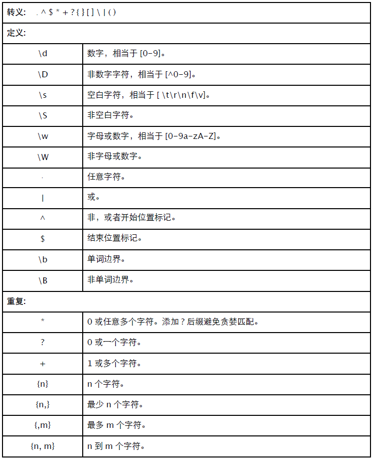
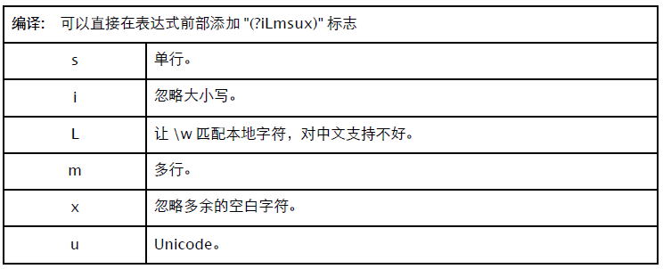
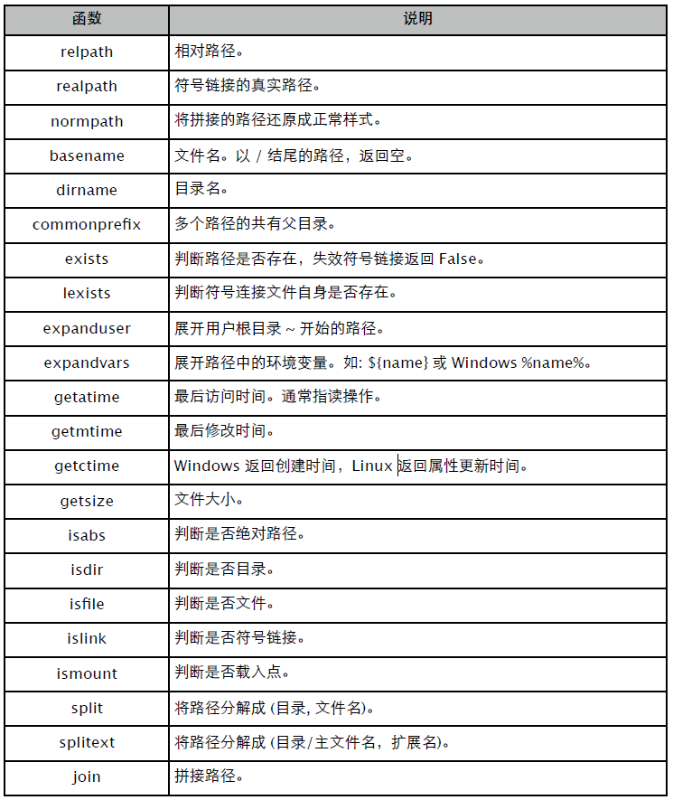
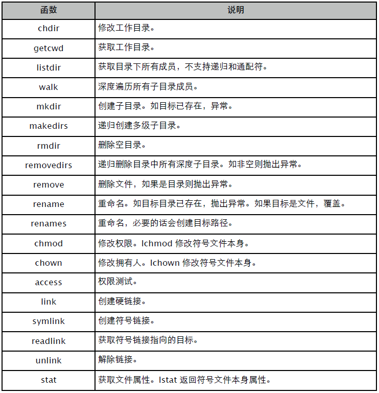
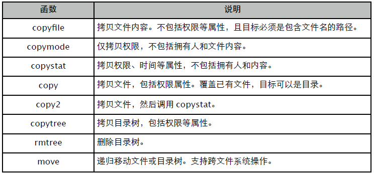

#第二部分 标准库
本部分内容尚未校对……

#第 12 章 字符串
##12.1 re
正则表达式是处理字符串最重要的一种手段。





**正则函数**

re 有几个重要的函数：

- match(): 匹配字符串开始位置。
- search(): 扫描字符串，找到第一个位置。
- findall(): 找到全部匹配，以列表返回。
- finditer(): 找到全部匹配，以迭代器返回。

match 和 search 仅匹配一次，匹配不到返回 None。

```
>>> import re

>>> s = "12abc345ab"

>>> m = re.match(r"\d+", s)
>>> m.group(), m.span()
('12', (0, 2))

>>> m = re.match(r"\d{3,}", s)
>>> m is None
True

>>> m = re.search(r"\d{3,}", s)
>>> m.group(), m.span()
('345', (5, 8))

>>> m = re.search(r"\d+", s)
>>> m.group(), m.span()
('12', (0, 2))
```

findall 返回列表 (或空列表)，finditer 和 match、search 一样返回 MatchObject 对象。

```
>>> ms = re.findall(r"\d+", s)
>>> ms
['12', '345']

>>> ms = re.findall(r"\d{5}", s)
>>> ms
[]

>>> for m in re.finditer(r"\d+", s): print m.group(), m.span()
...
12 (0, 2)
345 (5, 8)

>>> for m in re.finditer(r"\d{5}", s): print m.group(), m.span() # 返回空列表
...
>>>
```

**MatchObject**

match、search、finditer 返回的对象 —— MatchObject。

- group(): 返回匹配的完整字符串。
- start(): 匹配的开始位置。
- end(): 匹配的结束位置。
- span(): 包含起始、结束位置的元组。
- groups(): 返回分组信息。
- groupdict(): 返回命名分组信息。

```
>>> m = re.match(r"(\d+)(P<letter>[abc]+)", s)

>>> m.group()
'12abc'

>>> m.start()
0

>>> m.end()
5

>>> m.span()
(0, 5)

>>> m.groups()
('12', 'abc')

>>> m.groupdict()
{'letter': 'abc'}
```

group() 可以接收多个参数，用于返回指定序号的分组。

```
>>> m.group(0)
'12abc'

>>> m.group(1)
'12'

>>> m.group(2)
'abc'

>>> m.group(1,2)
('12', 'abc')

>>> m.group(0,1,2)
('12abc', '12', 'abc')
```

start()、end() 和 span() 同样能接收分组序号。和 group() 一样，序号 0 表示整体匹配结果。

```
>>> m.start(0), m.end(0)
(0, 5)

>>> m.start(1), m.end(1)
(0, 2)

>>> m.start(2), m.end(2)
(2, 5)

>>> m.span(0)
(0, 5)

>>> m.span(1)
(0, 2)

>>> m.span(2)
(2, 5)
```

**编译标志**

可以用 re.I、re.M 等参数，也可以直接在表达式中添加 "(iLmsux)" 标志。

- s: 单行。"." 匹配包括换行符在内的所有字符。
- i: 忽略大小写。
- L: 让 "\w" 能匹配当地字符，貌似对中文支持不好。
- m: 多行。
- x: 忽略多余的空白字符，让表达式更易阅读。
- u: Unicode。

试试看。

```
>>> re.findall(r"[a-z]+", "%123Abc%45xyz&")
['bc', 'xyz']

>>> re.findall(r"[a-z]+", "%123Abc%45xyz&", re.I)
['Abc', 'xyz']

>>> re.findall(r"(i)[a-z]+", "%123Abc%45xyz&")
['Abc', 'xyz']
```

下面这么写好看多了吧？

```
>>> pattern = r"""
... 	(\d+) # number
... 	([a-z]+) # letter
... """

>>> re.findall(pattern, "%123Abc\n%45xyz&", re.I | re.S | re.X)
[('123', 'Abc'), ('45', 'xyz')]
```

**组操作**

命名组：(P<name>...)

```
>>> for m in re.finditer(r"(P<number>\d+)(P<letter>[a-z]+)", "%123Abc%45xyz&", re.I):
... 	print m.groupdict()
...
{'number': '123', 'letter': 'Abc'}
{'number': '45', 'letter': 'xyz'}
```

无捕获组：(:...)，作为匹配条件，但不返回。

```
>>> for m in re.finditer(r"(:\d+)([a-z]+)", "%123Abc%45xyz&", re.I):
... 	print m.groups()
...
('Abc',)
('xyz',)
```

反向引用：\<number> 或 (P=name)，引用前面的组。

```
>>> for m in re.finditer(r"<a>\w+</a>", "%<a>123Abc</a>%<b>45xyz</b>&"):
... 	print m.group()
...
<a>123Abc</a>

>>> for m in re.finditer(r"<(\w)>\w+</(\1)>", "%<a>123Abc</a>%<b>45xyz</b>&"):
... 	print m.group()
...
<a>123Abc</a>
<b>45xyz</b>

>>> for m in re.finditer(r"<(P<tag>\w)>\w+</(P=tag)>", "%<a>123Abc</a>%<b>45xyz</
b>&"):
... 	print m.group()
...
<a>123Abc</a>
<b>45xyz</b>
```

正声明 (=...)：组内容必须出现在右侧，不返回。
负声明 (...)：组内容不能出现在右侧，不返回。
反向正声明 (<=)：组内容必须出现在左侧，不返回。
反向负声明 (<)：组内容不能出现在左侧，不返回。

```
>>> for m in re.finditer(r"\d+(=[ab])", "%123Abc%45xyz%780b&", re.I):
... 	print m.group()
...
123
780

>>> for m in re.finditer(r"(<\d)[a-z]{3,}", "%123Abc%45xyz%byse&", re.I):
... print m.group()
...
byse
```

更多信息请阅读官方文档或更专业的书籍。

**修改**

split: 用 pattern 做分隔符切割字符串。如果用 "(pattern)"，那么分隔符也会返回。

```
>>> re.split(r"\W", "abc,123,x")
['abc', '123', 'x']

>>> re.split(r"(\W)", "abc,123,x")
['abc', ',', '123', ',', 'x']
```

sub: 替换子串。可指定替换次数。

```
>>> re.sub(r"[a-z]+", "*", "abc,123,x")
'*,123,*'

>>> re.sub(r"[a-z]+", "*", "abc,123,x", 1)
'*,123,x'
```

subn() 和 sub() 差不多，不过返回 "(新字符串，替换次数)"。

```
>>> re.subn(r"[a-z]+", "*", "abc,123,x")
('*,123,*', 2)
```

还可以将替换字符串改成函数，以便替换成不同的结果。

```
>>> def repl(m):
... 	print m.group()
... 	return "*" * len(m.group())
...

>>> re.subn(r"[a-z]+", repl, "abc,123,x")
abc
x
('***,123,*', 2)
```

##12.2 StringIO
提供类文件接口的字符串缓冲区，可选用性能更好的 cStringIO 版本。

```
>>> from contextlib import closing
>>> from cStringIO import StringIO

>>> with closing(StringIO("ab")) as f:
... 	print >> f, "cd"
... 	f.write("1234")
... 	print f.getvalue()
abcd
1234
```

建议用 with 上下文确保调用 close() 方法释放所占用内存。用 getvalue() 返回字符串前，必须确保是打开状态 (closed = False)。

##12.3 struct
struct 看上去有点像 format，区别是它输出的是二进制字节序列。可以通过格式化参数，指定类型、长度、字节序(大小端)、内存对齐等。

```
>>> from struct import *

>>> hexstr = lambda s: map(lambda c: hex(ord(c)), s)

>>> s = pack("i", 0x1234)

>>> hexstr(s)      # 4 字节整数小端排列
['0x34', '0x12', '0x0', '0x0']

>>> unpack("i", s)      # 还原。4660 = 0x1234
(4660,)

>>> s = pack(">i", 0x1234)    # 大端

>>> hexstr(s)
['0x0', '0x0', '0x12', '0x34']

>>> s = pack("2i2s", 0x12, 0x34, "ab")   # 多值。注意指定字符串长度。

>>> hexstr(s)
['0x12', '0x0', '0x0', '0x0', '0x34', '0x0', '0x0', '0x0', '0x61', '0x62']

>>> unpack("2i2s", s)
(18, 52, 'ab')
```

还可以将结果输出到 bytearray、array、ctypes.create_str_buffer() 等缓冲对象中。

```
>>> fmt = "3bi2s"
>>> size = calcsize(fmt)   # 计算指定格式转换所需的字节长度。

>>> buffer = bytearray(size)

>>> pack_into(fmt, buffer, 0, 0x1, 0x2, 0x3, 0x1FFFFF, "ab")

>>> buffer
bytearray(b'\x01\x02\x03\x00\xff\xff\x1f\x00ab')

>>> unpack_from(fmt, str(buffer), 0)
(1, 2, 3, 2097151, 'ab')
```

#第 13 章 数据类型
##13.1 bisect
bisect 使用二分法在一个 "已排序 (sorted) 序列" 中查找合适的插入位置。

```
>>> import bisect

>>> b = [ 20, 34, 35, 65, 78 ]

>>> bisect.bisect(b, 25)  # 查找 25 在列表中的合适插入位置。
1

>>> bisect.bisect(b, 40)  # 查找 40 在列表中的合适插入位置。
3

>>> bisect.bisect_left(b, 35)  # 如果待查找元素在列表中存在，则返回左侧插入位置。
2

>>> bisect.bisect_right(b, 35)  # 如果待查找元素在列表中存在，则返回右侧插入位置。
3
```

还可以直接用 insort_left() 直接插入元素而非查找。

```
>>> bisect.insort_left(b, 25)

>>> b
[20, 25, 34, 35, 65, 78]

>>> bisect.insort_left(b, 40)

>>> b
[20, 25, 34, 35, 40, 65, 78]
```

用 bisect 实现一个 SortedList 非常简单。

```
>>> def SortedList(list, *elements):
... 	for e in elements:
... 		bisect.insort_right(list, e)
...
... 	return list

>>> SortedList([], 3, 7, 4, 1)
[1, 3, 4, 7]

>>> o = SortedList([], 3, 7, 4, 1)

>>> o
[1, 3, 4, 7]

>>> SortedList(o, 8, 2, 6, 0)
[0, 1, 2, 3, 4, 6, 7, 8]
```

可以考虑用 bisect 来实现 Consistent Hashing 算法，只要找到 Key 在 Ring 上的插入位置，其下一个有效元素就是我们的目标服务器配置。

##13.2 heapq
最小堆: 完全平衡二叉树，所有节点都小于其子节点。

堆的意义：最快找到最大/最小值。在堆结构中插入或删除最小(最大)元素时进行重新构造时间复杂度为 O(logN)，而其他方法最少为O(N)。堆在实际开发中的更倾向于算法调度而非排序。比如优先级调度时，每次取优先级最高的；时间驱动调度时，取时间最小或等待最长的等等。

```
>>> from heapq import *
>>> from random import *

>>> rand = sample(xrange(1000), 10)    # 生成随机数序列。
>>> rand
[572, 758, 737, 738, 412, 755, 507, 734, 479, 374]

>>> heap = []
>>> for x in rand: heappush(heap, x)    # 将随机数压入堆。
>>> heap        # 堆是树，并非排序列表。
[374, 412, 507, 572, 479, 755, 737, 758, 734, 738]

>>> while heap: print heappop(heap)    # 总是弹出最小元素。
374
412
479
507
572
734
737
738
755
758
```

其他相关函数。

```
>>> d = sample(xrange(10), 10)
>>> d
[9, 7, 3, 4, 0, 2, 5, 1, 8, 6]

>>> heapify(d)    # 将列表转换为堆。
>>> d
[0, 1, 2, 4, 6, 3, 5, 9, 8, 7]

>>> heappushpop(d, -1)    # 先 push(item)，后 pop。弹出值肯定小于或等于 item。
-1

>>> heapreplace(d, -1)    # 先 pop，后 push(item)。弹出值可能大于 item。
0

... ...

>>> a = range(1, 10, 2)
>>> b = range(2, 10, 2)
>>> [x for x in merge(a, b)]   # 合并有序序列。
[1, 2, 3, 4, 5, 6, 7, 8, 9]

... ...

>>> d = sample(range(10), 10)
>>> d
[9, 0, 3, 4, 5, 6, 1, 2, 8, 7]

>>> nlargest(5, list)    # 从列表(不一定是堆)有序返回最大的 n 个元素。
[9, 8, 7, 6, 5]

>>> nsmallest(5, list)    # 有序返回最小的 n 个元素。
[0, 1, 2, 3, 4]
```

利用元组 __cmp__，用数字表示对象优先级，实现优先级队列。

```
>>> from string import *

>>> data = map(None, sample(xrange(100), 10), sample(letters, 10))
>>> data
[(31, 'Z'),
(71, 'S'),
(94, 'r'),
(65, 's'),
(98, 'B'),
(10, 'U'),
(8, 'u'),
(25, 'p'),
(11, 'v'),
(29, 'i')]

>>> for item in data: heappush(heap, item)
>>> heap
[(8, 'u'),
(11, 'v'),
(10, 'U'),
(25, 'p'),
(29, 'i'),
(94, 'r'),
(31, 'Z'),
(71, 'S'),
(65, 's'),
(98, 'B')]

>>> while heap: print heappop(heap)
(8, 'u')
(10, 'U')
(11, 'v')
(25, 'p')
(29, 'i')
(31, 'Z')
(65, 's')
(71, 'S')
(94, 'r')
(98, 'B')
```

或者重载自定义类型的 __cmp__ 操作符。

#第 14 章 数学运算
##14.1 random
伪随机数生成模块。如果不提供 seed，默认使用系统时间。使用相同 seed，可获得相同的随机数序列，常用于测试。

```
>>> from random import *

>>> a = Random(); a.seed(1)

>>> [a.randint(1, 100) for i in range(20)]
[14, 85, 77, 26, 50, 45, 66, 79, 10, 3, 84, 44, 77, 1, 45, 73, 23, 95, 91, 4]

>>> b = Random(); b.seed(1)

>>> [b.randint(1, 100) for i in range(20)]
[14, 85, 77, 26, 50, 45, 66, 79, 10, 3, 84, 44, 77, 1, 45, 73, 23, 95, 91, 4]
```

**使用示例**

生成最大 N 个二进制位的长整数。

```
>>> getrandbits(5)
29L

>>> bin(getrandbits(5))
'0b11101'
```

生成 start <= N < stop 范围内的随机整数。

```
>>> randrange(1, 10)
2

>>> randrange(1, 10, 3)   # 支持步进
4

>>> randrange(1, 10, 3)
1

>>> randrange(1, 10, 3)
7
```

生成 a <= N <= b 范围内的整数。

```
>>> randint(1, 10)
5
```

从序列中随机返回元素。

```
>>> import string

>>> string.digits
'0123456789'

>>> choice(string.digits)
'6'

>>> choice(string.digits)
'1'

>>> choice(string.digits)
'3'
```

打乱序列，随机洗牌。

```
>>> a = range(10)

>>> shuffle(a)

>>> a
[6, 4, 8, 7, 5, 3, 0, 9, 2, 1]
```

从序列中随机挑选 n 个不同元素组合成列表。

```
>>> string.letters
'abcdefghijklmnopqrstuvwxyzABCDEFGHIJKLMNOPQRSTUVWXYZ'

>>> sample(string.letters, 10)
['I', 'F', 'W', 'O', 'r', 'o', 'A', 'K', 'i', 'h']

>>> "".join(sample(string.letters, 10))  # 生成指定长度的随机字符串很容易
'kMmSgPVWIi'

>>> "".join(sample(string.letters, 10))
'feCTyRZrHv'
```

生成 0.0 <= N < 1 的随机浮点数。

```
>>> random()
0.39559451765020448

>>> random()
0.62378508101496177
```

生成 min <= N <= max 范围内的随机浮点数。

```
>>> uniform(1, 10)
7.6889886379206587

>>> uniform(10, 1)
5.1617099528426609
```

该模块还支持三角、β分布、指数分布、伽马分布、高斯分布等非常专业的随机算法。

#第 15 章 文件与目录
##15.1 file
通常建议用内置函数 open() 打开文件，file 用于类型判断。

```
>>> with open("test.txt", "w") as f:
... 	print isinstance(f, file)   // 类型判断
... 	f.writelines(map(str, range(10)))

True
```

File Object 实现了上下文协议，可确保文件被及时关闭。实际上，文件对象被回收时总是会调用 close 方法，所以可以写下面这样的代码。

```
>>> open("test.txt", "r").read()
'0123456789'
```

如果要把数据写到磁盘上，除调用 flush() 外，还得用 sync()，以确保数据从系统缓冲区同步到磁盘。close() 总是会调用这两个方法。

打开模式：

- r: 只读。
- w: 只写。已存在文件将被清除 (truncate)。
- a: 添加。总是添加到文件尾部。
- b: 二进制模式。
- r+: 更新文件，可读写，不会截短文件。
- w+: 更新文件，可读写，清除原有内容。
- a+: 更新文件，可读写，总是在尾部添加。

文件对象还实现了迭代器协议，可直接循环获取其内容。

```
>>> with open("main.py", "r") as f:
... 	for line in f: print line
...
```

读方法总能判断不同平台的换行标记，但写方法不会添加任何换行字符，包括 writelines。

```
>>> with open("test.txt", "w") as f:
... 	f.write("a")
... 	f.writelines("bc")

>>> cat test.txt
abc
```

如必须按不同平台写入换行标记，可使用 os.linesep。

```
>>> os.linesep
'\n'
```

字符串本身就是序列类型，可以直接用 writelines(str)。readline() 会返回包括换行符在内的整个行数据。通常建议用迭代器或 xreadlines() 代替 readlines()，后者默认一次性读取整个文件。

##15.2 binary
用 struct 将其他类型构建成二进制字节数组，然后写入文件即可。

```
>>> import struct

>>> data = struct.pack("2i2s", 0x1234, 0xFF56, "ab")
>>> open("test.dat", "w").write(data)

>>> !xxd -g 1 test.dat
0000000: 34 12 00 00 56 ff 00 00 61 62 4...V...ab

>>> struct.unpack("2i2s", open("test.dat").read())
(4660, 65366, 'ab')

>>> with open("test.dat") as f:   // 结构化读取
... 	def xread(fmt):
... 		n = struct.calcsize(fmt)  // 计算长度
... 		s = f.read(n)
... 		return struct.unpack(fmt, s)
... 	print xread("i")
... 	print xread("i")
... 	print xread("2s")

(4660,)
(65366,)
('ab',)
```

对于相同类型的数据，可考虑用 array，以获得更好的性能。

```
>>> import array

>>> datas = array.array("i")
>>> datas.append(0x1234)
>>> datas.append(0xFF56)
>>> datas.tofile(open("test.dat", "w"))

>>> !xxd -g 1 test.dat
0000000: 34 12 00 00 56 ff 00 00 4...V...

>>> d2 = array.array("i")
>>> d2.fromfile(open("test.dat"), 2)
>>> d2
array('i', [4660, 65366])
```

类似的还有 bytearray，可作 Buffer 用，详情参见 struct 章节。

##15.3 encoding
标准库 codecs 提供了一个包装版的 open()，可自动完成编码转换工作。

```
>>> import sys
>>> reload(sys)
>>> sys.setdefaultencoding("utf-8")

>>> with codecs.open("test.txt", "w", "gbk") as f:
... 	f.write("中国")

>>> !xxd -g 1 test.txt
0000000: d6 d0 b9 fa ....

>>> "中国".encode("gbk")
'\xd6\xd0\xb9\xfa'

>>> s = codecs.open("test.txt", encoding = "gbk").read()
>>> s
u'\u4e2d\u56fd'
>>> print s
中国
```

##15.4 descriptor
除使用文件对象外，某些时候还可能需要直接操控文件描述符。

```
>>> import os

>>> fd = os.open("test.txt", os.O_CREAT | os.O_RDWR, 0644) // 注意是八进制。

>>> ls -l test.txt
-rw-r--r-- 1 yuhen staff 6 3 25 10:45 test.txt

>>> os.write(fd, "abc")
3

>>> f = os.fdopen(fd, "r+")  // 通过描述符创建文件对象。
>>> f.seek(0, os.SEEK_SET)  // 注意调整位置。
>>> f.read()
'abc'
>>> f.write("123")
>>> f.flush()    // os 库提供的函数是系统调用，因此需要把数据从用户缓存
      // 刷新到系统缓存。

>>> os.lseek(fd, 0, os.SEEK_SET)
0

>>> os.read(fd, 100)
'abc123'

>>> os.close(fd)    // 通常建议用和打开对应的方式关闭。
```

文件对象 fileno() 方法返回其对应的文件描述符。

##15.5 tempfile
Python 对临时文件的支持算是我所见过语言中最丰富的。通常建议使用 NamedTemporaryFile，其他可以忽略。

- TemporaryFile: 创建临时文件对象，关闭时自动删除。
- NamedTemporaryFile: 创建临时文件对象，可获取文件名，参数决定是否自动删除。
- SpooledTemporaryFile: 和 TemporaryFile 类似，只有在数据超过阈值时，才写入硬盘。

```
>>> import tempfile, os.path

>>> tmp = tempfile.NamedTemporaryFile()
>>> tmp.name
'/var/folders/r2/4vkjhz6s6lz02hk6nh2qb99c0000gn/T/tmpYYB6p3'

>>> os.path.exists(tmp.name)
True

>>> tmp.close()
>>> os.path.exists(tmp.name)
False
```

默认使用系统临时目录和前缀，当然也可以指定不同的配置。

```
>>> with tempfile.NamedTemporaryFile(prefix = "xxx_", suffix = ".tmp", dir = ".") as f:
... 	print f.name
...
/Users/yuhen/test/xxx_SL3apY.tmp
```

与临时文件有关的函数还有：
- tempfile.gettempdir: 返回系统临时文件存放路径。
- tempfile.gettempprefix: 返回默认的临时文件名前缀。
- tempfile.mkdtemp: 创建临时目录。
- tempfile.mkstemp: 创建临时文件，返回描述符和文件名，需手工删除。
- os.tempnam: 仅返回有效的临时文件名，并不创建文件。
- os.tmpfile(): 创建临时文件对象，关闭后自动删除。

```
>>> tempfile.gettempdir()
'/var/folders/r2/4vkjhz6s6lz02hk6nh2qb99c0000gn/T'

>>> tempfile.gettempprefix()
'tmp'
```

```
>>> d = tempfile.mkdtemp(); d
'/var/folders/r2/4vkjhz6s6lz02hk6nh2qb99c0000gn/T/tmpE_bRWd'

>>> os.path.exists(d)
True

>>> os.removedirs(d)
```

```
>>> fd, name = tempfile.mkstemp()

>>> os.write(fd, "123\n")
4

>>> os.close(fd)

>>> os.path.exists(name)
True

>>> os.remove(name)
```

##15.6 os.path
常用函数列表：




拼接的目录看上乱糟糟让人烦心。

```
>>> os.path.normpath("./../a/b/../c")
'../a/c'
```

展开用户根路径，或者包含系统环境变量的路径。

```
>>> os.path.expanduser("~/.vimrc")
'/Users/yuhen/.vimrc'

>>> os.path.expandvars("$HOME/.vimrc")
'/Users/yuhen/.vimrc'
```

除非只要扩展名，否则还是先用 basename 将路径去掉。

```
>>> os.path.splitext(os.path.basename("/usr/local/lib/libevent.a"))
('libevent', '.a')
```

##15.7 os
常用函数列表：




迭代 walk，返回 "(路径，子目录列表，文件列表)"，可配合 fnmatch 做通配符过滤。

```
>>> for path, dirs, files in os.walk("."):
... 	for f in files:
... 		if fnmatch.fnmatch(f, "*.py"):
... 			print os.path.join(path, f)

./main.py
./bak/amqplib_test.py
./bak/eventlet_test.py
./bak/extract_text.py
./bak/fabric_test.py
```

如果仅操作当前目录，可以用 glob 代替 listdir，前者支持通配符。

```
>>> glob.glob("./bak/[rs]*.py")    # 迭代器版本: iglob
['./bak/redis_test.py', './bak/socket_test.py']
```

如目录中还有文件存在，removedirs 会抛出异常。建议用 shutil.rmtree() 代替，注意参数区别。

```
>>> os.makedirs("./a/b/c")
>>> open("./a/b/c/test.txt", "w").write("abc")

>>> os.removedirs("./a/b/c")
OSError: [Errno 66] Directory not empty: './a/b/c'

>>> import shutil
>>> shutil.rmtree("./a")
```

某些时候，需要先测试文件是否拥有某些权限。

```
>>> os.access("a.txt", os.W_OK)
True
```

都是哪些人需要修改文件时间？

```
>>> stat -x a.txt
	File: "a.txt"
	Size: 0 FileType: Regular File
	Mode: (0644/-rw-r--r--) Uid: ( 501/ yuhen) Gid: ( 20/ staff)
Device: 1,2 Inode: 5111644 Links: 1
Access: Mon Mar 25 17:43:01 2013
Modify: Mon Mar 25 17:43:01 2013
Change: Mon Mar 25 17:43:01 2013
>>> atime = time.mktime(datetime.datetime(2010, 10, 1).utctimetuple())
>>> mtime = time.mktime(datetime.datetime(2010, 11, 2).utctimetuple())
>>> os.utime("a.txt", (atime, mtime))

>>> os.stat("a.txt").st_atime == atime
True
```

获取文件权限信息时，别忘了转换成八进制。

```
>>> oct(os.stat("a.txt").st_mode)
'0100644'
```

##15.8 shutil
常用函数列表：



copytree 可以指定多个忽略通配符，且必须确保目标路径不存在。

```
>>> shutil.copytree("./bak", "./b/bak", ignore = shutil.ignore_patterns("*.pyc",
"*.bak"))
```

#第 16 章 数据存储
##16.1 serialization
**marshal**

Python 专用的序列化算法，PyCodeObject 就是用该算法序列化后保存到 pyc 二进制文件。与具体的机器架构无关，但可能随 Python 版本发生变化。通常不建议用来存储自定义数据。

支持：None, bool, int, long, float, complex, str, unicode, tuple, list, set, frozenset, dict,code objects, StopIteration。容器元素必须是所支持类型，不能是递归引用。

```
>>> from marshal import dump, load, dumps, loads

>>> s = dumps(range(10))
>>> s
'[\n\x00\x00\x00i\x00\...\x00\x00'

>>> loads(s)
[0, 1, 2, 3, 4, 5, 6, 7, 8, 9]
```

保存序列化结果到文件。

```
>>> with file("test.dat", "w") as f:
... 	dump(range(10), f)

>>> with file("test.dat", "r") as f:
... 	print load(f)

[0, 1, 2, 3, 4, 5, 6, 7, 8, 9]
```

**pickle**

应该用 cPickle 代替 pickle，按官方文档的说法有千倍的提升，且可相互替换。支持用户自定义类型，支持三种协议版本：

- 0: 使用可显示的 ASCII 字符编码，便于阅读和手工编辑。(默认)
- 1: 兼容早期 Python 版本的二进制格式。
- 2: 最有效的二进制编码格式。

```
>>> import pickle, cPickle

>>> s = "Hello, World"
>>> d = cPickle.dumps(s, 2)
>>> d
'\x80\x02U\rHello, Worldq\x01.'

>>> cPickle.loads(d)
'Hello, World'

>>> pickle.loads(d)   # 和 pickle 格式完全相同。
'Hello, World'
```

同样有读写文件的 dump、load 函数。看看支持的数据类型：

- None, True, False
- int, long, float, complex
- str, unicode
- tuple, list, set, and dict (元素必须是支持类型)
- function (模块级别的函数)
- classe (模块级别的自定义类，非嵌套)
- instance (有 __dict__ 属性，或者实现 pickle protocol 协议)

看看对自定义类型的测试。

```
>>> class Data(object):
... 	def __init__(self, x, y):
... 		print "__init__"
... 		self._x = x
... 		self._y = y

>>> d = Data(100, 200)
__init__

>>> s = cPickle.dumps(d, 2)

>>> d2 = cPickle.loads(s)  # 反序列化并没有调用 __init__
>>> d2.__dict__
{'_x': 100, '_y': 200}
```

利用 pickle protocol 可以控制序列化的细节。比如下面例子中，我们不像保留 _y 字段。

```
>>> class Data(object):
... 	def __init__(self, x, y):
... 		self._x = x
... 		self._y = y
...
... 	def __getstate__(self):
... 		d = self.__dict__.copy()
... 		del d["_y"]
... 	return d
...
... 	def __setstate__(self, state):
... 		self.__dict__.update(state)

>>> d = Data(10, 20)

>>> s = cPickle.dumps(d, 2)

>>> d2 = cPickle.loads(s)
>>> d2.__dict__
{'_x': 10}
```

##16.2 shevle
将对象 pickle 序列化，然后保存到 anydbm 格式文件。anydbm 是个 KV 结构的数据库，可以保存多个序列化的对象。当然也可以选择使用 dbm、gdbm、bdb。

- flag: r 读, w 写, c 读写, n 新建、读写。
- protocol: pickle 版本。
- writeback: 允许将变更的对象同步到数据库。(还是显式修改保存比较好)

```
>>> import shelve
>>> from contextlib import closing

>>> with closing(shelve.open("test", protocol = 2)) as f:
... f["a"] = dict(name = "Tom", age = 34, sex = "male")
... f["b"] = (1, ["a", 3], "abcdefg")

>>> !xxd -g 1 -l 100 test.db
0000000: 00 06 15 61 00 00 00 02 00 00 04 d2 00 00 10 00 ...a............
0000010: 00 00 00 0c 00 00 01 00 00 00 01 00 00 00 00 08 ................
0000050: 00 00 00 00 00 00 00 00 00 00 00 00 00 00 00 00 ................
0000060: 00 00 00 00 ....

>>> with closing(shelve.open("test", protocol = 2)) as f:
... 	print f["a"]
... 	print f["b"]
... 	print ["c"]

{'age': 34, 'name': 'Tom', 'sex': 'male'}
(1, ['a', 3], 'abcdefg')
['c']
```

#第 17 章 数据压缩

#第 18 章 格式解析

#第 19 章 数据加密

#第 20 章 操作系统
##20.1 time
Unix-Like 系统使用自基准点以来消逝的秒数来表达绝对时间。

- 绝对时间: 某个绝对精确的时间值。如 2010-11-1 13:48:05 。
- 相对时间: 相对于某个时间的前后差。如 5分钟以前。
- epoch: 基准点。1970-01-01 00:00:00 UTC。
- UTC: 协调世界时。世界不同时区的一个基准，比如中国为 UTC+8。
- DST: 阳光节约时 (夏时制)。好在我国已经取消了，真麻烦。

用 time() 返回自 epoch 以来的秒数，gmtime()、localtime() 将其转换为 struct_time 结构体。

```
>>> from time import *

>>> t = time()
>>> t
1357761634.903692

>>> gmtime(t)   # epoch -> UTC
time.struct_time(tm_year=2013, tm_mon=1, tm_mday=9, tm_hour=20, tm_min=0, tm_sec=34,
tm_wday=2, tm_yday=9, tm_isdst=0)

>>> localtime(t)   # epoch -> Local (UTC+8)
time.struct_time(tm_year=2013, tm_mon=1, tm_mday=10, tm_hour=4, tm_min=0, tm_sec=34,
tm_wday=3, tm_yday=10, tm_isdst=0)
```

将 struct_time 转回 epoch。

```
>>> from calendar import timegm

>>> t = time()
>>> t
1357762219.162796

>>> utc = gmtime(t)  # epoch -> UTC
>>> timegm(utc)   # UTC -> epoch
1357762219

>>> local = localtime(t)  # epoch -> local
>>> mktime(local)   # local -> epoch
1357762219
```

与 datetime 的转换，注意返回的是 localtime 时间。

```
>>> from datetime import datetime
>>> from time import time

>>> t = time()

>>> d = datetime.fromtimestamp(t)  # localtime 时间
>>> d
datetime.datetime(2013, 1, 10, 4, 20, 27, 301148)

>>> d.timetuple()
time.struct_time(tm_year=2013, tm_mon=1, tm_mday=10, tm_hour=4, tm_min=20, tm_sec=27,
tm_wday=3, tm_yday=10, tm_isdst=-1)
```

相关函数：

ctime: 将 epoch 转换为字符串。
asctime: 将 struct_time 转换为字符串。

```
>>> t = time()

>>> ctime(t)
'Thu Jan 10 04:26:01 2013'

>>> asctime(localtime(t))
'Thu Jan 10 04:26:01 2013'
```

clock: 返回当前进程消耗的CPU时间 (秒)。
sleep: 暂停进程 (秒，可以是小数，以便设置毫秒、微秒级暂停)。

```
>>> clock()
0.56022400000000006

>>> sleep(0.1)
```

strftime: 将 struct_time 格式化为字符串。
strptime: 将字符串格式化为 struct_time。

```
>>> t = time()

>>> s = strftime("%Y-%m-%d %H:%M:%S", localtime(t))
>>> s
'2013-01-10 04:27:39'

>>> strptime(s, "%Y-%m-%d %H:%M:%S")
time.struct_time(tm_year=2013, tm_mon=1, tm_mday=10, tm_hour=4, tm_min=27, tm_sec=39,
tm_wday=3, tm_yday=10, tm_isdst=-1)
```

timezone: 与 UTC 的时差。
tzname: 当前时区名称。

```
>>> timezone / 3600
-8

>>> tzname    # 北京时间，China Standard Time
('CST', 'CST')
```

##20.2 threading
尽管因为 GIL 的缘故，Python 多线程一直遭受种种非议。但作为多个并发执行流程，多线程是无法完全用 "手工" 切换的协程来替代的。

###20.2.1 Thread
创建 Thread 实例，传入待执行函数。

```
>>> from threading import Thread, currentThread, activeCount

>>> def test(s):
... 	print "ident:", currentThread().ident
... 	print "count:", activeCount()
... 	print s
...

>>> Thread(target = test, args = ("Hello",)).start()
ident: 4353970176
count: 3
Hello
```

除了标识符，还可以线程取个名字，这有助于调试。

还可以继承 Thread 实现自己的线程类。

```
>>> class MyThread(Thread):
... 	def __init__(self, name, *args):
... 		super(MyThread, self).__init__(name = name)
... 		self.data = args
...
... 	def run(self):
... 		print self.name, self.data

>>> MyThread("abc", range(10)).start()
abc ([0, 1, 2, 3, 4, 5, 6, 7, 8, 9],)
```

将线程 daemon 属性设为 True，那么表示这是一个背景线程，进程退出时不会等待该线程结束。

调用 join() 等待线程结束，可提供超时参数 (秒，浮点数设定更小粒度)。isAlive() 检查线程状态，join() 可多次调用。

```
>>> from time import sleep

>>> def test():
... 	print "__thread_start__"
... 	sleep(10)
... 	print "__thread_exit__"

>>> def run():
... 	t = Thread(target = test)
... 	t.start()
... 	t.join(2)   // 超时
...
... 	print t.isAlive() // 检查状态
... 	t.join()   // 再次等待
...
... 	print "over"

>>> run()
__thread_start__
True
__thread_exit__
over!
```

###20.2.2 Lock
Lock 不支持递归加锁，也就是说即便在同一线程中，也必须等待锁释放。通常建议改用 RLock，它会处理 "owning thread" 和 "recursion level" 状态，对于同一线程的多次请求锁行为，只累加计数器。每次调用 release() 将递减该计数器，直到 0 时释放锁，因此 acquire() 和 release() 必须要成对出现。

threading 中的成员大多实现了上下文协议，尽可能用 with 代替手工调用。

```
>>> lock = RLock()

>>> def show(i):
... 	with lock:     // 递归请求锁
... 		print currentThread().name, i
... 		sleep(0.1)

>>> def test():
... 	with lock:     // 加锁
... 		for i in range(5):
... 			show(i)

>>> for i in range(2):
... 	Thread(target = test).start()

Thread-1 0
Thread-1 1
Thread-1 2
Thread-1 3
Thread-1 4
Thread-2 0
Thread-2 1
Thread-2 2
Thread-2 3
Thread-2 4
```

###20.2.3 Event
Event 通过通过一个内部标记来协调多线程运行。方法 wait() 阻塞线程执行，直到标记为 True。set() 将标记设为 True，clear() 更改标记为 False。isSet() 用于判断标记状态。

```
>>> def test():
... 	e = Event()
... 	def test():
... 		for i in range(5):
... 			e.wait()
... 			e.clear()
... 			print i
...
... 	Thread(target = test).start()
... 	return e

>>> e = test()

>>> e.set()
0
>>> e.set()
1
```

如果不调用 clear()，那么标记一直为 True，wait() 就不会发生阻塞行为。

在实际编程中，我们通常为每个线程准备一个独立的 Event，而不是多个线程共享，以避免未及时调用 clear() 时发生意外情况。

###20.2.4 Condition

Condition 像 Lock 和 Event 的综合体，除基本的锁操作外，还提供了类似 yield 的功能。在获取锁以后，可以调用 wait() 临时让出锁，当前线程被阻塞，直到 notify() 发送通知后再次请求锁来恢复执行。将 wait 当做 yield，那么 notify 就是 send。

可以将已有的锁对象传给 Condition。

```
>>> def t1():
... 	with cond:
... 		for i in range(5):
... 			print currentThread().name, i
... 			sleep(0.1)
... 			if i == 3: cond.wait()

>>> def t2():
... 	with cond:
... 		for i in range(5):
... 			print currentThread().name, i
... 			sleep(0.1)
... 		cond.notify()

>>> Thread(target = t1).start(); Thread(target = t2).start()
Thread-1 0
Thread-1 1
Thread-1 2
Thread-1 3   // 让出锁
Thread-2 0
Thread-2 1
Thread-2 2
Thread-2 3
Thread-2 4
Thread-1 4   // 重新获取锁，继续执行。
```

只有获取锁的线程才能调用 wait() 和 notify()，因此必须在锁释放前调用。

当 wait() 释放锁后，其他线程也可进入 wait 状态。notifyAll() 激活所有等待线程，让它们去抢锁然后完成后续执行。

```
>>> def test():
... 	with cond:
... 		for i in range(5):
... 		print currentThread().name, i
... 		sleep(0.1)
... 		if i == 2: cond.wait()

>>> Thread(target = t1).start(); Thread(target = t1).start()
Thread-1 0
Thread-1 1
Thread-1 2     // Thread-1: 等待
Thread-2 0
Thread-2 1
Thread-2 2     // Thread-2: 等待

>>> with cond: cond.notifyAll()  // 通知所有 cond.wait 线程。
Thread-2 3     // Thread-1 和 Thread-2 再次抢锁以完成后续执行，
Thread-2 4     // 至于谁先抢到，就不好说了。
Thread-1 3
Thread-1 4
```

###20.2.5 Semaphore
Semaphore 通过一个计数器来限制可同时运行的线程数量。计数器表示还可以运行的线程数量，acquire() 递减计数器，release() 则是增加计数器。

```
>>> sem = Semaphore(2)

>>> def test():
... 	with sem:
... 		for i in range(5):
... 			print currentThread().name, i
... 			sleep(0.1)

>>> for i in range(3):
... 	Thread(target = test).start()

Thread-1 0   // 1 和 2 同时执行。因为计数器为 0，所以 3 被阻塞。
Thread-2 0
Thread-1 1
Thread-2 1
Thread-1 2
Thread-2 2
Thread-1 3
Thread-2 3
Thread-1 4
Thread-2 4
Thread-3 0   // 1 和 2 释放信号量，3 开始执行。
Thread-3 1
Thread-3 2
Thread-3 3
Thread-3 4
```

###20.2.6 Timer
用一个独立线程在 n 秒后执行某个函数。如定时器尚未执行，可用 cancel() 取消，定时器仅执行一次。

```
>>> def test():
... 	print datetime.datetime.now()

>>> Timer(2, test).start()
2013-03-26 11:06:19.840455
```

###20.2.7 Local
TLS (thread-local storage) 为线程提供独立的存储空间。

```
>>> data = local()

>>> def test(fn, x):
... 	data.x = x
... 	for i in range(5):
... 		data.x = fn(data.x)
... 		print currentThread().name, data.x
... 		sleep(0.1)

>>> t1 = (lambda x: x + 1, 0)
>>> t2 = (lambda x: x + "a", "a")

>>> for d in (t1, t2):
... 	Thread(target = test, args = d).start()

Thread-1 1
Thread-2 aa
Thread-2 aaa
Thread-1 2
Thread-2 aaaa
Thread-1 3
Thread-2 aaaaa
Thread-1 4
Thread-1 5
Thread-2 aaaaaa
```

##20.3 multiprocessing
看上去和 threading 类似，区别在于用进程代替线程。这是规避 GIL，实现多核并发的常用方法。

###20.3.1 Process
创建子进程执行指定函数。

```
from multiprocessing import Process, current_process

def test(*args, **kwargs):
	p = current_process()
	print p.name, p.pid
	print args
	print kwargs

if __name__ == "__main__":
	p = Process(target=test, args=(1, 2), kwargs = {"a": "hello"}, name = "TEST")
	p.start()
	p.join()
```

输出:

```
TEST, 2570
(1, 2)
{'a': 'hello'}
```

方法 start() 创建子进程，然后在新进程中通过 run() 执行目标函数。构建参数 args、kwargs 会传递给目标函数。在父进程中用 join() 等待并获取子进程退出状态，否则会留下僵尸进程，除非父进程先终止。

从下例输出结果，可以看到 __init__() 在父进程执行，但 run() 已经是子进程了。

```
class MyProcess(Process):
	def __init__(self):
		print "init:", os.getpid()
		super(MyProcess, self).__init__()
	
	def run(self):
		print "run:", os.getpid()

if __name__ == "__main__":
	print "parent:", os.getpid()
	p = MyProcess()
	p.start()
	p.join()
```

输出:

```
parent: 12093
init: 12093
run: 12094
```

子进程不会调用退出函数，而且只有后台 (daemon) 进程才可捕获主进程退出信号，默认处理自然是终止子进程。另外，后台进程不能创建新的子进程，这将导致僵尸出现。

```
from os import getpid
from time import sleep
from signal import signal, SIGTERM
from multiprocessing import Process

def test():
	def handler(signum, frame):
		print "child exit.", getpid()
		exit(0)

	signal(SIGTERM, handler)
	print "child start:", getpid()
	while True: sleep(1)

if __name__ == "__main__":
	p = Process(target = test)
	p.daemon = True   # 必须在 start() 前设置。
	p.start()

	sleep(2)    # 给点时间让子进程进入 "状态"。
	print "parent exit."
```

输出:

```
child start: 12185
parent exit.
child exit. 12185
```

调用 terminate() 会立即强制终止子进程 (不会执行任何清理操作)。有关状态还有: is_alive()、pid、exitcode。

###20.3.2 Pool
进程池。用多个可重复使用的后台 (daemon) 进程执行函数，默认数量和 CPU 核相等。

```
from multiprocessing import Pool

def test(*args, **kwargs):
	print args
	print kwargs
	return 123
if __name__ == "__main__":
	pool = Pool()
	print pool.apply(test, range(3), dict(a=1, b=2))
	pool.close()
	pool.join()
```

输出:

```
(0, 1, 2)
{'a': 1, 'b': 2}
123
```

调用 join() 等待所有工作进程结束前，必须确保用 close() 或 terminate() 关闭进程池。close() 阻止提交新任务，通知工作进程在完成全部任务后结束。该方法立即返回，不会阻塞等待。

使用异步模型时，callback 是可选的。

```
from multiprocessing import Pool
from time import sleep

def test(*args, **kwargs):
	sleep(2)
	return 123

def callback(ret):
	sleep(2)
	print "return:", ret

if __name__ == "__main__":
	pool = Pool()
	pool.apply_async(test, callback=callback)

	ar = pool.apply_async(test)
	print ar.get()

	pool.close()
	pool.join()
```

apply_async 返回 AsyncResult 实例，其 get([timeout])、wait()、successful() 等方法可获知任务执行状态和结果。

map() 和 imap() 用于批量执行，分别返回列表和迭代器结果。

```
from multiprocessing import Pool, current_process

def test(x):
	print current_process().pid, x
	return x + 100

def test2(s):
	print current_process().pid, s

if __name__ == "__main__":
	pool = Pool(3)

	print pool.map(test, xrange(5))
	pool.map(test2, "abc")
```

输出:

```
1566 0
1567 1
1566 3
1568 2
1567 4
[100, 101, 102, 103, 104]

1566 a
1568 b
1567 c
```

参数 chunksize 指定数据分块大小，如果待处理数据量很大，建议调高该参数。

```
if __name__ == "__main__":
	pool = Pool(3)
	print pool.map(test, xrange(10), chunksize=2)
```

输出:

```
1585 0    # 实际输出顺序可能不同。
1585 1
1586 2
1586 3
1587 4
1587 5
1585 6
1585 7
1586 8
1586 9
[100, 101, 102, 103, 104, 105, 106, 107, 108, 109]
```

###20.3.3 Queue
Queue 是最常用的数据交换方法。参数 maxsize 限制队列中的数据项数量，这会影响 get/put 等阻塞操作。默认值无限制。

通常直接使用 JoinableQueue，其内部使用 Semaphore 进行协调。在执行 put()、task_done()时调整信号量计数器。当 task_done() 发现计数值等于 0，立即通知 join() 解除阻塞。

```
from Queue import Empty
from multiprocessing import Process, current_process, JoinableQueue

def test(q):
	pid = current_process().pid
	while True:
		try:
		d = q.get(timeout=2)   # 阻塞 + 超时。照顾生产者未及生产情形。
		print pid, d
		q.task_done()
	except Empty:
		print pid, "empty"
		break

if __name__ == "__main__":
	q = JoinableQueue(maxsize=1000)

	map(q.put, range(5))     # 未超出队列容量限制，不会阻塞。
	print "put over"

	for i in range(3):      # 创建多个 consumer。
		Process(target=test, args=(q,)).start()

	q.join()       # 等待任务完成。
	print "task done"
```

输出:

```
put over
2127 0
2127 1
2127 2
2127 3
2127 4
task done
2127 empty
2128 empty
2129 empty
```

或许你会考虑压入同等数量的 None 作为结束标志，但无法保证每个 Consumer 都能获取。

##20.4 argparse
命令行参数解析模块。原 optparse 已经停止开发，建议替换为 argparse。

###20.4.1 parser
ArgumentParser 默认解析来源 sys.argv，也可提供显式参数进行解析。

构造参数中，通常只需关心 description 和 epilog。前者显示程序标题，后者在帮助信息的尾部显示详细的版权、使用描述等。

```
>>> from argparse import ArgumentParser
>>> parser = ArgumentParser(description="Test Program", epilog="author:qyuhen")
>>> parser.add_argument("-x", help="xxx...")

>>> parser.print_help()
usage: ipython [-h] [-x X]

Test Program

optional arguments:
-h, --help show this help message and exit
-x X xxx...

author:qyuhen
```

方法 parse_args 显式列表参数可用 string.split 或 shlex.split 分解。

```
>>> args = parser.parse_args("-x 123".split())
>>> args
Namespace(x='123')
```

###20.4.2 argument
参数分为可选参数 (optional) 和 位置参数 (positional) 两种，前者用指定前缀 (默认是 "-") 标识。

```
>>> parser = ArgumentParser()
>>> parser.add_argument("-name", help="name...")
>>> parser.add_argument("x", help="x...")

>>> parser.print_help()
usage: ipython [-h] [-name NAME] x

positional arguments:
x x...

optional arguments:
	-h, --help show this help message and exit
	-name NAME name...

>>> parser.parse_args("-name q.yuhen 123".split())
Namespace(name='q.yuhen', x='123')
```

可选参数名可以有多个，键值间可以有 "="，而且单字符名称的参数键值可以合并。

```
>>> parser = ArgumentParser()
>>> parser.add_argument('-x', "-XX")

>>> parser.print_help()
usage: ipython [-h] [-x X]

optional arguments:
	-h, --help show this help message and exit
	-x X, -XX X

>>> parser.parse_args("-x 100".split()) # 普通方式
Namespace(x='100')

>>> parser.parse_args("-x=100".split()) # 使用等号
Namespace(x='100')

>>> parser.parse_args("-x100".split())  # 合并键值
Namespace(x='100')

>>> parser.parse_args("-XX 100".split()) # 其他名称
Namespace(x='100')

>>> parser.parse_args("-XX100".split()) # 仅单字符名可以合并
error: unrecognized arguments: -XX100
```

如果参数值是包含空格的字符串，注意用引号或转义处理。

```
>>> parser = ArgumentParser()
>>> parser.add_argument("-s")

>>> parser.parse_args(shlex.split("-s='a b c'")) # 不能用 string.split()
Namespace(s='a b c')

>>> parser.parse_args(shlex.split("-s=a\ b\ c"))
Namespace(s='a b c')
```

可选参数默认返回 None，可用 default 参数或 parser.set_defaults 方法指定默认值。如果参数是必须的，只需设定 required=True 即可。

```
>>> parser = ArgumentParser()
>>> parser.add_argument("-x", default=123)
>>> parser.add_argument("-y", required=True)

>>> parser.parse_args()
error: argument -y is required

>>> parser.parse_args("-y abc".split())
Namespace(x=123, y='abc')
```

除非用 dest 指定值存储名称，否则和参数名相同。metavar 用于修改参数值显示标记，默认使用 dest 大写名称。metavar 不会影响 dest 设置。

```
>>> parser = ArgumentParser()
>>> parser.add_argument("-n", dest="name")
>>> parser.add_argument("-x", dest="x", metavar="value")

>>> parser.print_help()
usage: ipython [-h] [-n NAME] [-x value]

optional arguments:
	-h, --help show this help message and exit
	-n NAME
	-x value

>>> parser.parse_args("-n q.yuhen -x 123".split())
Namespace(name='q.yuhen', x='123')
```

type 参数用于指定值转换函数，比如内置函数 int、float、file，也可以自定义函数。

```
>>> parser = ArgumentParser()
>>> parser.add_argument("-x", type=int)
>>> parser.add_argument("-s", type=lambda s: "s:"+s)

>>> parser.parse_args("-x 123 -s abc".split())
Namespace(s='s:abc', x=123)
```

nargs 指示参数值数量，默认为 1。除具体的数字外，还可以使用通配符。

- : 0 或 1。
- *: 0 或 N。
- +: 1 或 N。
- REMAINDER: 所有剩下的值。

```
>>> parser = ArgumentParser()
>>> parser.add_argument("-x", nargs="+")
>>> parser.add_argument("-y", nargs="")
>>> parser.add_argument("n", nargs=2)
>>> parser.add_argument("args", nargs=REMAINDER)

>>> parser.print_help()
usage: ipython [-h] [-x X [X ...]] [-y [Y]] n n ...

positional arguments:
	n
	args

optional arguments:
	-h, --help show this help message and exit
	-x X [X ...]
	-y [Y]
>>> parser.parse_args("-x x1 x2 -y y1 1 2 a b c -xxx".split())
Namespace(args=['a', 'b', 'c', '-xxx'], n=['1', '2'], x=['x1', 'x2'], y='y1')
```

action 用于指定参数取值行为。

- store: 默认，仅存储。
- store_const: 返回 const 或 default 值。
- store_true/store_false: 返回 True 或 False。
- append: 合并多个同名参数值。
- append_const: 合并多个不同名参数的 const 值，注意这些参数的 dest 必须相同。
- count: 统计参数名出现的次数，常见的就是 -vvvv 这样表示 level 的参数。
- version: 版本信息.

```
# 1. store_const: 提供参数时返回 const 值，否则返回 default。

>>> parser = ArgumentParser()
>>> parser.add_argument("-x", action="store_const", const=100)
>>> parser.add_argument("-y", action="store_const", const=100, default=1)

>>> parser.parse_args("-x".split())
Namespace(x=100, y=1)

>>> parser.parse_args("-x -y".split())
Namespace(x=100, y=100)

>>> parser.parse_args()
Namespace(x=None, y=1)
```

```
# 2. store_true/store_false: 显式返回指定布尔值，否则返回相反值。

>>> parser = ArgumentParser()
>>> parser.add_argument("-x", action="store_true")
>>> parser.add_argument("-y", action="store_false")

>>> parser.parse_args("-x -y".split())
Namespace(x=True, y=False)

>>> parser.parse_args()
Namespace(x=False, y=True)
```

```
# 3. append: 将多个同名参数值合并成列表。

>>> parser = ArgumentParser()
>>> parser.add_argument("-x", action="append")

>>> parser.parse_args("-x 1 -x 2".split())
Namespace(x=['1', '2'])
```

```
# 4. append_const: 合并多个不同名参数 const 值，注意所有合并参数的 dest 相同。

>>> parser = ArgumentParser()
>>> parser.add_argument("-x", dest="numbers", action="append_const", const=1)
>>> parser.add_argument("-y", dest="numbers", action="append_const", const=2)

>>> parser.parse_args("-x -y".split())
Namespace(numbers=[1, 2])
```

```
# 5. count: 通常用于统计 -vvv 这类 level 参数，只能是单字符名。

>>> parser = ArgumentParser()
>>> parser.add_argument("--verbose", "-v", action="count")

>>> parser.parse_args("-vv".split())
Namespace(v=2)
```

```
# 6. version: 显示版本信息。

>>> parser = ArgumentParser()
>>> parser.add_argument('--version', "-V", action='version', version='%(prog)s 2.0')

>>> parser.parse_args("--version".split())
ipython 2.0
```

choices 用于指定参数取值范围。

```
>>> parser = ArgumentParser()
>>> parser.add_argument('-x', choices=range(1, 5), type=int)
>>> parser.add_argument('-s', choices=("a", "b"))

>>> parser.print_help()
usage: ipython [-h] [-x {1,2,3,4}] [-s {a,b}]

optional arguments:
	-h, --help show this help message and exit
	-x {1,2,3,4}
	-s {a,b}

>>> parser.parse_args("-x 2 -s a".split())
Namespace(s='a', x=2)

>>> parser.parse_args("-x 6".split())
error: argument -x: invalid choice: 6 (choose from 1, 2, 3, 4)

>>> parser.parse_args("-s abc".split())
error: argument -s: invalid choice: 'abc' (choose from 'a', 'b')
```

###20.4.3 group
如果参数较多，分组显示更便于查看。

```
>>> parser = ArgumentParser()

>>> group1 = parser.add_argument_group("group1", "group1 description...")
>>> group1.add_argument("x", help="xxx...")

>>> group2 = parser.add_argument_group("group2", "group2 description...")
>>> group2.add_argument("y", help="yyy...")
>>> group2.add_argument("z", help="zzz...")

>>> parser.print_help()
usage: ipython [-h] x y z

optional arguments:
	-h, --help show this help message and exit

group1:
	group1 description...
	
	x 			xxx...

group2:
	group2 description...
	y 			yyy...
	z 			zzz...
```

组的另外一个作用就是互斥，仅允许组中的一个参数出现。可对组设置 required=True。

```
>>> parser = ArgumentParser()

>>> group = parser.add_mutually_exclusive_group(required=True)
>>> group.add_argument("-x")
>>> group.add_argument("-y")

>>> parser.print_help()
usage: ipython [-h] (-x X | -y Y)

optional arguments:
	-h, --help show this help message and exit
	-x X
	-y Y
>>> parser.parse_args("-x 100 -y 200".split())
error: argument -y: not allowed with argument -x

>>> parser.parse_args("-x 100".split())
Namespace(x='100', y=None)

>>> parser.parse_args("-y 200".split())
Namespace(x=None, y='200')
```

##20.5 ctypes
标准库 ctypes 模块可以非常方便地调用动态库 (.so)，这有助于解决安全和性能问题。

```
#include <stdio.h>
#include <stdlib.h>
#include <string.h>

int add(int x, int y)
{
	return x + y;
}

void inc(int* x)
{
	*x += 1;
}

void cprint(char* s)
{
	printf("%s: %s\n", __func__, s);
}
```

编译:

```
$ gcc -fPIC -shared -o test.so test.c
```

测试:

```
>>> from ctypes import *
>>> so = cdll.LoadLibrary("./test.so")

>>> so.add(10, 20)
30

>>> so.cprint("Hello, World")
cprint: Hello, World
22

>>> x = c_int(123)
>>> so.inc(byref(x))    # 传入指针
124
>>> x
c_int(124)
```

当然也可以直接调用系统库的函数。

```
>>> libc = cdll.LoadLibrary("libc.dylib") # Linux: libc.so.6

>>> libc.printf("Hi\n")
Hi
4

>>> import time
>>> time.time(), libc.time()
(1364284691.803043, 1364284691)
```

#第 21 章 进程通信
##21.1 subprocess
执行程序，获取返回码或输出信息。

- call: 返回 ExitCode。
- check_call: 如果 ExitCode = 0，抛出 CalledProcessError 异常。
- check_output: 返回输出信息。ExitCode = 0 抛出异常。

命令行参数可以用 shlex.split 分解成列表。

```
>>> from subprocess import *
>>> from shlex import split

>>> s = check_output(split("ls -l"))
>>> print s
total 0
drwx------+ 4 yuhen staff 136 1 11 07:40 Desktop
drwx------+ 10 yuhen staff 340 1 4 01:53 Documents
drwx------+ 4 yuhen staff 136 1 11 08:35 Downloads
drwx------@ 56 yuhen staff 1904 1 11 08:28 Library
drwx------+ 3 yuhen staff 102 9 22 15:20 Movies
drwx------+ 5 yuhen staff 170 1 9 19:37 Music
drwx------+ 5 yuhen staff 170 1 3 21:14 Pictures
drwxr-xr-x+ 4 yuhen staff 136 9 15 16:21 Public
```

如果需要获取 ExitCode，又不想看到输出信息。可以将 stdout 重定位到 /dev/null。

```
>>> null = open(os.devnull, "w")
>>> call(split("ls -l"), stdout = null, stderr = null)
0
```

官方建议用 subprocess 代替 os.system、os.spawn*、os.popen*、popen2.*、commands.*这个传统用法。基于以后向 Python 3 迁移的需要，还是放弃所有打上 obsolete 标记的库。

```
>>> from subprocess import Popen, PIPE

>>> Popen('find . -name "*.py" | xargs ls -l', shell=True).wait()
-rwxr-xr-x 1 yuhen staff 286 5 29 19:24 ./main.py
-rw-r--r-- 1 yuhen staff 76 6 7 17:49 ./test.py
```

可以用 PIPE 改变输入输出对象。

```
>>> p = Popen('find . -name "*.py" | xargs ls -l', shell=True, stdout=PIPE)
>>> p.pid
71474

>>> print p.stdout.read()
-rwxr-xr-x 1 yuhen staff 286 5 29 19:24 ./main.py
-rw-r--r-- 1 yuhen staff 76 6 7 17:49 ./test.py

>>> p.wait()
0
```

除使用简便函数外，还可以创建 Popen 对象以获取更细节的控制。subprocess 不能控制终端和 TTY 交互程序，建议使用第三方库 Fabric 或 pexpect。进程信息可以用 psutil 获取。

##22.2 signal
信号是软中断，提供了一种异步事件通知机制。Python 默认已经安装了一些信号处理器，比如 SIGPIPE 被忽略，SIGINT 引发 KeyboardInterrupt 异常，捕获 SIGTERM 调用退出函数。

**常用信号**

- SIGINT: 用户中断 (ctrl + c)。
- SIGTERM: 由 kill() 发送，进程终止。
- SIGCHLD: 子进程终止。
- SIGHUP: 终端会话终止。
- SIGSTP: 进程暂停 (ctrl + z)。
- SIGALRM: 告警。

注意: 信号 SIGKILL、SIGSTOP 不能被捕获。

**signal**

仅能在主线程调用 signal() 注册信号处理器函数，它会移除当前处理动作。可用 getsignal() 获取，在需要时重新注册。有两个特殊的处理器：SIG_IGN 忽略信号，SIG_DFL 默认处理。

试着用 SIGINT 代替 KeyboardInterrupt 异常来处理用户中断。

```
from signal import *
from time import time, sleep

def sig_handler(signum, frame):
	print "exit"
	exit(0)

def main():
	signal(SIGINT, sig_handler)
	while True:
		sleep(1)
		print time()

if __name__ == "__main__":
	main()
```

输出:

```
$ ./main.py
1357987332.33
1357987333.33
1357987334.33
^Cexit
```

中断信号被拦截，我们可以自主决定是否终止进程。在 GDB 里，用 SIGINT 来处理调试中断。也有一些软件用 SIGUSR1、SIGUSR2 作为外部通知事件，比如重启什么的。信号处理会被带入 fork()创建的子进程。

**pause**

函数 pause() 会使进程休眠，直到进程接收到信号。信号要么被处理，要么终止进程。

```
def sig_handler(signum, frame):
	print "sig:", signum

def main():
	signal(SIGUSR1, sig_handler)

	while True:
		print time()
		pause()
```

如果收到 SIGUSR1 信号，则进程苏醒后显示时间，然后再次休眠。如是其他信号，进程终止。

**alarm**

在 n 秒后发送一个 SIGALRM 告警信号。或用 0 秒取消所有尚未到期的告警。

```
signal(SIGALRM, sig_alarm) # 捕获信号
alarm(2)    # 2 秒后发送告警信号。仅一次。
```

**timer**

用来设置在 seconds 秒后发出信号，并在此以后每隔 interval 秒重复发出信号。参数 which 决定了发出何种信号。

- ITIMER_REAL: SIGALRM
- ITIMER_VIRTUAL: SIGVTALRM
- ITIMER_PROF: SIGPROF

```
signal(SIGALRM, sig_alarm)
setitimer(ITIMER_REAL, 2, 5) # 2 秒后首次发出信号，随后每隔 5 秒发一次。
```

将 seconds 设置为 0，将清除定时器。

#第 22 章 网络编程

#第 23 章 程序框架
##23.1 cmd
可用 cmd 写出 mongo、redis-cli 那样的交互命令行客户端。支持常用快捷键和命令补全提示。

从 Cmd 继承，然后按需要重写相关的方法。比较郁闷的是 Cmd 是 Classic Class，建议用多继承加个 object 基类，否则无法使用 super 调用基类方法。

```
preloop
cmdloop
 	precmd  修正命令信息，返回 line。
 	onecmd  查找并执行 do_* 方法。  返回 stop 给 postcmd。
  		do_*  比如 test 命令，对应 do_test。 返回 stop 给 onecmd。
  		default  没找到 do_* 或无法解析的命令，默认显示错误提示。
  		emptyline 不输入命令，直接回车。默认重复上次命名。
  
		do_shell  调用系统命令。
  		complete_* 参数补全。如果没有对应方法，默认调用 completedefault。
  
		help_*  help cmd 或  cmd 显示具体命令帮助信息 (__doc__)。
  		do_help help 默认显示全部命令列表，可重写本方法修改输出。
 	postcmd  接收 stop 参数，返回 True 终止 cmdloop 循环。
postloop
```

通过返回 stop 值决定是否继续 cmdloop 循环。好在函数默认返回 None，没必要显式 return。参数 line 不包括命令串。

相关属性：

```
prompt   命令提示符。
identchars   有效命令字符，默认是数字、字母和下划线。
lastcmd   最后一条命令。
intro    介绍。
doc_header   命令帮助标题。
misc_header   没找到帮助时显示的标题。
undoc_header   没有 __doc__ 时显示的标题。
ruler    帮助信息分隔线，默认 "="。
use_rawinput   默认 True。
```

示例:

```
#/usr/bin/env python
#coding=utf-8

from os import popen
from cmd import Cmd
from shlex import split as shsplit

class Shell(Cmd, object):
	intro = "TEST shell, version 0.0.0.1"
	prompt = "$ "

	def default(self, line):
		# 退出 (EOF, <ctrl> + d)
		if line in ("exit", "quit", "bye", "EOF"):
			print "bye..."
			return True

		# 未知命令
		super(Shell, self).default(line)

	def do_test(self, line):
		# 参数分割
		print shsplit(line)
	def complete_test(self, text, line, beginidx, endidx):
		# 参数补全
		args = ("a1", "a2", "b1", "b2")
		return args if not text else filter(lambda s: s.startswith(text), args)

	def do_shell(self, line):
		# 系统命令
		print popen(line).read()
if __name__ == "__main__":
	Shell().cmdloop()
```

还可以用 code.interact() 嵌入 Python Shell 交互环境。

##23.2 shlex
shlex 是一个分割 Unix Shell 命令行参数的简单词法分析器。

```
>>> from shlex import split
>>> split("ls -l /usr/local")
['ls', '-l', '/usr/local']

>>> split('test a b "c d"')  # 对引号参数的支持
['test', 'a', 'b', 'c d']
```

如果要将分解的列表还原，可以用 subprocess.list2cmdline。

```
>>> from subprocess import list2cmdline

>>> args = split('test a b "c d"')

>>> list2cmdline(args)
'test a b "c d"'
```

复杂的参数处理，应该使用 argparse。

#第 24 章 开发工具

#第 25 章 运行时服务

#第 26 章 语言服务